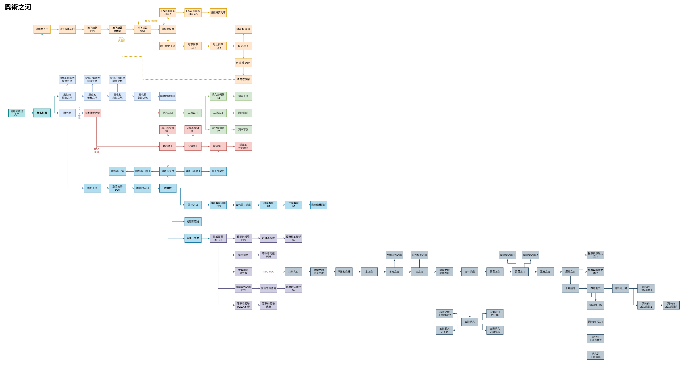
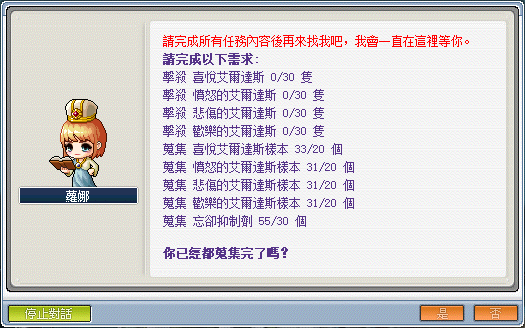
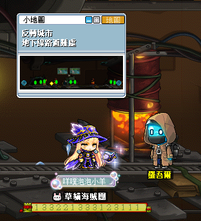
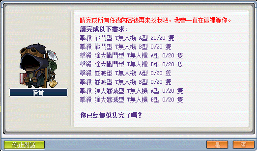
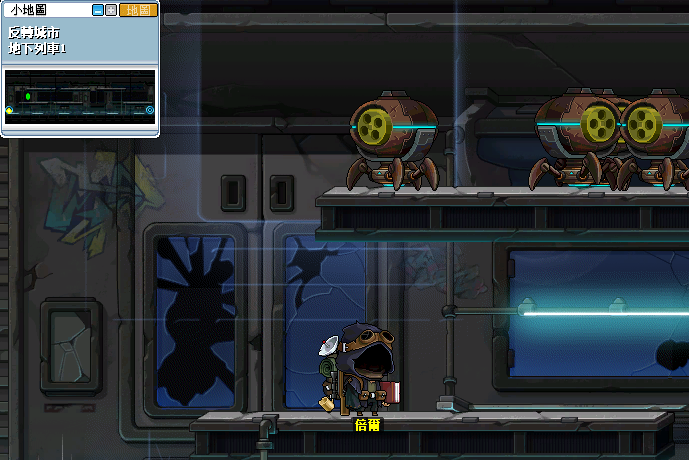
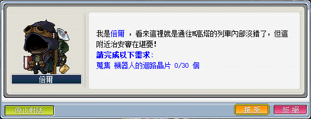
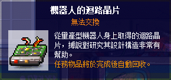
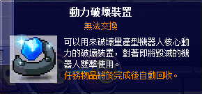
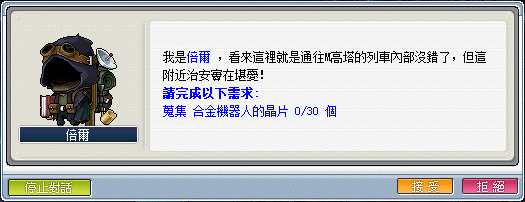
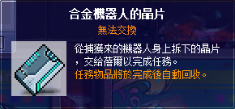

# 消失的路途

## 任務前置

- 在進入無名村落後，可先到村落周圍（開心、憤怒、悲傷、歡樂之地）打怪並取得楓葉祝福 30 技能書（機率掉落、無法交易）。
- 在成功進化楓葉祝福 30 後，向卡歐取得祕法符文：奧術探索者。

## 無名村落 NPC 功能

在取得祕法符文：奧術探索者後，可以向以下 NPC 進行相關功能：

| NPC                | 功能                    |
|--------------------|------------------------|
| 休菲凱曼 奧術之河嚮導 | 查詢導引、每日任務快速通關 |
| 蘿娜 每日任務        | 進行每日任務             |
| 妮娜 艾爾達斯光譜    | 升級祕法符文：奧術探索者   |

## 奧術之河大地圖

<a href="/奧術之河/消失的路途/大地圖/MapleDreams.drawio.png" target="_blank">點我檢視原圖</a>

## 每日任務

### 喜怒哀樂

喜怒哀樂每日任務可以到無名村落最右邊上面傳點進入開打。

| 任務內容                                    | 傳送點                                      |
|--------------------------------------------|--------------------------------------------|
|  |  |

### 安息、火焰地帶

安息每日任務可以到無名村落最右邊下方傳點進入忘卻之湖 - 湖水邊，並與 NPC 奇馬船夫對話後進入消逝的火焰地帶 - 海市蜃樓絕壁，並經由傳點進入安息的洞穴 - 洞穴入口後走到最右邊傳點進入開打。

火焰地帶每日任務可以到無名村落最右邊下方傳點進入忘卻之湖 - 湖水邊，並與 NPC 奇馬船夫對話後進入消逝的火焰地帶 - 海市蜃樓絕壁，並經由傳點進入後開打，或透過 NPC 里諾傳送。

| 任務內容                                    | 傳送點                                      |
|--------------------------------------------|--------------------------------------------|
|  |  |
|  |  |

### 地下線路避難處

地下線路避難處任務可以到無名村落中間傳點進入忘卻之湖 - 地鐵站路口，並持續向右邊地圖前進（依序為地下線路入口 > 地下線路 1 > 地下線路 2 > 地下線路 3），直到抵達地下線路避難處。

| 任務內容                                              | NPC                                                  |
|------------------------------------------------------|------------------------------------------------------|
|  |  |

### 地下列車 1

地下列車可由地下線路避難處右方傳點進入反轉城市 - 地下線路 4，並與 NPC 拉索爾對話後傳送至倍爾的居處，並從右下方傳點進入反轉城市 - 地下線路某處後，再向右方傳點前進抵達反轉城市 - 地下列車 1。

| 任務內容                                      | NPC                                          |
|----------------------------------------------|----------------------------------------------|
|  |  |

### 地下列車 3

地下列車可由地下線路避難處右方傳點進入反轉城市 - 地下線路 4，並與 NPC 拉索爾對話後傳送至倍爾的居處，並從右下方傳點進入反轉城市 - 地下線路某處後，再向右方傳點持續前進直到抵達反轉城市 - 地下列車 3。

- 任務道具【機器人的迴路晶片】需要從 M 高塔副本任務中打倒量產型機器人 B 型取得，建議開啟【掉寶加倍券】以及【道具掉落率 2 倍券】。

| 任務內容                                      | 任務道具                                      |
|----------------------------------------------|----------------------------------------------|
|  |  |

### 地下列車 4

地下列車可由地下線路避難處右方傳點進入反轉城市 - 地下線路 4，並與 NPC 拉索爾對話後傳送至倍爾的居處，並從右下方傳點進入反轉城市 - 地下線路某處後，再向右方傳點持續前進直到抵達反轉城市 - 地下列車 4。

- 任務道具【合金機器人的晶片】需要從 M 高塔副本任務中將量產型機器人 A 型打至殘血，並對怪物使用任務道具【動力破壞裝置】來取得。

  

- 可以將【動力破壞裝置】放在鍵盤按鍵上來直接使用。

| 任務內容                                      | 任務道具                                      |
|----------------------------------------------|----------------------------------------------|
|  |  |

## 升級祕法符文：奧術探索者

| Lv           | 祕法符文：消逝的旅途需求數量 | 需求楓幣      |
|--------------|-------------------------:|-------------:|
| Lv0  -> Lv1  | 12                       |   30,000,000 |
| Lv1  -> Lv2  | 15                       |   50,000,000 |
| Lv2  -> Lv3  | 20                       |   70,000,000 |
| Lv3  -> Lv4  | 27                       |   90,000,000 |
| Lv4  -> Lv5  | 36                       |  110,000,000 |
| Lv5  -> Lv6  | 47                       |  130,000,000 |
| Lv6  -> Lv7  | 60                       |  150,000,000 |
| Lv7  -> Lv8  | 75                       |  170,000,000 |
| Lv8  -> Lv9  | 92                       |  190,000,000 |
| Lv9  -> Lv10 | 111                      |  210,000,000 |
| Lv10 -> Lv11 | 132                      |  230,000,000 |
| Lv11 -> Lv12 | 155                      |  250,000,000 |
| Lv12 -> Lv13 | 180                      |  270,000,000 |
| Lv13 -> Lv14 | 207                      |  290,000,000 |
| Lv14 -> Lv15 | 236                      |  310,000,000 |
| Lv15 -> Lv16 | 267                      |  330,000,000 |
| Lv16 -> Lv17 | 300                      |  350,000,000 |
| Lv17 -> Lv18 | 335                      |  370,000,000 |
| Lv18 -> Lv19 | 372                      |  390,000,000 |
| Lv19 -> Lv20 | 411                      |  410,000,000 |
| Lv19 -> Lv20 | 411                      |  410,000,000 |
| 總計          | 3090                     | 4,400,000,000 |
