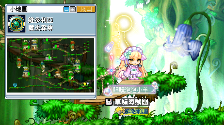
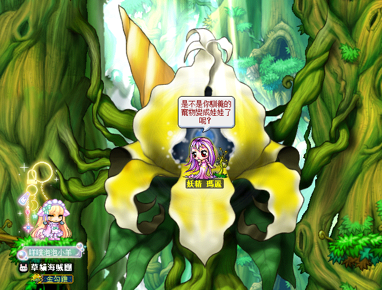
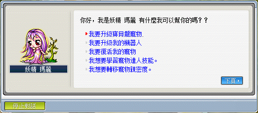
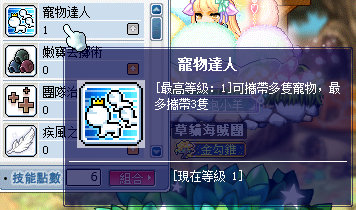
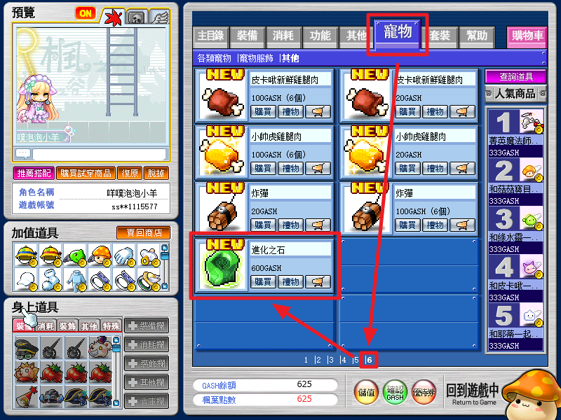
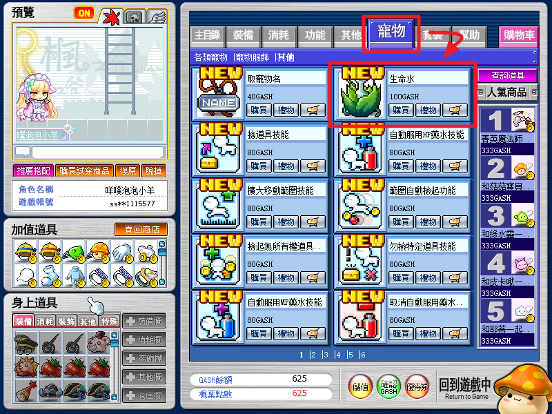
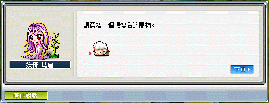

# 寵物相關知識

## 妖精瑪麗位置

寵物相關功能都可以透過 NPC 妖精瑪麗完成。

1. 到魔法森林右下角傳點。

    

2. NPC 妖精瑪麗位於畫面中間。

    

3. NPC 妖精瑪麗提供各種寵物相關功能。

    

## 寵物達人

1. 準備多隻以上寵物。

    

2. 到購物商城購買【進化之石】三顆。

    

3. 和 [NPC 妖精瑪麗](#妖精瑪麗位置)對話並選擇`我想要學習寵物達人技能`。

## 寵物復活

當寵物超過魔法時間後會無法召喚，此時需要使用【生命水】來對寵物進行復活。

1. 準備已超過魔法時間的寵物。

2. 到購物商城購買【生命水】一個。

    

3. 和 [NPC 妖精瑪麗](#妖精瑪麗位置)對話並選擇`我要復活我的寵物`。

4. 選擇要復活的寵物即可。

    
