# 怪物騎乘任務系列

## 怪物騎乘

- 等級：Lv70、角色已三轉
- 前置：無
- NPC 位置：水世界動物園 - 坎特

1. 到水世界動物園找到 NPC 坎特並接任務「怪物騎乘」。

    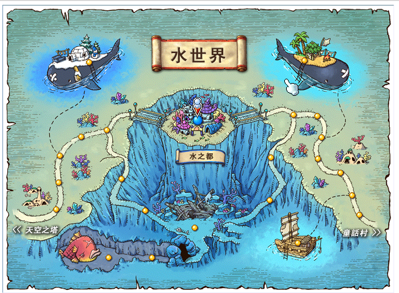

    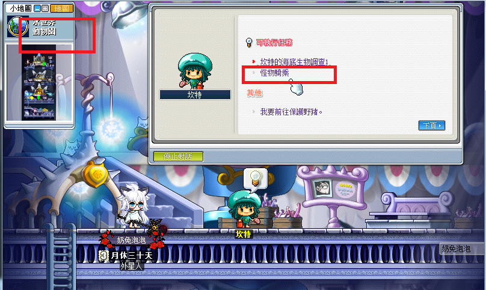

    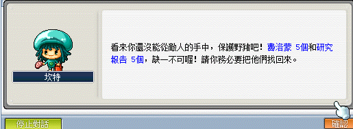

2. 任務內容所需要的費洛蒙與研究報告各五個，可以自己開啟組隊後從 NPC 坎特「我要前往保護野豬」進入地圖獲得。

    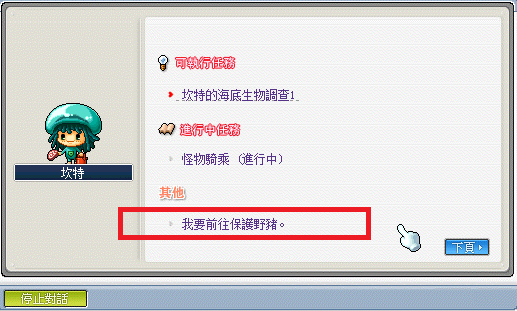

3. 研究報告可以從地圖中的箱子中獲得（箱子重生需要時間）。

    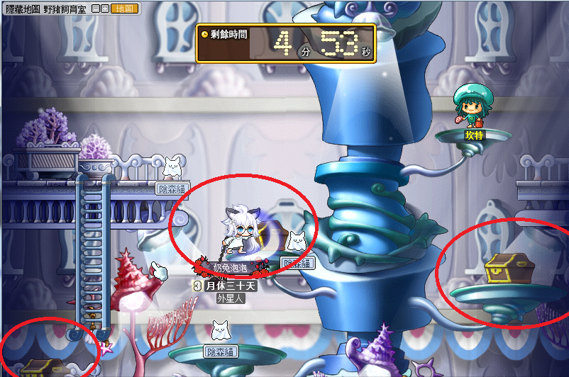

    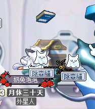

    可以一次收集 1~2 本研究報告，並直接點選 NPC 出去。若是自己點 NPC 出去則研究報告不會回收，可以之後自近來重複收集；但如果是因為野豬 HP 歸零被踢出地圖則會被回收。

    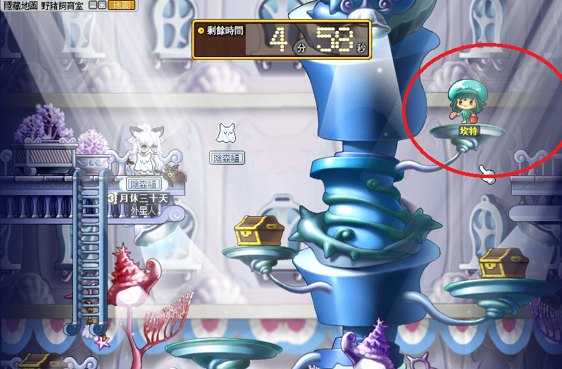

    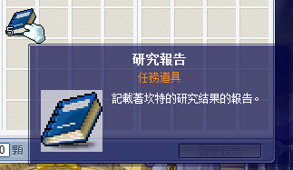

4. 在收集完研究報告後可以開始全力保護野豬。傷害不夠的話可以各打一下吸引到旁邊，不要讓他靠近野豬就好。

    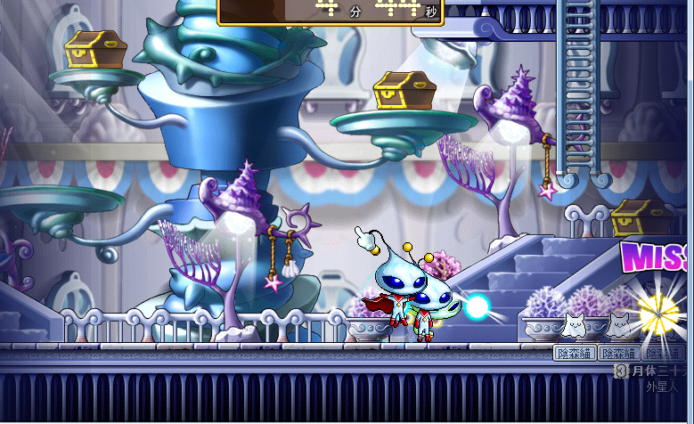

    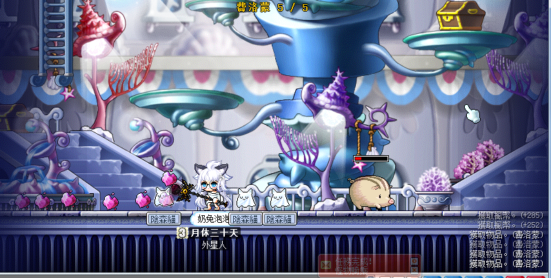

5. 在收集完研究報告與費洛蒙後回報任務，即可獲得馬鞍與怪物騎乘技能。

    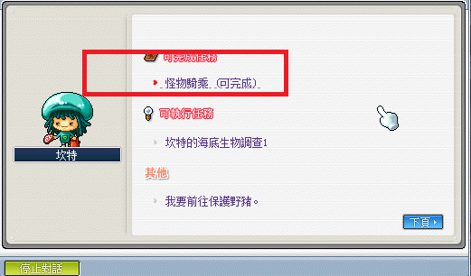

    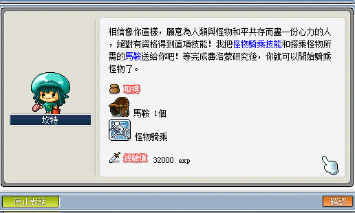

    **注意：如果只是要騎乘魔法馬鞍的話，這邊拿到技能即可結束，裝備魔法馬鞍跟魔法騎寵後，即可用怪物騎乘技能騎乘起來。**

---

## 費洛蒙香水

- 等級：Lv70、角色已三轉
- 前置：怪物騎乘
- NPC 位置：水世界動物園 - 坎特
- 需求道具／怪物：2000 萬楓幣

1. 到水世界動物園找到 NPC 坎特並接任務「費洛蒙香水」。

    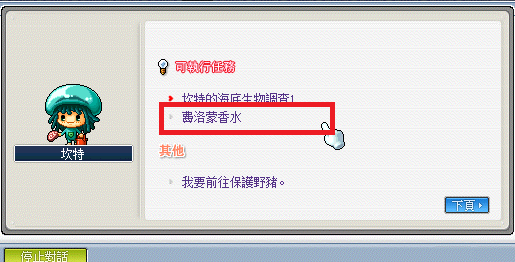

    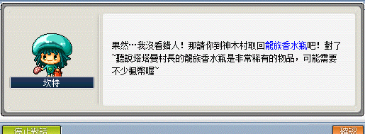

2. 到神木村找村長塔塔曼，並以 2000 萬楓幣來換取龍族香水瓶。

    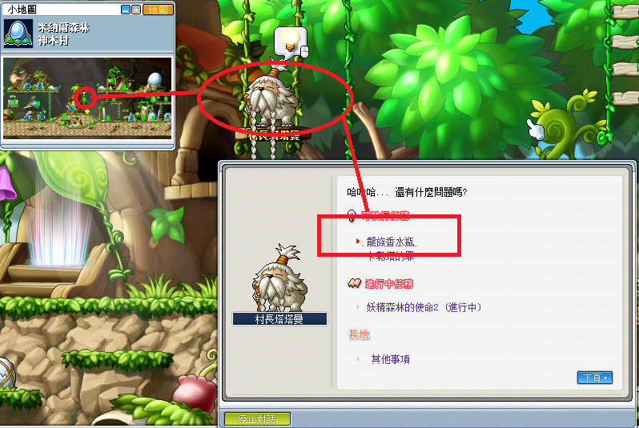

    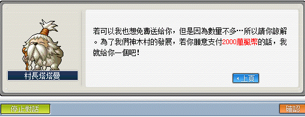

3. 返回水世界動物園並找坎特完成任務，並獲得香水。

    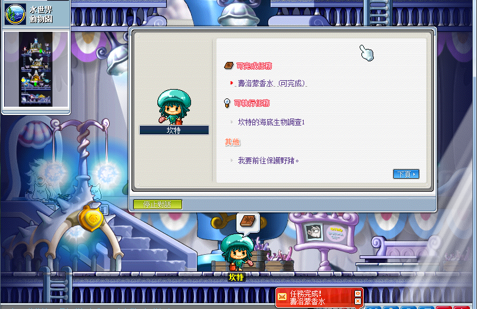

    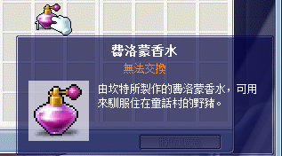

    費洛蒙香水可依照個人習慣手動開啟道具欄使用，或放在鍵盤按鍵上使用。

    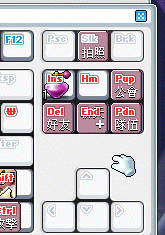

---

## 抓取野豬

1. 到童話村 - 老虎山坡。

    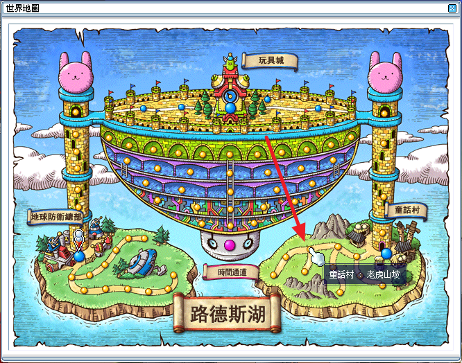

2. 到途中紅圈點隱藏傳點按上。

    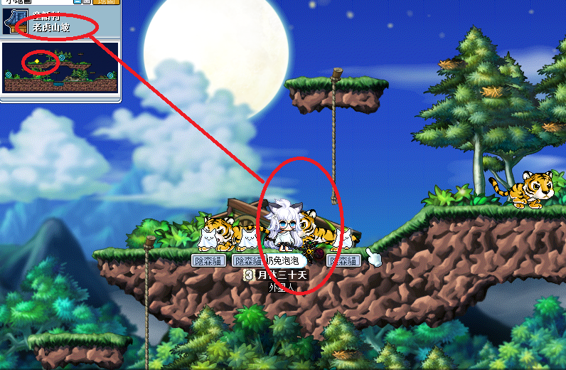

3. 靠近野豬（三公分內）使用費洛蒙香水抓取野豬，周圍的老虎可以不用理牠們。

    

4. 完成後獲得野豬。

    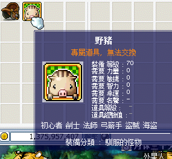

5. 裝備上去後即可使用技能欄位的怪物騎乘來騎乘野豬。

    | 野豬                        | 怪物騎乘                     |
    |----------------------------|-----------------------------|
    | 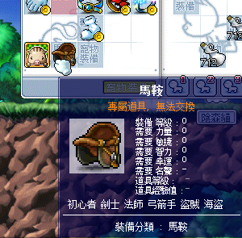 | 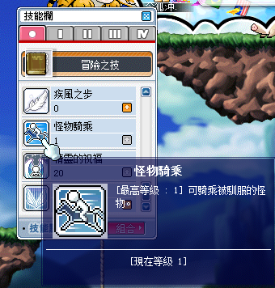 |

6. 怪物騎乘可放置鍵盤位上隨時騎豬。

    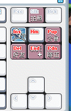

7. 如果不喜歡可以到商城購買自己喜歡的點裝馬鞍與點裝騎寵並套用。

    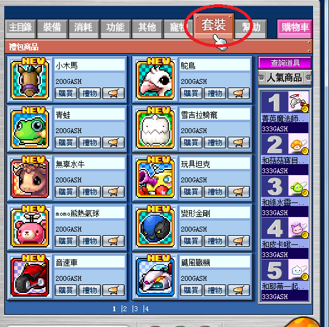

    需要注意的是要買相對應的馬鞍，例如無辜水牛要配水牛馬鞍。

    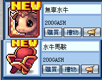

## 銀色鬃毛

- 等級：Lv70、角色已三轉
- 前置：怪物騎乘、捕捉到野豬且野豬等級達到 Lv3
- NPC 位置：水世界動物園 - 坎特
- 需求道具／怪物
  - 金色皮革x600
  - 木頭肩護帶x400
  - 骷髏肩護帶x400
  - ____萬楓幣

1. 前往水世界動物園與坎特對話，並收集三項任務道具：【金色皮革x600】、【木頭肩護帶x400】、【骷髏肩護帶x400】、【萬楓幣】。

    - 【金色皮革】可從獨角迅猛龍身上獲得。
    - 【木頭肩護帶】可從短刃龍戰士身上獲得。
    - 【骷髏肩護帶】可從雙刀龍戰士身上獲得。

        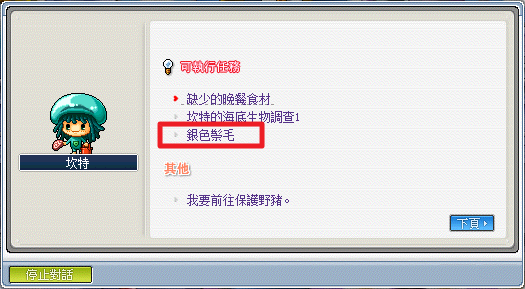

        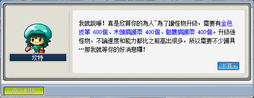

        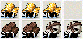

2. 收集完畢後到水世界動物園與坎特回報任務，任務完成後會將野豬替換為銀色鬃毛。

    | 騎寵     | 移動速度 | 跳躍力 |
    |---------|---------|-------|
    | 野豬    | 150%     | 120%  |
    | 銀色鬃毛 | 170%    | 120%  |

    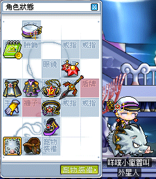

## 如何提升騎寵等級

1. 每當騎寵被召喚出一段時間（約每 50 秒增加 1 疲勞度），其疲勞度便會提升，此時只要給寵物喝下提神飲料就會將降低疲勞度並提升經驗值。

    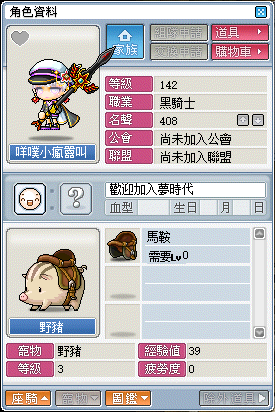

2. 提神飲料可以從寵物商人處購買。

    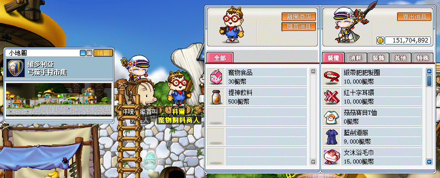
