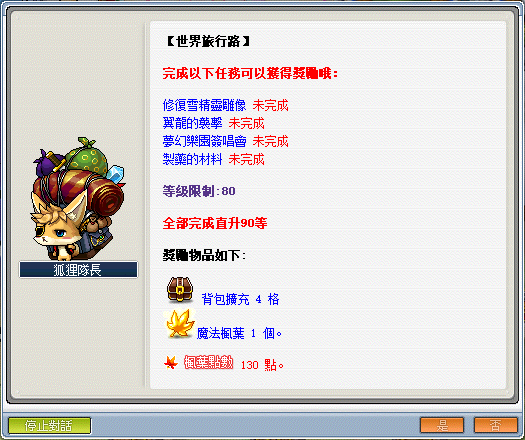
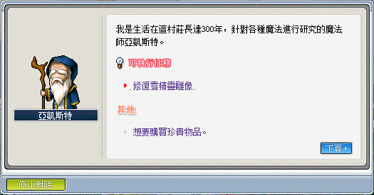
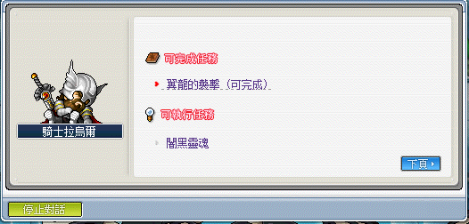

# 世界旅行路



```text
此系列任務所需道具：
    - 傑克的帽子x100
    - 羅絲的假髮x100
    - 兔兔耳x100
    - 粉紅小香水x200
    - 紫色小香水x200
    - 黃色小香水x200
    - 連接線x150
    - 動態多媒體喇叭x150
    - 邪惡綿羊嚼過的草x80

接取任務後才可取得的道具或怪物擊殺數：
    - 手電筒x1
    - 相機x1
    - 記事本x1
    - 赤翼龍x18
    - 藍翼龍x18
    - 黑翼龍x18
```

---

## 修復雪精靈雕像（系列任務）

### 雪原的巨大生物

- 等級：Lv80
- 前置：無
- NPC 位置：冰原雪域

1. 到冰原雪域右方與 NPC 杰德對話，接取任務「雪原的巨大生物」。

    

2. 到冰原雪域左方與 NPC 史卡圖勒對話，回報並完成任務「雪原的巨大生物」。

    

### 傳說中的雪毛怪人

- 等級：Lv80
- 前置：雪原的巨大生物
- NPC 位置：冰原雪域

1. 到冰原雪域左方與 NPC 史卡圖勒對話，接取任務「傳說中的雪毛怪人」。

    

2. 到冰原雪域右方與 NPC 杰德對話，回報並完成任務「傳說中的雪毛怪人」。

    

### 雪毛怪人的憤怒

- 等級：Lv80
- 前置：傳說中的雪毛怪人
- NPC 位置：冰原雪域

1. 到冰原雪域左方與 NPC 史卡圖勒對話，接取並完成任務「雪毛怪人的憤怒」。

    

2. 到冰原峽谷 I，進入告示牌隱藏傳點後抵達地圖雪人之谷，接著一直往上爬直到抵達地圖雪精靈之谷。

    | 冰原峽谷 I       | 隱藏傳點         | 雪人之谷         |
    |-----------------|-----------------|-----------------|
    |  |  |  |

3. 與 NPC 雪精靈雕像對話，接取任務「雪毛怪人的憤怒 - 發現線索」。

    

4. 回到冰原雪域左方與 NPC 史卡圖勒對話，回報並完成任務「傳說中的雪毛怪人」。

    

### 阻止雪毛怪人

- 等級：Lv80
- 前置：雪毛怪人的憤怒、雪毛怪人的憤怒 - 發現線索
- NPC 位置：冰原雪域

1. 到冰原雪域左方與 NPC 史卡圖勒對話，接取任務「阻止雪毛怪人」。

    
`
2. 到隱藏地圖雪人之谷，並擊敗雪毛怪人。

    - 如果地圖沒有出現雪毛怪人，可以先透過指令 `@BOSSCD` 來查詢重生 CD 時間。
    - 若訊息出現`這個地圖沒有等待重生的 BOSS`，請先清理地圖上的怪物。

    

3. 擊敗雪毛怪人後回到冰原雪域左方與 NPC 史卡圖勒對話，回報並完成任務「阻止雪毛怪人」。

    

### 修復雪精靈雕像

- 等級：Lv80
- 前置：阻止雪毛怪人
- NPC 位置：冰原雪域市集

1. 到冰原雪域市集右方與 NPC 亞凱斯特對話，接取任務「修復雪精靈雕像」，並得到任務道具【冰之結晶】。

    | 修復雪精靈雕像      | 冰之結晶           |
    |-------------------|-------------------|
    |  |  |

2. 到地圖雪精靈之谷與 NPC 雪精靈雕像對話並完成任務「修復雪精靈雕像」。

    

---

## 翼龍的襲擊

- 等級：Lv100
- 前置：無
- NPC 位置：翼龍峽谷 - 騎士拉烏爾
- 需求道具／怪物：赤翼龍x18、藍翼龍x18、黑翼龍x18

1. 要先去翼龍峽谷找 NPC 騎士拉烏爾接取任務「翼龍的襲擊」。

    

2. 騎士拉烏爾的任務需求。

    - 【赤翼龍、藍翼龍、黑翼龍】可直接在翼龍峽谷打。

    

3. 打完任務指定道具後，回去找 NPC 騎士拉烏爾回報即可完成任務。

    

---

## 夢幻樂園簽唱會

- 等級：Lv75
- 前置：無
- NPC 位置：101大道 - 暴龍
- 需求道具／怪物：3D 魔幻音效、獨衣無二、夢幻小禮物（非怪物掉落物）

1. 要先去 101 大道找 NPC 暴龍接取任務「夢幻樂園簽唱會」。

    | 世界導遊         | 101 大道         |
    |-----------------|-----------------|
    |  |  |

2. 跟附近的 NPC 吳建豪、仔仔、朱嘯天接取任務。

    

3. 任務需求道具。

    | 吳建豪           | 仔仔            | 朱嘯天           |
    |-----------------|-----------------|-----------------|
    |  |  |  |

    - 【傑克的帽子、羅絲的假髮、兔兔耳】可至圖中人偶區打獲得。
    - 【粉紅小香水、紫色小香水、黃色小香水】可至圖中香水區打獲得。
    - 【動態多媒體喇叭、連接線】可至圖中音響區打獲得。

        

    - 因為怪物數量比較稀少，建議打香水時要開掉寶機率加倍卡。

4. 打完指定道具後，回去 101 大道找 NPC 吳建豪、仔仔、朱嘯天回報即可獲得指定任務道具。

    

5. 找 NPC 暴龍回報任務即可完成。

    - 任務完成後，三個任務道具不會被回收，佔位置可直接扔掉。

    

---

## 製藥的材料

- 等級：Lv85
- 前置：無
- NPC 位置：神木村潘姆之家 - 潘姆
- 需求道具／怪物：邪惡綿羊嚼過的草x80

1. 要先去神木村潘姆之家找 NPC 潘姆接取任務「製藥的材料」。

    

2. 潘姆任務需求道具。

    

    - 【邪惡綿羊嚼過的草】可至森林岔道打邪惡綿羊（白灰色的）獲得。

        

3. 打完指定道具後，回去神木村潘姆之家找 NPC 潘姆回報即可完成任務。

    

---

## 完成任務

以上任務完成即可去找狐狸隊長回報擴包任務。


