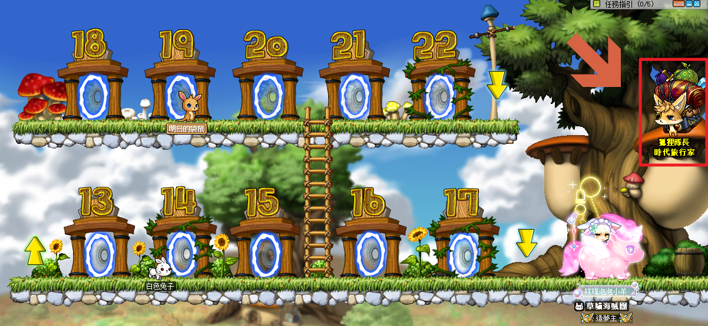
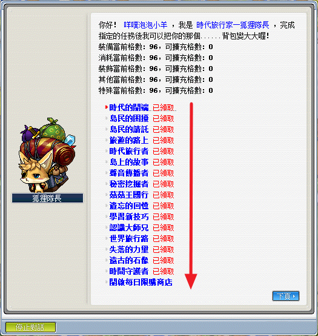
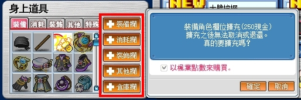
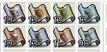
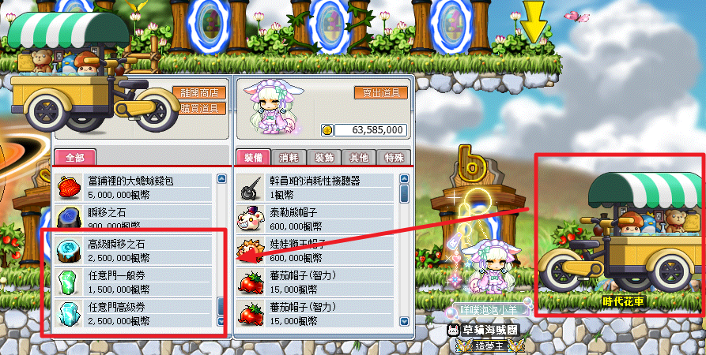

# 前言

## 擴包任務系列注意事項

1. 自由市場和 NPC 的相對位置會隨著版本做異動，但一定會在自由市場入口。

   當前位置為自由市場右上角（樹洞上方）：

   

2. 擴包任務每完成一個系列，就會幫你開啟四格背包格子！
3. 擴包任務系列只能由上往下依序解完，但每系列內的任務則不需要按照順序。

   

4. 完成全部擴包任務後則可以使用狐狸隊長的每日特價商店，內容每天都會做更換。
5. 若是懶惰解擴包任務的話，可以到「購物商城」用 GASH／楓葉點數（需要 250 點）來擴充背包，但狐狸隊長的特價商店就沒辦法使用。

   

6. 由於擴包任務系列需要跑到各村莊，建議準備好各村莊的移動卷軸／高級順移之石／任意門高級券。
   - 村莊移動卷軸：各村莊的藥水店有販賣：

     

   - 高級順移之石／任意門高級券：購物商城和自由市場入口的 NPC 時代花車有賣：
     - 更新：楓之谷知識家-鯨魚號任務，此任務會送「任意門高級券」方便後續任務進行！

     

7. 擴包玩家在解各種任務時記得要多留幾格背包空間（消耗和其他欄），防止任務道具被系統吃掉。
8. 若解完任務發現 NPC 狐狸隊長沒有顯示完成任務或背包未新增四格欄位，請更換頻道或重新登入確認。
