# 失落的力量

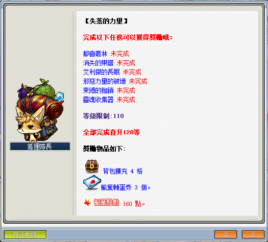

```text
此系列任務所需道具／怪物：
  - 達可泰可x1
```

---

## 都會叢林

- 等級：Lv80
- 前置：無
- NPC 位置：新葉城市區中心 - 蒙面傑克
- 需求道具／怪物：機械蜘蛛x100

1. 要先去新葉城市區中心找 NPC 蒙面傑克接取任務「都會叢林」。

    - 新葉城市區中心走法：墮落城市地鐵售票處 > 跟NPC貝爾買票 > 剪票口 > 離開地鐵站 > 新葉城。

        | 地鐵售票處       | 新葉城           |
        |-----------------|-----------------|
        | 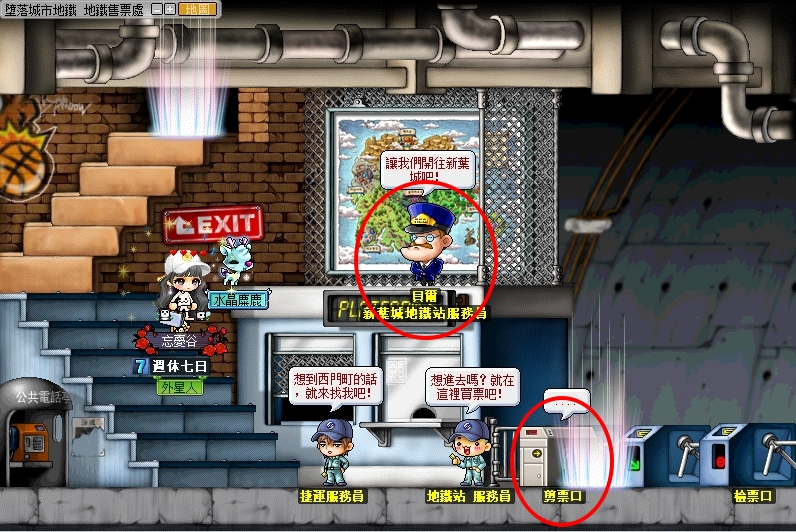 | 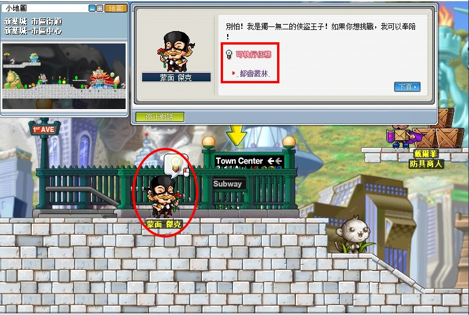 |

    - 機械蜘蛛洞穴走法：新葉城鐘塔上方時鐘進去 > 大廳 > 照著圖中1234處按上即可移動 > 走到大廳最下面 > 女神室往右走 > 靈魂迴廊 > 機械蜘蛛洞穴。

2. 新葉城鐘塔上方紅色箭頭處進去。

    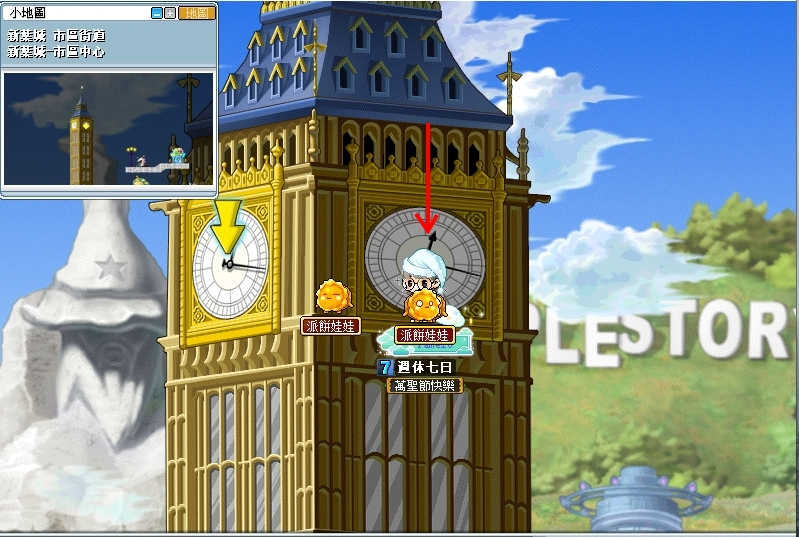

3. 照著順序順移到紅圈4。

    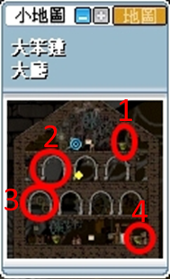

4. 走到大廳最下方。

    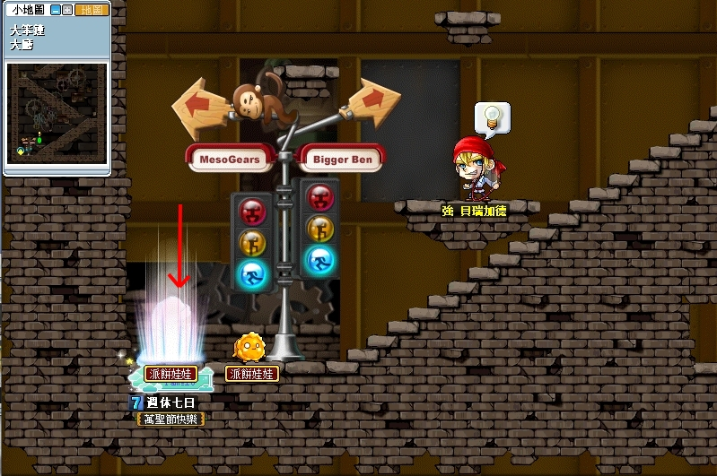

5. 到女神室後往右走至靈魂迴廊。

    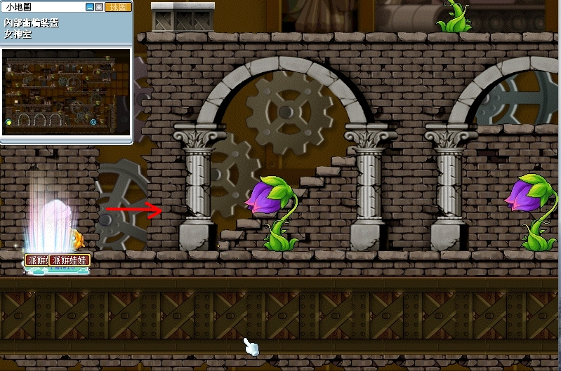

6. 下跳至中間傳送口。

    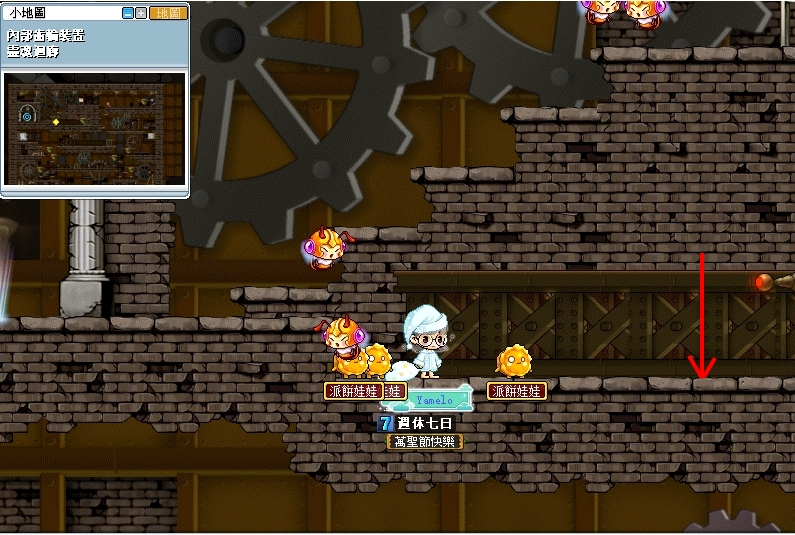

7. 進入。

    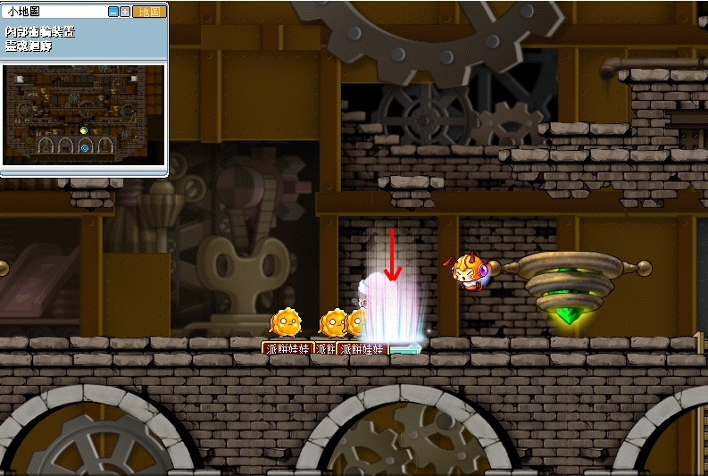

8. 抵達機械蜘蛛洞穴。

    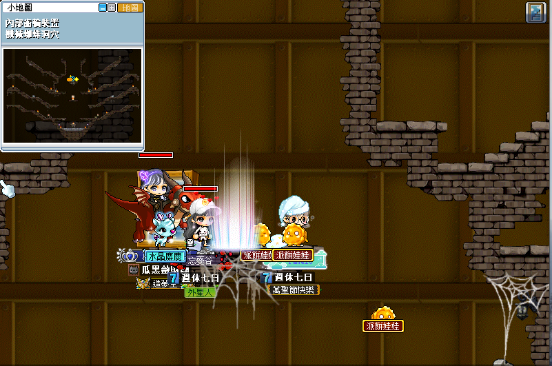

9. 打完任務指定怪物數量後，回去新葉城找 NPC 蒙面傑克回報即可完成任務。

    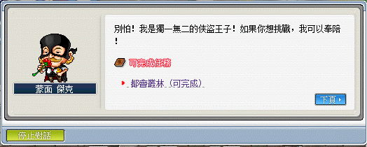

---

## 消失的樂譜

- 等級：Lv75
- 前置：夢幻樂園簽唱會
- NPC 位置：101大道 - 暴龍
- 需求道具／怪物：樂譜x1

1. 要先去 101 大道找 NPC 暴龍接取任務「消失的樂譜」。

    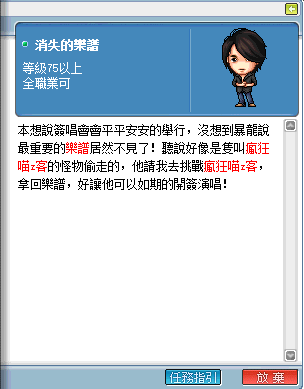

2. 暴龍的任務需求。

    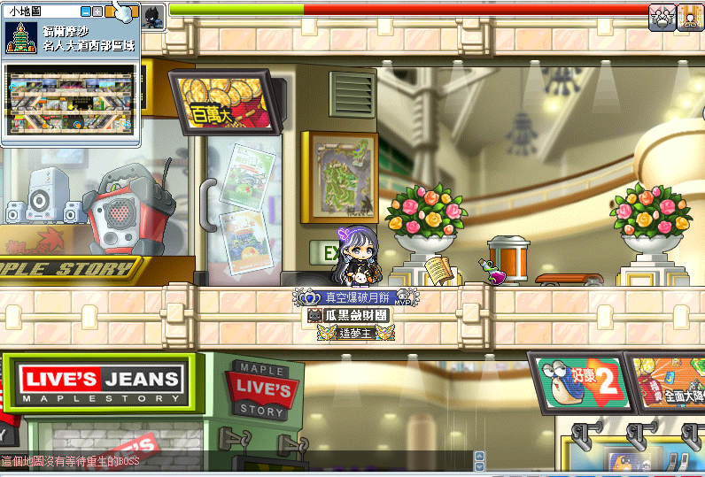

    - 【樂譜】可至名人大道西部區域打【瘋狂喵 z 客】有機率掉落。

        

3. 至名人大道西部區域打@bosscd確認一下【瘋狂喵 z 客】是否還活著。

    - 代表王還活著，只要清理地圖上的怪物即可召喚【瘋狂喵 z 客】。

        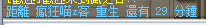

    - 代表王已被其他玩家清理，瘋狂喵z克重生時間要 30 分鐘。

        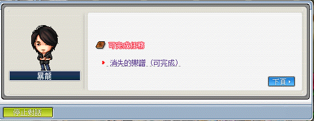

    - 建議開掉寶機率加倍提升樂譜掉落率。

4. 打完任務指定道具後，回去 101 大道找 NPC 暴龍回報即可完成任務。

    

---

## 艾利傑的憤怒（女神的寵物）

- 等級：Lv83
- 前置：無
- NPC 位置：天空之城老婆之屋 - 史菲魯納
- 需求道具／怪物：星光精靈x50、月光精靈x100、日光精靈x150隻

1. 要先去天空之城老婆之屋找 NPC 史菲魯納接取任務「艾利傑的憤怒」。

    

2. 史菲魯納的任務需求。

    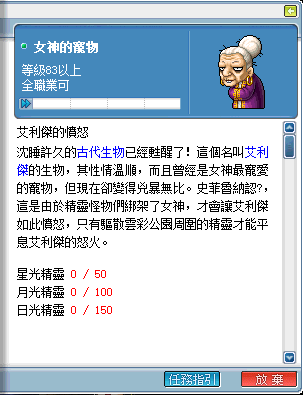

3. 打完任務指定怪物數量後，回去天空之城老婆之屋找 NPC 史菲魯納回報。

    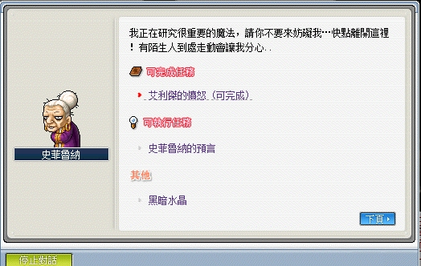

4. 繼續與史菲魯納接任務「艾利傑的庭園」。

    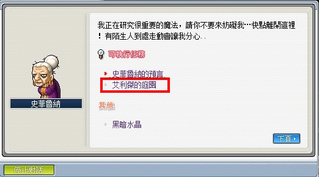

5. 前往天空階梯 II。

    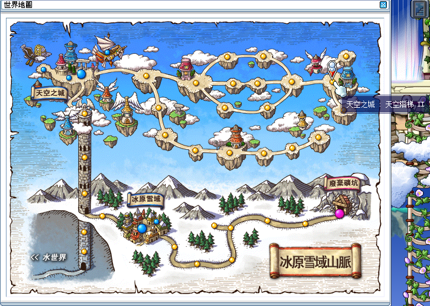

6. 左邊拱門進去。

    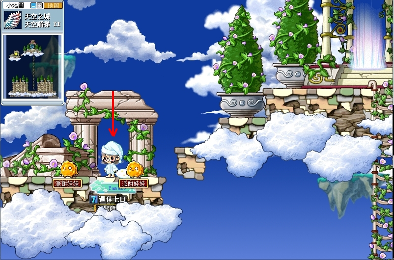

7. 抵達艾利傑的庭園。

    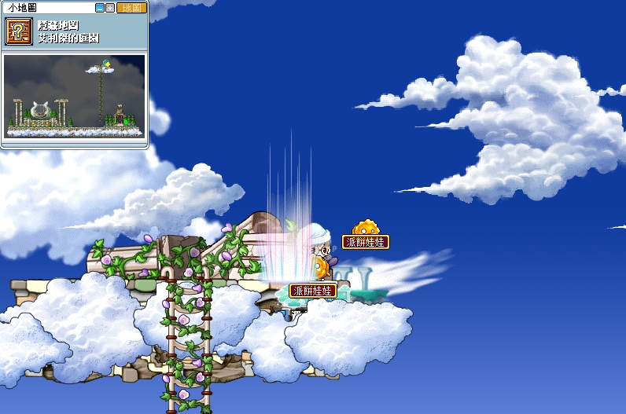

8. 與 NPC 艾利傑對話。

    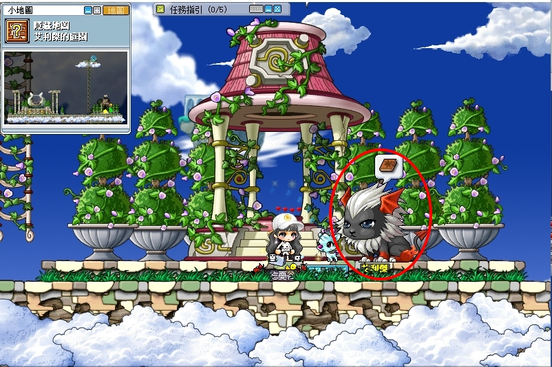

9. 繼續接取任務「與艾利傑的對話」。

    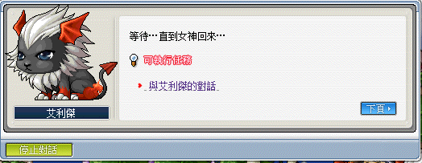

10. 擊倒在天空階梯 II 的艾利傑即可完成任務。

    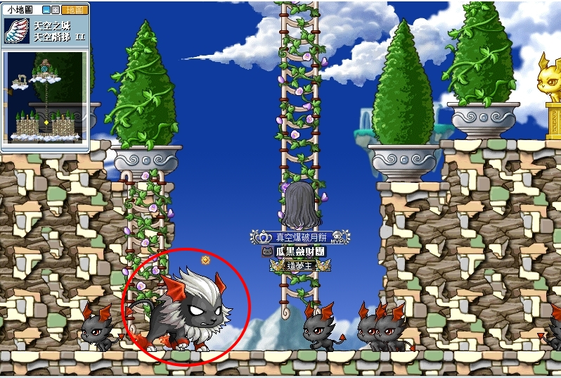

11. 回去艾利傑的庭園與 NPC 艾利傑回報。

    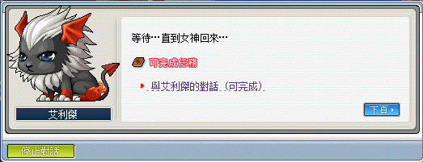

12. 繼續接任務「艾利傑的長眠」。

    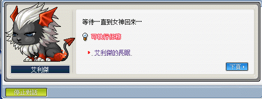

13. 至最左邊點擊豎琴上的石頭即可完成任務，任務完成聊天視窗會跳出相關完成任務字句。

    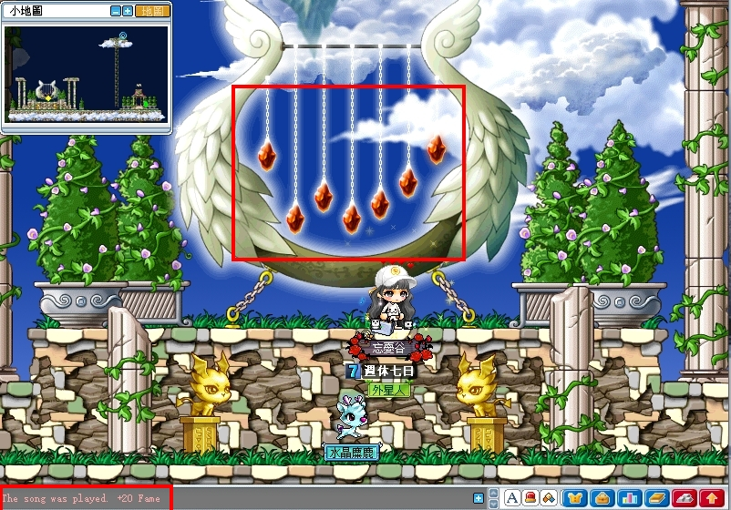

    - 任務完成後，任務道具【演奏曲 : 小星星】不會被回收，佔位置可直接扔掉。

---

## 邪惡力量的破壞

- 等級：Lv83
- 前置：無
- NPC 位置：熔岩洞窟（試煉洞窟 II 中間的岩漿） - 熔岩
- 需求道具／怪物：達可泰可x1

**【達可泰可】打拉圖斯有低機率掉落。建議要打的話開八倍掉落率。**

1. 需先到玩具城 - 時間通道，尋找 NPC 皮耶魯先生。

    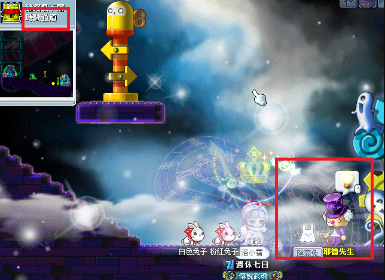

2. 對話後接取任務「邪惡力量的破壞」。

    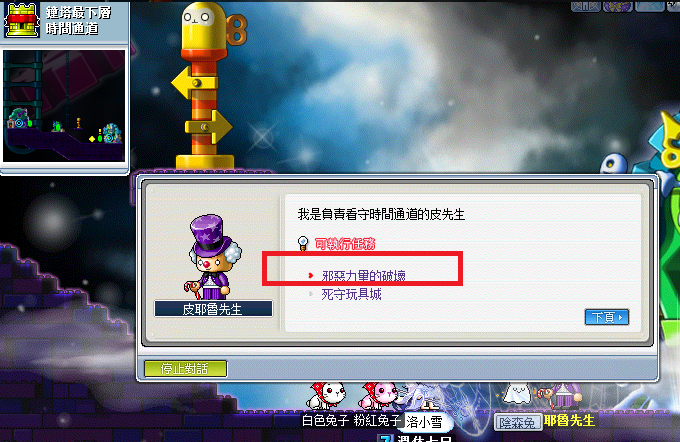

3. 到熔岩洞窟（試煉洞窟 II 中間的岩漿）與 NPC 熔岩對話接起任務（身上需攜有達可泰可才會顯示任務）。

    | 沒有達可泰可     | 有達可泰可        |
    |-----------------|-----------------|
    | 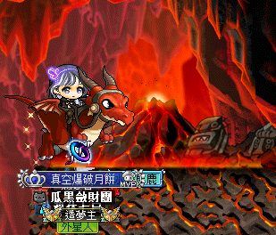 | 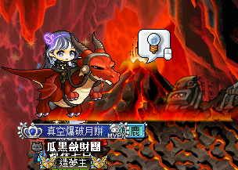 |

4. 對話繼續完成任務即可。

    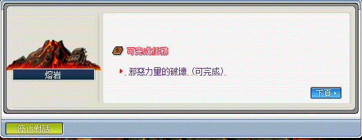

---

## 束縛的枷鎖

- 等級：Lv84
- 前置：無
- NPC 位置：遺忘的時間之路 <1> - 幽靈獵人巴柏
- 需求道具／怪物：束縛枷鎖x20

1. 要先去玩具城遺忘的時間之路 <1>找 NPC 幽靈獵人巴柏接取任務「束縛的枷鎖」。

    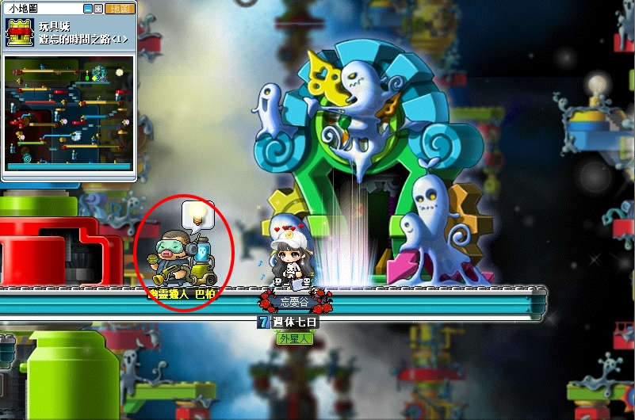

2. 巴柏任務需求道具。

    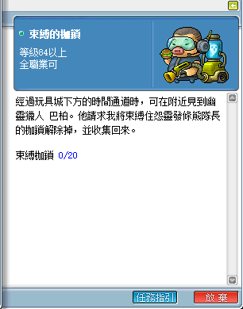

    - 【束縛枷鎖】可至毀壞的時間打怨靈發條熊隊長獲得。
    - 毀壞的時間走法：在玩具城的遺忘的時間之路 <3> 的隱藏地圖。

        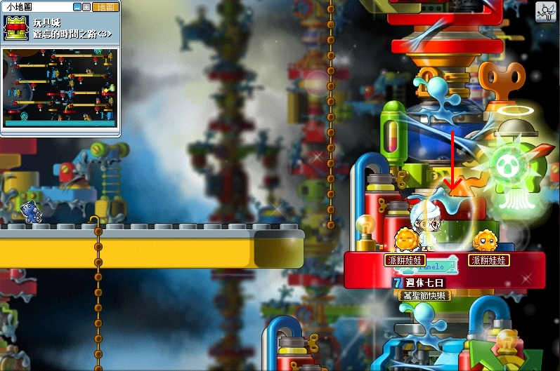

3. 打完任務指定道具後，回去遺忘的時間之路 <1> 找 NPC 巴柏回報即可完成任務。

    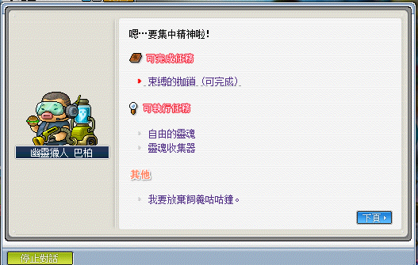

---

## 靈魂收集器

- 等級：Lv85
- 前置：無
- NPC 位置：遺忘的時間之路 <1> - 幽靈獵人巴柏
- 需求道具／怪物：維京x20、靈魂蒐集器

1. 要先去玩具城遺忘的時間之路 <1> 找 NPC 幽靈獵人巴柏接取任務「靈魂收集器」。

2. 巴柏任務需求道具。

    - 【靈魂搜集器】可至扭曲的時間之路 <4> 打維京低機率獲得（建議開掉寶機率加倍卡打）。

    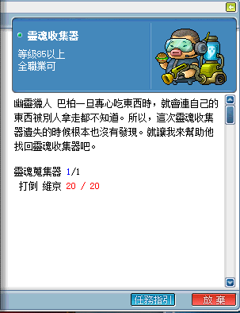

3. 打完任務指定道具後，回去遺忘的時間之路 <1> 找 NPC 巴柏回報即可完成任務。

    

---

## 完成任務

以上任務完成即可去找狐狸隊長回報擴包任務。

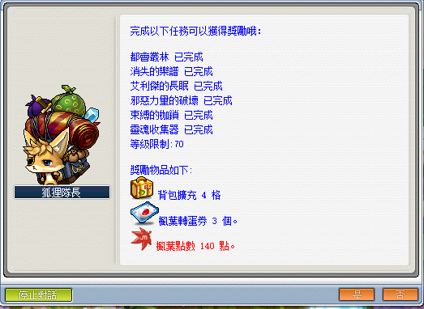
