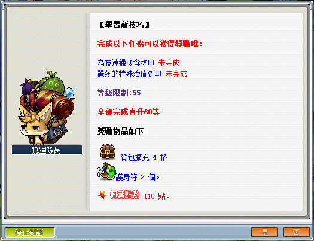
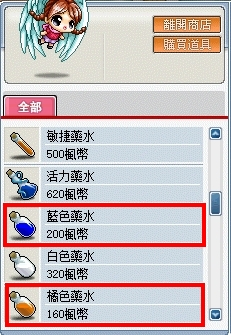

# 學習新技巧



```text
此系列任務所需道具／怪物：
  - 獨角獅硬角x80
  - 蝴蝶精的觸角x1
  - 小企鵝王的魚x600
  - 堅硬的羽毛x15
  - 動物皮x5
  - 橘色藥水x40
  - 藍色藥水x20
  - 解毒劑x1
```

- 原本還有任務「怪物騎乘」和「消失的馬鞍」但現在已經移除囉！
- 這邊會先從前置開始介紹！要先解完「麗莎的特殊治療劑 III」才能解「為波達獵取食物」。

---

## 寂寞的波達

- 等級：Lv30
- 前置：無
- NPC 位置：天空之城藥水店前面 - 波達
- 需求道具／怪物：傳遞訊息

1. 要先去天空之城找 NPC 波達接取任務「寂寞的波達」。

    

2. 與 NPC 波奇對話。

    

3. 與 NPC 麗莎對話即可完成任務。

    

---

## 妖精的號角 I

- 等級：Lv30
- 前置：寂寞的波達
- NPC 位置：天空之城藥水店前面 - 麗莎
- 需求道具／怪物：獨角獅硬角x80、堅硬的羽毛x15、動物皮x5

1. 繼續跟NPC麗莎接取任務「妖精的號角」。

    

2. 麗莎需求道具。

    - 【獨角獅硬角／堅硬的羽毛／動物皮】可從三色庭院中的各色幼獨角獅獲得。

    

3. 去「前往三色庭園的路」。

    

4. 走至右上涼亭。

    

5. 抵達「前往三色庭園的路」。

    

4. 打完任務指定道具後，回去天空之城找NPC麗莎回報。

    

---

## 妖精的號角 II

- 等級：Lv30
- 前置：妖精的號角 I
- NPC 位置：天空之城藥水店前面 - 麗莎
- 需求道具／怪物：傳遞訊息

**記得接取任務時要把其它欄空幾格出來，不然有可能會把任務道具吃掉。**

1. 繼續跟 NPC 麗莎接取任務「妖精的號角 II」。

    

2. 與 NPC 波達對話即可完成任務。

    

---

## 麗莎的特殊治療劑

- 等級：Lv30
- 前置：妖精的號角 II
- NPC 位置：天空之城藥水店前面 - 波達
- 需求道具／怪物：傳遞訊息

1. 繼續跟 NPC 波達接取任務「麗莎的特殊治療劑」。

    

2. 與 NPC 麗莎對話即可完成任務。

    

---

## 麗莎的特殊治療劑 II

- 等級：Lv30
- 前置：麗莎的特殊治療劑 I
- NPC 位置：天空之城藥水店前面 - 麗莎
- 需求道具／怪物：橘色藥水x40、藍色藥水x20、解毒劑x1、蝴蝶精的觸角x1

1. 繼續跟 NPC 麗莎接取任務「麗莎的特殊治療劑 II」。

2. 麗莎需求的道具。

    

    - 【橘色藥水、藍色藥水、解毒劑】可從藥水店獲得。

        | 橘色藥水、藍色藥水  | 解毒劑             |
        |-------------------|-------------------|
        |  |  |

    - 【蝴蝶精的觸角】可從蝴蝶精獲得。

        - 蝴蝶精最近的區域：散步路 I

            

3. 打完任務指定道具後，回去天空之城找 NPC 麗莎回報。

---

## 麗莎的特殊治療劑 III

- 等級：Lv30
- 前置：麗莎的特殊治療劑 II
- NPC 位置：天空之城藥水店前面 - 麗莎
- 需求道具／怪物：傳遞任務道具

1. 繼續跟 NPC 麗莎接取任務「麗莎的特殊治療劑 III」。

    

2. 獲得任務道具【麗莎的特殊治療劑】。

    

3. 與 NPC 波達對話即可完成任務。

    

---

## 波達的請求

- 等級：Lv30
- 前置：麗莎的特殊治療劑 III
- NPC 位置：天空之城藥水店前面 - 波達
- 需求道具／怪物：傳遞訊息

1. 繼續與 NPC 波達對話接取任務「波達的請求」。

    

2. 前往天空之城塔<10 層>中間的秘密之室找尋他的主人 NPC 豪克。

    

3. 找到NPC豪克並回報任務。

    

---

## 為波達獵取食物 I/II/III

- 等級：Lv30
- 前置：波達的請求
- NPC 位置：天空之城塔<10 層>中間的秘密之室 - 豪克
- 需求道具／怪物：小企鵝王的魚共需要 600 隻（每個任務分別要100／200／300隻）

此任務就是打完道具拿著魚給 NPC 波達吃，回去找豪克重複接取為「波達獵取食物II和III」。

- 【小企鵝王的魚】從天空之城塔<1/2 層>打小企鵝王獲得。

  

- 這邊懶人方法
  - 建議直接找一隻主教待在 NPC 豪克那邊開時空門。
  - 利用高級瞬移之石紀錄豪克那張地圖，利用回捲 + 高級瞬移之石來回跑圖。

---

## 完成任務

以上任務完成即可去找狐狸隊長回報擴包任務。


