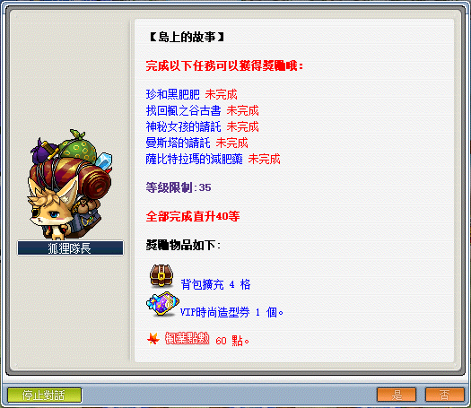
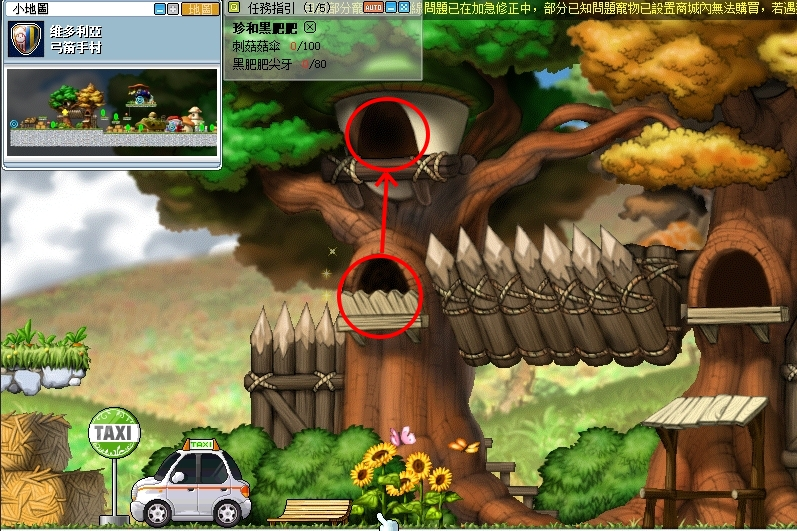
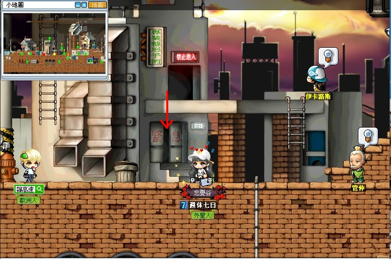
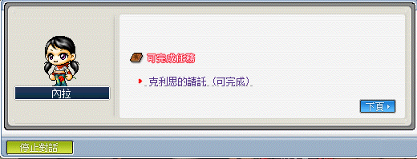

# 島上的故事



```text
此系列任務所需道具／怪物：
    - 刺菇菇傘x200
    - 黑肥肥尖牙x80
    - 章魚腳x100
    - 火獨眼獸尾巴x150
    - 蛇皮x50
    - 動物皮x20
    - 礦泉水x1
    - 粉紅花束（可從忍耐姬花費 1000 萬楓幣購買）
```

---

## 珍和黑肥肥

- 等級：Lv25
- 前置：無
- NPC 位置：維多利亞港 - 珍
- 需求道具／怪物：刺菇菇傘x100、黑肥肥尖牙x80

1. 要先去維多利亞港找NPC珍接取任務「珍和黑肥肥」。

    

    - 【刺菇菇傘】可至菇菇公園 2 打刺菇菇掉落。

        - 菇菇王出沒地走法：弓箭手村計程車旁樹洞 > 菇菇公園 1 > 菇菇公園 2。

        

    - 【黑肥肥尖牙】可至黑肥肥領土打黑肥肥掉落。

        - 黑肥肥領土走法：勇士之村右側中間傳送點 > 勇士之村東入口 > 黑肥肥領土。

            

2. 打完任務指定道具後，回去維多利亞港找 NPC 珍回報即可完成任務。

   

---

## 找回楓之谷古書

- 等級：Lv25
- 前置：無
- NPC 位置：弓箭手村 - 傑伊
- 需求道具／怪物：楓之古書 (上)、楓之古書 (中)、楓之古書 (下)

1. 要先去弓箭手村找 NPC 傑伊接取任務「找回楓之谷古書」。

    

    - 推薦獲得順序

        - 【楓之古書 (上)】
        - 【楓之古書 (中)】
        - 【楓之古書 (下)】

    - 任務道具獲得方式

        - 【楓之古書 (上)】魔法森林往天空之城的船艙內。

            1. 到魔法森林右上的碼頭買票等船。

                - 我要搭船去天空之城 → 要等船（選這個才可以解任務）。
                - 我想直接到天空之城 → 不用等船。
                - 每 10 分鐘一班船，有 2 分鐘的上船時間。
                - 打到古書後直接下線可以直達天空之城，不然要船搭 10 分鐘才會抵達天空之城

                

            2. 船到了會出現圖示。

                

            3. 要等船離港才能進去船艙內打書本。

                

            4. 離港後就可以進入船艙。

                

            5. 船艙內部。

                

        - 【楓之古書 (中)】魔法森林最上方圖書館內。

            魔法森林圖書館內打箱子就會掉落，如果沒看到箱子可換頻。

            

        - 【楓之古書 (下)】玩具城的妖魔。
        - 可至時間之路 (2) 打妖魔有機率掉落。
        - 時間之路 (2) 走法：玩具城中間鐘塔 > 露臺中庭 > 玩具工廠主工程 A > 玩具工廠主工程 B > 時間分岔道 左側傳送點 > 時間之路 (2)

            

2. 打完任務指定道具後，去玩具城最左邊 > 玩具城村莊 > 愛奧斯塔入口找到 NPC 輔助官提根回報即可完成任務。

    

---

## 神祕女孩的請託

- 等級：Lv25
- 前置：無
- NPC 位置：墮落城市醫院 - 神秘的女孩
- 需求道具／怪物：鏡子碎片x20

1. 要先去墮落城市醫院找 NPC 神秘的女孩接取任務「神祕女孩的請託」。

    

    

    - 【鏡子碎片】可至黑肥肥領土打黑肥肥有機率掉落。

        

2. 打完任務指定道具後，回去墮落城市醫院 NPC 神秘的女孩回報即可完成任務。

    

---

## 曼斯塔的請託

- 等級：Lv15
- 前置：休咪的請託、安德里亞的請託、銘仁的請託、克里思的請託
- NPC 位置：墮落城市 - 內拉
- 需求道具／怪物
- 安德里亞的請託：章魚腳x100、礦泉水x1
- 銘仁　　的請託：刺菇菇傘x100、蛇皮x50
- 克利思　的請託：堅硬的羽毛x50、動物皮x20
- 曼斯塔　的請託：火獨眼獸尾巴x150
- 備註
  - 此任務要把 NPC 內拉所有任務全解完才會有曼斯塔的請託。
  - 此任務完成後會送「鋼鐵+青銅」，可以留著換成螺絲釘！後續的任務剛好需要用到螺絲釘。

1. 依序解掉每個人的請託。

    - 【礦泉水】可至奇幻村一般桑拿房或妙妙直接購買。

        

    - 【堅硬的羽毛】掉落怪物（僅供參考，後面還有很多怪物會掉落）。

        

2. 打完各個階段的任務指定道具後，回去墮落城市找 NPC 內拉回報即可完成任務。

    

    

    

    

---

## 薩比特拉瑪的減肥藥

- 等級：Lv25
- 前置：無
- NPC 位置：奇幻村 - 薩比特拉瑪
- 需求道具／怪物：粉紅花束（需從魔法森林 - 賽恩的忍耐之林一層獲得）
- 備註
  - 此任務要把 NPC 內拉所有任務全解完才會有曼斯塔的請託。
  - 此任務完成後會送「鋼鐵+青銅」，可以留著換成螺絲釘！後續的任務剛好需要用到螺絲釘。

1. 要先去奇幻村找 NPC 薩比特拉瑪接取任務「薩比特拉瑪的減肥藥」。

    

2. 到魔法森林找 NPC 賽恩即可進入忍耐之林（一層），點擊最後忍耐地圖的粉紅花束 NPC 即可拿到【粉紅花束】。

    

    

    - 忍耐姬妍羽花錢通關 - 選擇相對應的忍耐任務地圖。

    - 花錢通關需花費 1000 萬楓幣，即可獲得任務道具【粉紅花束】。

        

3. 跳完/花錢通過得到任務指定道具後，回去奇幻村找 NPC 薩比特拉瑪回報即可完成任務。

    

---

## 完成任務

以上任務完成即可去找狐狸隊長回報擴包任務。


