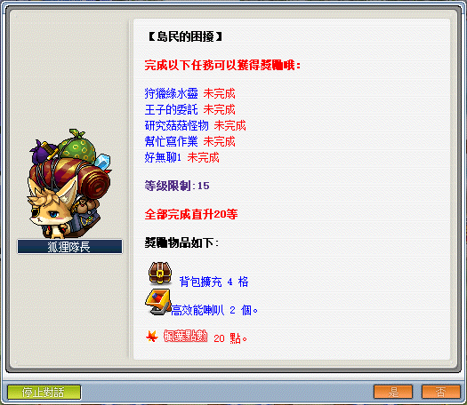
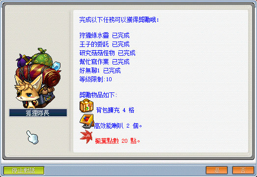

# 島民的困擾



```text
推薦一次接完此系列任務，因為打的怪物與道具有相關，可以加速解完任務！
此系列任務所需道具／怪物：
    - 活力藥水x1
    - 樹枝x70
    - 綠水靈 100 隻
    - 綠液球x70
    - 綠水靈珠x10
    - 磨菇芽孢x10
    - 菇菇寶貝傘x40
```

---

## 狩獵綠水靈

- 等級：Lv10
- 前置：無
- NPC 位置：維多利亞港 - 特奧
- 需求道具／怪物：綠水靈 100 隻

1. 到維多利亞港找到 NPC 特奧並接任務「狩獵綠水靈」。

    

2. 至魔法森林南郊，這有綠水靈和其它相關任務道具【綠液球／綠水靈珠／樹枝】。

    

    

3. 完成指定數量後，即可回去魔法森林找 NPC 賽恩回報任務。

    

---

## 王子的委託

- 等級：Lv10
- 前置：無
- NPC 位置：鯨魚號下層走廊 - 查理斯
- 需求道具／怪物：活力藥水x1

1. 到鯨魚號下層走廊找到 NPC 查理斯接取任務。

    

    

    

2. 查理斯任務需求道具。

    

3. 回到鯨魚號中央走廊，尋找雜貨商（就在隔壁）並購買任務道具。

    

    

4. 購買【活力藥水x1】。

    

5. 拎著任務道具回去找 NPC 查理斯回報任務即可。

    

---

## 研究菇菇怪物

- 等級：Lv10
- 前置：無
- NPC 位置：弓箭手村 - 布魯斯
- 需求道具／怪物：磨菇芽孢x10、菇菇寶貝傘x40

1. 到弓箭手村找到 NPC 布魯斯並接任務「研究菇菇怪物」。

    

2. 弓箭手村最左側傳送點進入可抵達弓箭手村訓練場 I。

    

3. 至弓箭手村訓練場 I 最上方爬上繩子可抵達地圖弓箭手村訓練場 II。
    - 任務道具【蘑菇芽孢】打菇菇仔獲得。
    - 任務道具【菇菇寶貝傘】打菇菇寶貝獲得。

    

4. 打完指定任務道具回去找 NPC 布魯斯回報任務即可。

    

---

## 幫忙寫作業

- 等級：Lv10
- 前置：無
- NPC 位置：魔法森林 - 維英
- 需求道具／怪物：樹枝x30、綠液球x30、綠水靈珠x10

1. 到魔法森林找到 NPC 妖精維英並接任務「幫忙寫作業」。

    

2. 至魔法森林南郊。
    - 任務道具【綠液球／綠水靈珠】打綠水靈獲得。
    - 任務道具【樹枝】打木妖獲得。

    

3. 打完指定任務道具回去找NPC妖精維英回報任務即可。

    

---

## 好無聊 1/2

### 好無聊 1

- 等級：Lv10
- 前置：無
- NPC 位置：墮落城市 - 伊卡洛斯

1. 到墮落城市找到 NPC 伊卡洛斯並接任務「好無聊」。
2. 回答三個問題。
3. 答案順序 5 > 4 > 1。

    

### 好無聊 2

- 等級：Lv10
- 前置：好無聊 1
- NPC 位置：墮落城市-伊卡洛斯
- 需求道具／怪物：樹枝x40、綠液球x40

1. 打完指定任務道具回去找 NPC 伊卡洛斯回報任務即可。

    

---

## 完成任務

以上任務完成即可去找狐狸隊長回報擴包任務。


