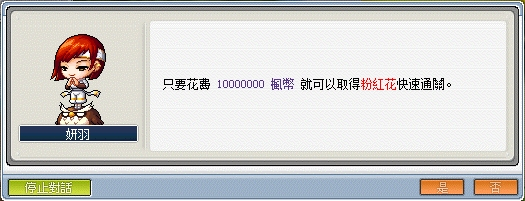
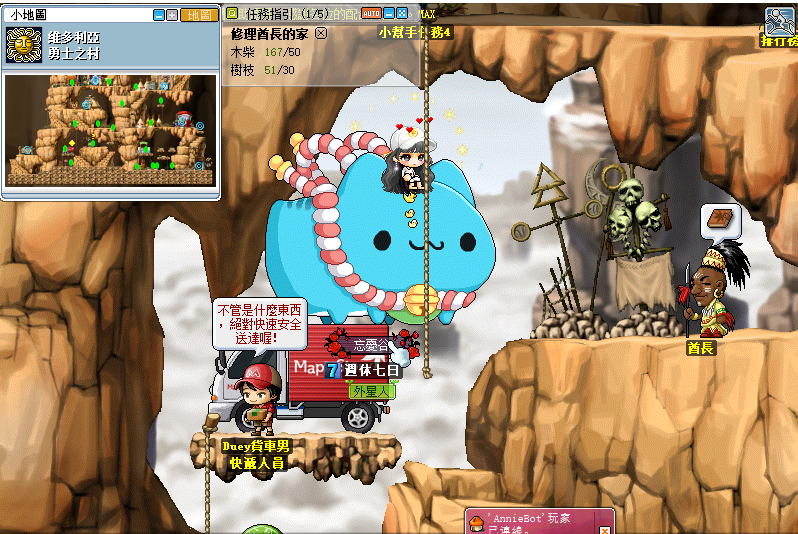

# 島民的請託


```text
此系列任務所需道具／怪物：
    - 粉紅花x10（需從奇幻村 - 奇怪的石像的忍耐沉睡森林獲得）
    - 綠菇菇傘x50
    - 藍水靈珠x50
    - 螺絲釘x5
        - 製作材料：鋼鐵x1、青銅x1
    - 木材x5
        - 製作材料：樹枝x10 或 木柴x5
    - 樹枝x30
    - 木柴x50
    - 蛇皮x100
    - 蝙蝠翅膀x10
    - 沙拉x1
```

---

## 約翰的粉紅花籃

- 等級：Lv15
- 前置：無
- NPC 位置：維多利亞港 - 約翰
- 需求道具／怪物：粉紅花x10（需從奇幻村-奇怪的石像的忍耐沉睡森林 1 獲得）

1. 到維多利亞港找到 NPC 約翰並接任務「約翰的粉紅花籃」。

    

2. 至奇幻村尋找 NPC 奇怪的石像，進入沉睡森林 1 完成忍耐，點擊最後地圖內的 NPC 花朵即可獲得任務道具【粉紅花 10 朵】。

    

    **如果不會跳忍耐／懶得跳忍耐的玩家也可以到自由市場入口左側進入時代主題公園，尋找NPC妍羽花錢通關忍耐任務！**

    

   1. 進入到時代廣場後往右走，在第二層的區域可以找到 NPC 妍羽。

        

   2. 我要快速通關忍耐任務。

        

   3. 選擇相對應的忍耐任務地圖（約翰的第一階段忍耐為沉睡森林1）。

        

   4. 需花費 ~~1000~~ 30 萬楓幣，即可獲得任務道具【粉紅花 10 朵】。

        

3. 拿到任務道具後，即可回去維多利亞港找 NPC 約翰回報任務。

    

    - 約翰給的【螺絲釘】要留著，後續任務會用到！
    - 背包的粉紅花不會回收，完成任務後可直接丟棄。

---

## 維多利亞港的特奧

- 等級：Lv15
- 前置：無
- NPC 位置：弓箭手村民宅 - 瑪亞

1. 到弓箭手村民宅找到 NPC 瑪亞並接任務「維多利亞港的特奧」。

    

    

2. 到維多利亞港找到NPC特奧並回報任即可完成任務。

    

---

## 休咪的請託

- 等級：Lv15
- 前置：瑪帕的請託
- NPC 位置：墮落城市 - 內拉 **NPC 是找內拉不是休咪**

1. 要先去墮落城市找內拉接取任務「瑪帕的請託」。

    

2. 內拉需求道具【綠菇菇傘x50／藍水靈珠x50】。

    - 【綠菇菇傘】可至西部岩山II打綠菇菇獲得。
       西部岩山 II 走法：到勇士之村最左側後，進入地圖勇士村西入口，往左走兩張圖後到地圖西部岩山I，走進最高處的傳送點就到了。

        

        

        

        

    - 【藍水靈珠】可至地鐵一號線[地區 01]打藍水靈獲得。

        

        

        

3. 打完以上任務道具後，即可回去墮落城市找 NPC 內拉回報任務並接續下一個任務。

    

4. 與NPC內拉接取任務「休咪的請託」。

    

5. 內拉需求任務道具【螺絲釘x5／木材x5】。

    - 是木材（加工過後的）不是木柴（怪物掉落物）。
    - 【木材／螺絲釘】可至墮落城市找後街吉姆兌換。

        

        - 在「約翰的粉紅花籃」有送螺絲釘 30 個，如果有留著的玩家即可直接完成！
        - 沒有螺絲釘的玩家可以拿【鋼鐵x1 + 青銅x1】跟吉姆兌換。
        - 礦石可由怪物獲得，詳細的相關怪物資訊可以從指令查詢 `@itemdrop`，獲得 10 個母礦後即可找勇士之村 NPC 辛德合成成品。

        

        - 以下為查詢道具的指令使用方法。

            1. 打 `@itemdrop` 會跳出搜尋視窗，打入需求的道具名稱（可以打關鍵字）。

                

            2. 選取自己要的道具。

                

            3. 即可找尋到與掉落物相關的怪物來源。

                

6. 兌換完指定任務道具後，回去找NPC內拉完成任務即可。

    

---

## 修理酋長的家

- 等級：Lv10
- 前置：無
- NPC 位置：勇士之村 - 酋長
- 需求道具／怪物：樹枝x30／木柴x50

1. 到勇士之村找到 NPC 酋長並接任務「修理酋長的家」。

    

2. 酋長需求任務道具【樹枝x30／木柴x50】。
    - 【樹枝】可至勇士之村東入口打木妖獲得。
    - 【木柴】可至東方岩石山 III 打斧木妖獲得。

3. 打完以上任務道具後，即可回去勇士之村找 NPC 酋長回報任務即可。

    

---

## 迷宮入口的守衛兵，魯克

- 等級：Lv15
- 前置：無
- NPC 位置：弓箭手村迷宮入口 - 魯克
- 需求道具／怪物：蛇皮x100／蝙蝠翅膀x10／沙拉x1


1. 與 NPC 魯克接任務「迷宮入口的守衛兵，魯克」。

    

2. 魯克需求任務道具【蛇皮x100／蝙蝠翅膀x10／沙拉x1】

    - 【蛇皮】可至青蛇濕地打青蛇獲得。

        - 青蛇濕地走法：

        1. 到墮落城市後，走到下水溝（超級綠水靈組隊任務旁邊）。

            

        2. 進入後到沼澤地 I 往右邊走會看到一個告示牌，進去就是隱藏地圖：青蛇濕地。

            

    - 【蝙蝠翅膀】可至地鐵內的轉乘區打蝙蝠獲得

        - 轉乘區走法

            1. 到墮落城市後，走到地鐵售票處進入傳送點。

                

            2. 往右邊走兩張圖會抵達地圖轉乘區。

                

    - 【沙拉】可至螞蟻礦坑找 NPC 24 小時排檔購買

        - 螞蟻礦坑走法

            1. 到維多利亞港找NPC五星級計程車即可抵達。

                

                

3. 打完以上任務道具後，即可回去弓箭手村迷宮入口找NPC魯克回報任務即可。

    

---

## 完成任務

以上任務完成即可去找狐狸隊長回報擴包任務。


