# 旅行的路上

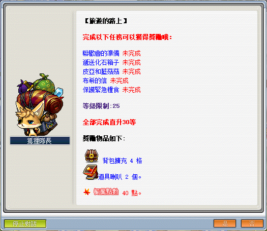

```text
此系列任務所需道具／怪物：
  - 蝴蝶結x100
  - 綠水靈珠x20
  - 藍水靈珠x50
  - 綠菇菇傘x40
  - 藍菇菇傘x40
```

---

## 聯歡會的準備

- 等級：Lv15
- 前置：明明夫人的第一個煩惱
- NPC 位置：弓箭手村 - 明明夫人
- 需求道具／怪物：蝴蝶結x100／綠水靈珠x20／藍水靈珠x50

1. 要先去弓箭手村找明明夫人接取任務「明明夫人的第一個煩惱」。

   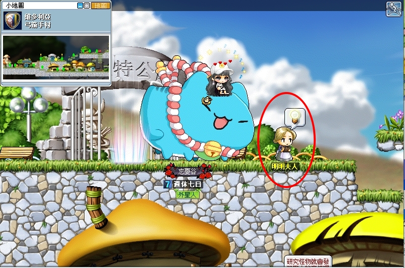

2. 明明夫人需求任務道具【蝴蝶結x100／綠水靈珠x20／藍水靈珠x50】 。

   - 【蝴蝶結】可至弓箭手訓練場 II 打緞帶肥肥獲得。
   - 【綠水靈珠】可至魔法森林北郊／南郊打綠水靈獲得。
   - 【藍水靈珠】可至地鐵一號線[地區 01]打藍水靈獲得。

3. 打完以上任務道具後，即可回去弓箭手村找 NPC 明明夫人回報並接續下一個任務。

   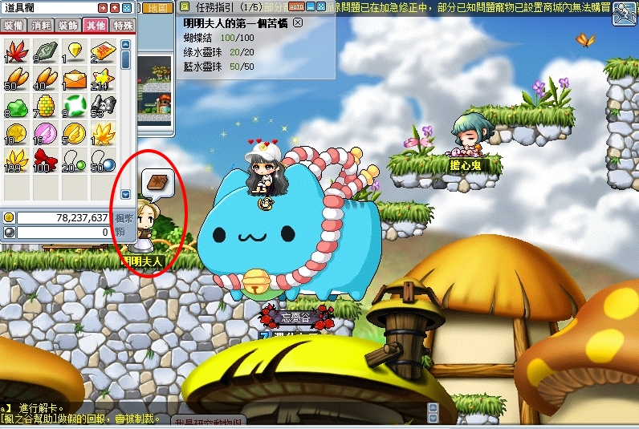

4. 繼續找NPC明明夫人接取任務「聯歡會的準備」，**這邊不需要打 NPC 明明夫人需求的道具。**。

   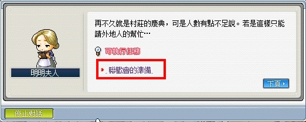

5. 至魔法森林南郊與 NPC 艾斯達對話即可完成任務。

   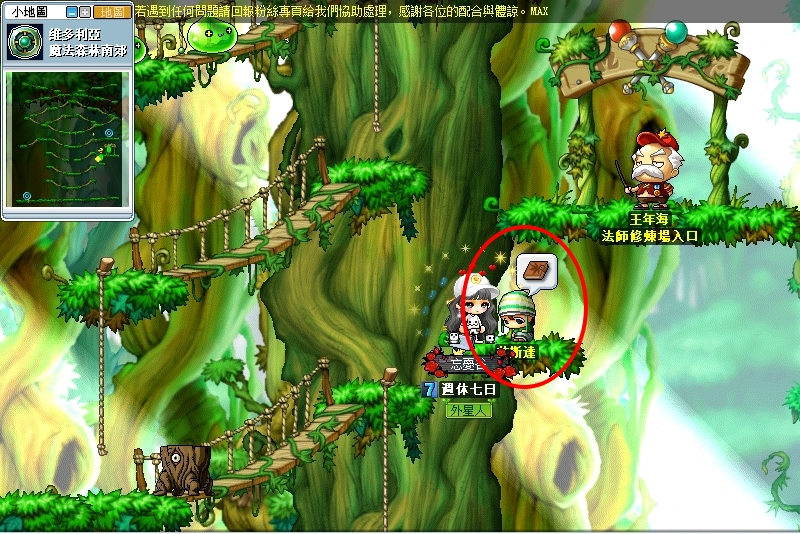

---

## 遞送化石箱子

- 等級：Lv20
- 前置：尋找化石
- NPC 位置：勇士之村東方岩石山 II - 溫斯頓
- 需求道具／怪物：動物骨化石x100／植物樹葉化石x100

   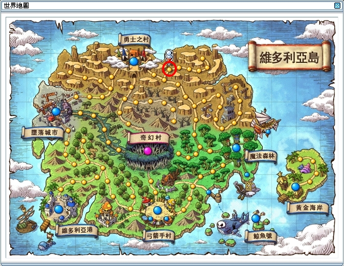

1. 要先去勇士之村東方岩石山 II 找溫斯頓接取任務「尋找化石」。

   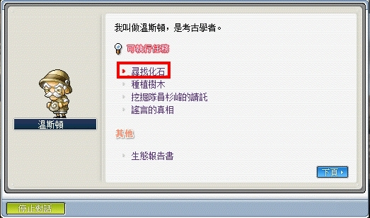

2. 溫斯頓需求任務道具【動物骨化石x100／植物樹葉化石x100】。

   - 【動物骨化石】可至西部岩山 II 打綠菇菇獲得。
   - 【植物樹葉化石】可至西部岩山 II 打斧木妖獲得。

   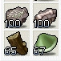

3. 完成以上指定任務道具後，即可返回東方岩石山 II 找溫斯頓回報任務並拿到兩個道具【溫斯頓的推薦書／化石箱】。

   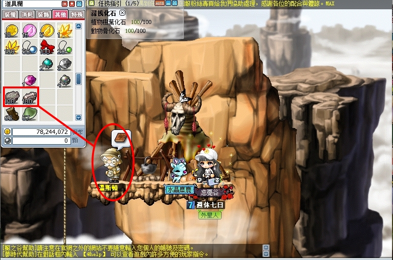

4. 前往魔法森林尋找 NPC 蓓蒂即可完成任務。

   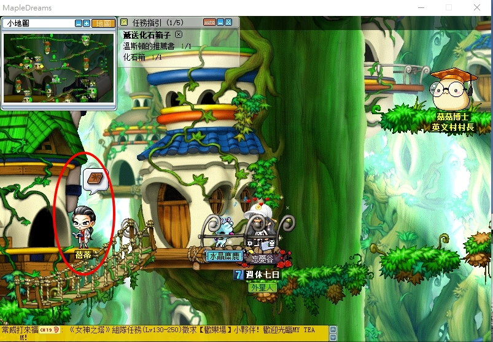

---

## 皮亞和藍菇菇

- 等級：Lv20
- 前置：無
- NPC 位置：弓箭手村邱比特公園 - 皮亞
- 需求道具／怪物：藍菇菇傘x40／綠菇菇傘x40

1. 去弓箭手村後，到邱比特公園往右邊走就會找到 NPC 皮亞並接取任務「皮亞和藍菇菇」。

   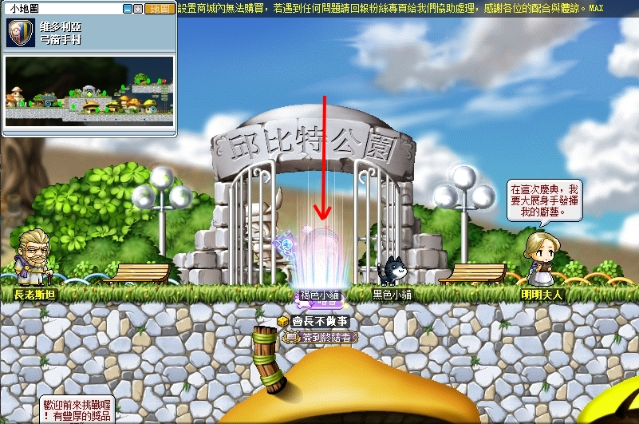

   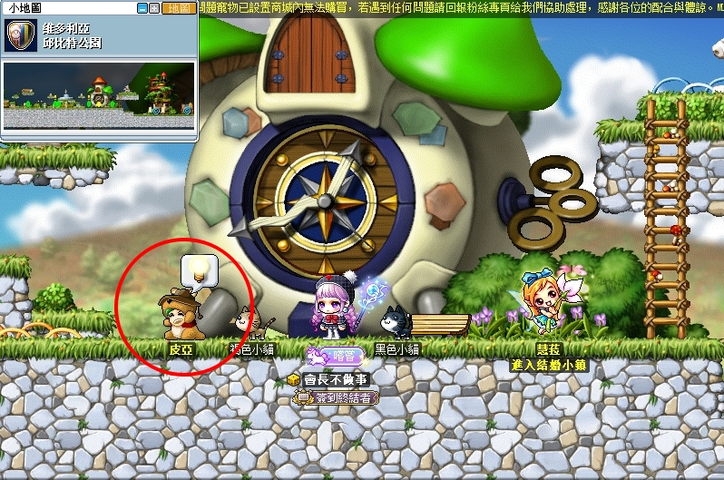

2. 皮亞需求任務道具【藍菇菇傘x40／綠菇菇傘x40】。

   - 【綠菇菇傘】可至西部岩山 II 打綠菇菇獲得

   - 【藍菇菇傘】可至石人寺院入口／藍菇菇森林打藍菇菇獲得。

      - 石人寺院入口走法：弓箭手村右上角 > 迷宮通道 > 弓箭手村迷宮入口 > 中間底部告示牌 > 石人寺院門外。

        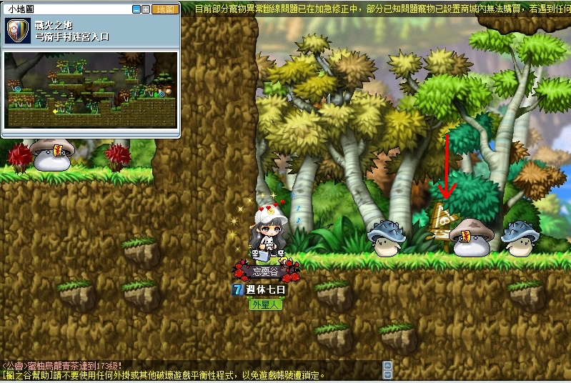

      - 藍菇菇森林走法：弓箭手村右下地圖 > 東部小山 > 東側草叢 > 東部森林。

        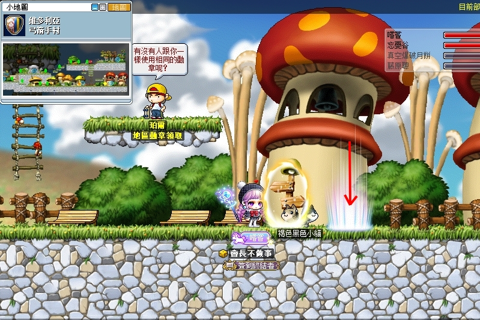

        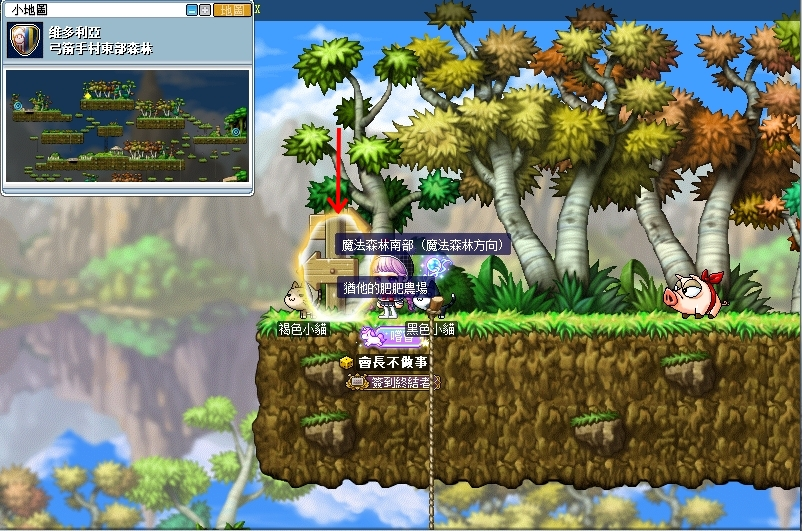

        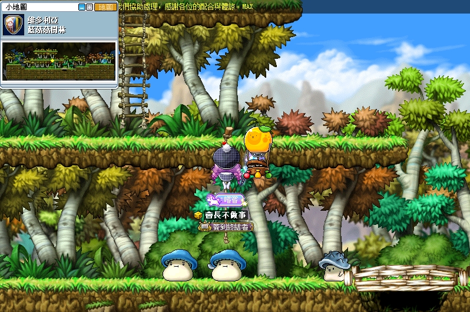

        到達弓箭手村東部森林後，爬至最高處會有個方向指示牌即為隱藏地圖「藍菇菇森林」。

3. 完成以上指定任務道具後，即可返回邱比特公園找皮亞回報即可完成任務。

   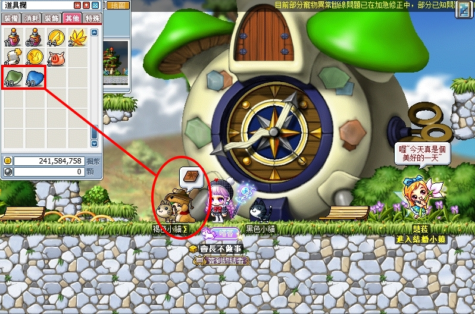

---

## 布希的信

- 等級：Lv20
- 前置：無
- NPC 位置：鯨魚號下層走廊動力機房 - 布希

1. 去鯨魚號後，到中央走廊往右邊走會看到下層走廊，到了之後往右邊走進入動力機房就會看到 NPC 布希並接取任務「布希的信」。

   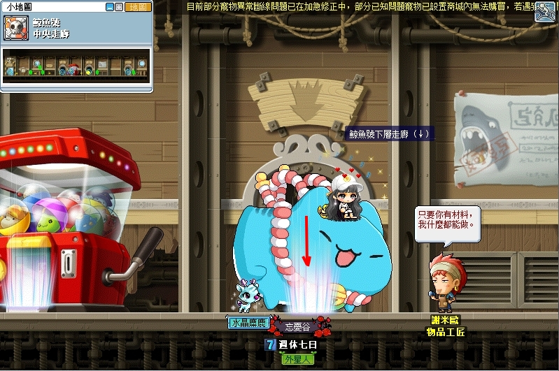

   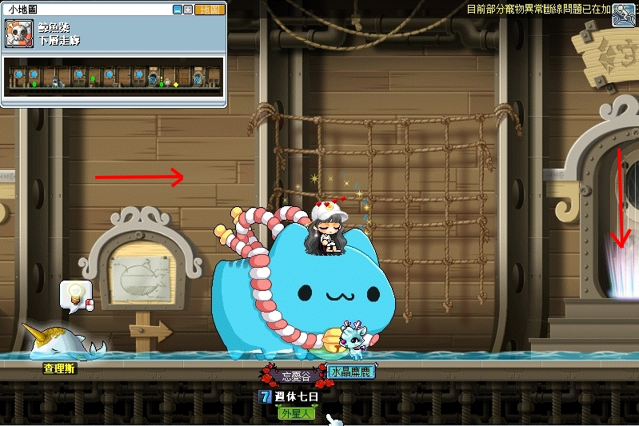

   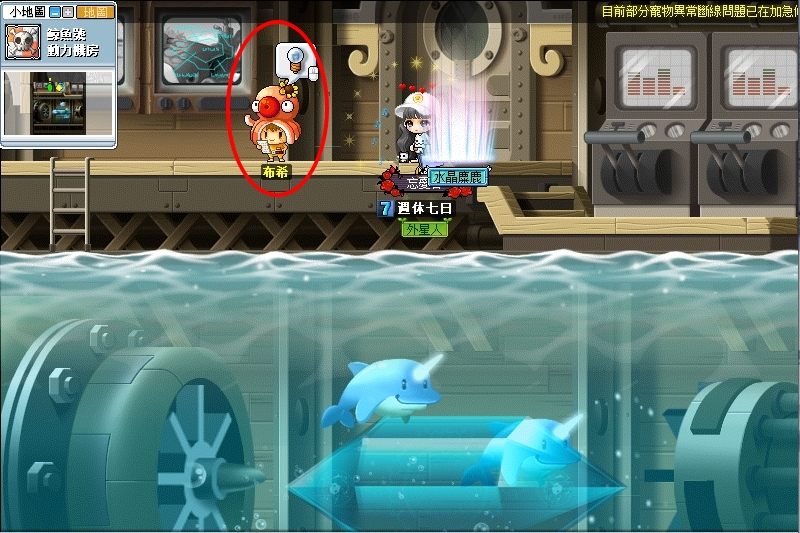

2. 前往水世界動物園尋找 NPC 坎特回報即可完成。

   - 前往水世界的方法 ⁠https://discord.com/channels/1023305944010063882/1025252421703847946
   - 任務完成後，任務道具【布希的信】不會被回收，佔位置可直接扔掉。

   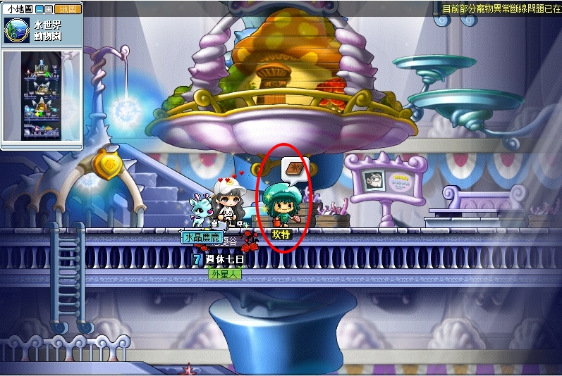

---

## 保護緊急糧食

- 等級：Lv20
- 前置：無
- NPC 位置：鯨魚號上層走廊廚房 - 湯寶寶
- 需求道具／怪物：肥肥 30 隻／緞帶肥肥 30 隻

1. 去鯨魚號後，到中央走廊往右邊走會看到上層走廊，進入之後往左邊走進入廚房就會看到 NPC 湯寶寶並接取任務「保護緊急糧食」。

   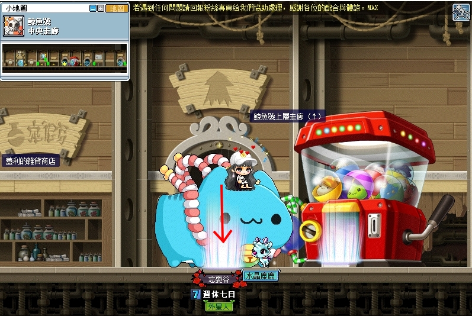

2. 湯寶寶需求任務怪物【肥肥 30 隻／緞帶肥肥 30 隻】。

   - 【肥肥／緞帶肥肥】可去弓箭手訓練場 II 打。

   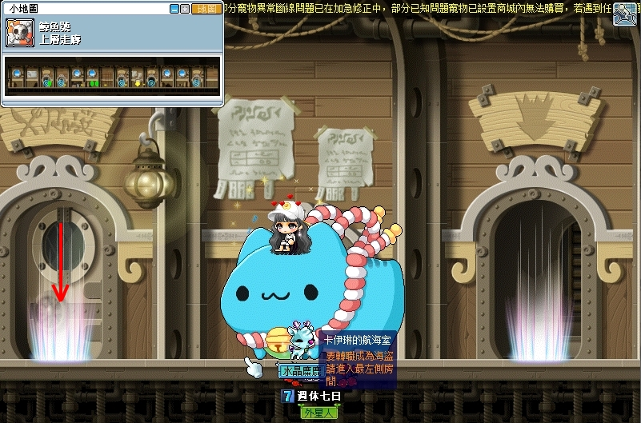

3. 完成指定數量後，即可返回鯨魚號上層走廊廚房找 NPC 湯寶寶回報即可完成任務。

   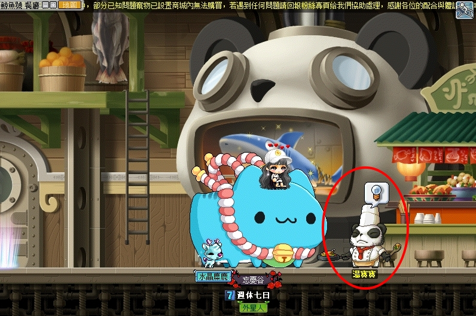

---

## 完成任務

以上任務完成即可去找狐狸隊長回報擴包任務。

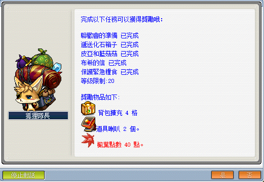
