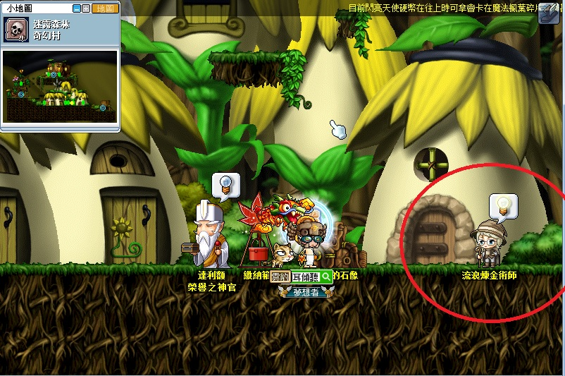
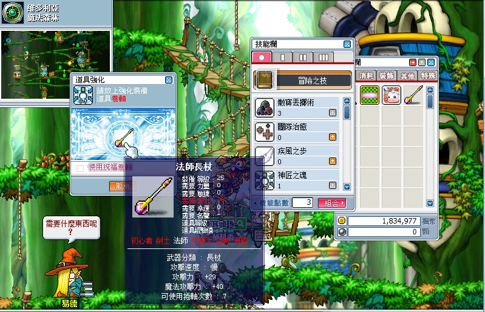
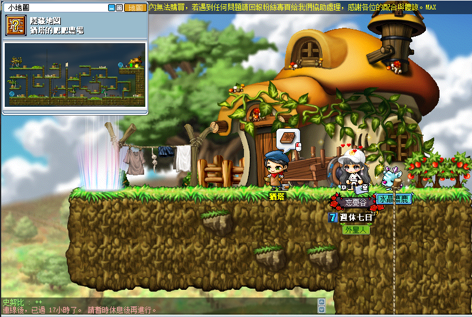

# 時代旅行者


```text
此系列任務所需道具／怪物：
    - 紅色鞭子x1
    - 100% 頭盔防禦捲軸x1
    - 100% 褲/裙防禦捲軸x1
    - 100% 上衣防禦捲軸x1
    - 100% 單手劍攻擊捲軸x1
    - 100 萬楓幣
    - 火獨眼獸尾巴x50
    - 風獨眼獸尾巴x50
    - 冰獨眼獸尾巴x50

接取任務後才可取得的道具或怪物擊殺數：
    - 玻璃鞋x1
```

---

## 流浪煉金術師的新技術（神匠之魂技能）

- 等級：Lv20
- 前置：無
- NPC 位置：奇幻村／玩具城／神木村 - 流浪煉金術師
- 需求道具／怪物
  - 紅色鞭子x1
  - 100% 頭盔防禦捲軸x1
  - 100% 褲/裙防禦捲軸x1
  - 100% 上衣防禦捲軸x1
  - 100% 單手劍攻擊捲軸x1
  - 100 萬楓幣

1. 首先找到流浪煉金術師。

    | 奇幻村               | 玩具城              | 神木村               |
    |---------------------|---------------------|---------------------|
    |  |  |  |

2. 流浪煉金術師所需物品。

    

3. 紅色鞭子打以下怪物會掉落。

    

4. 100% 卷軸從以下 NPC 商店取得：

    - 100% 頭盔防禦捲軸:
        - 大木林Ⅲ - 艾摩斯
        - 沼澤地Ⅱ - 杜卡斯
        - 愛奧斯塔 44 樓 - 彌爾格
        - 天空之巢路口 -諾曼
    - 100% 上衣防禦捲軸:
        - 大木林Ⅲ - 艾摩斯
        - 天空之塔 14 樓 - 巴倫
        - 愛奧斯塔 44 樓 - 彌爾格
        - 天空之巢路口 - 諾曼
    - 100% 褲/裙防禦捲軸:
        - 大木林Ⅲ - 艾摩斯
        - 沼澤地Ⅱ - 杜卡斯
        - 天空之塔 14 樓 - 巴倫
        - 愛奧斯塔 44 樓 - 彌爾格
        - 天空之巢路口 - 諾曼
    - 100% 單手劍攻擊捲軸:
        - 沼澤地Ⅱ - 杜卡斯
        - 天空之塔 14 樓 - 巴倫
        - 愛奧斯塔 44 樓 - 彌爾格
        - 天空之巢路口 - 諾曼

5. 交給流浪煉金術師後取得神匠之魂技能。

    

   獲得神匠之魂後，打開技能欄位「冒險之技」可以看到，可以用此項技能點**無法裝備上去**的裝備，且可直接打勾選擇是否使用祝福卷軸。需要注意的是如果身上有會預設打勾選擇使用，千萬小心。

    

---

## 卡蜜拉的玻璃珠

- 等級：Lv23
- 前置：無
- NPC 位置：弓箭手村 - 卡蜜拉

1. 要先去弓箭手村找卡蜜拉接取任務「卡蜜拉的玻璃珠」。

    

2. 前往猶塔的肥肥農場。

    - 猶塔的肥肥農場走法

        - 弓箭手村右下 > 東部小山 > 東側草叢 > 東部森林，

        - 到弓箭手村東部森林後爬到地圖左上角就到了。

            

3. 進入猶塔的肥肥農場

    

    - 每個稻草箱上都有個傳點，每一區只有一個傳點是正確的，被傳回原點的傳點一定是錯誤的，

    - 小撇步 : 去找每個區域的離你最遠的稻草堆。

4. 目標是要到最右上角跟 NPC 猶塔講話。

    

    懶人地圖包 : 正確的已經用紅圈圈起來

    

5. 到右上跟 NPC 猶塔對話即可完成任務。

    - 任務完成後，任務道具【閃爍玻璃球】不會被回收，佔位置可直接扔掉。

    

---

## 特殊料理 3

- 等級：特殊料理 3 (以下為特殊料理1/2/3需求等級和前置)
- 前置：特殊料理 1/2/3
- NPC 位置：鯨魚號上層走廊廚房 - 湯寶寶
- 需求道具／怪物：
  - 特殊料理1 > 火獨眼獸尾巴x40
  - 特殊料理2 > 風獨眼獸尾巴x50
  - 特殊料理3 > 冰獨眼獸尾巴x50

1. 去鯨魚號後，到中央走廊往右邊走會看到上層走廊，到了之後往左邊走進入廚房就會看到 NPC 湯寶寶並接取任務「特殊料理 1」。

    

2. 特殊料理 1 湯寶寶要求要打【火獨眼獸之尾巴x40】。

3. 特殊料理 2 湯寶寶要求要打【風獨眼獸尾巴x50】。

4. 特殊料理 3 湯寶寶要求要打【冰獨眼獸尾巴x50】。

    - 【火獨眼獸之尾巴】可去黑森林狩獵場 I 找火獨眼獸打。

        - 黑森林狩獵場 I 走法：奇幻村最左側 > 黑森林通道往下 > 黑森林狩獵場 I

            

    - 【風獨眼獸尾巴】可去黑森林狩獵場 I 或 II 打風獨眼獸獲得。

        - 黑森林狩獵場 II 走法：奇幻村最左側 > 黑森林通道往下 > 黑森林狩獵場 I 右上繩子爬上去 > 黑森林狩獵場 II。

            

    - 【冰獨眼獸尾巴】可去森林迷宮III打冰獨眼獸獲得。

        - 森林迷宮III走法：奇幻村 > 流浪煉金術師旁的房子 > 森林迷宮I 最下方繩子> 森林迷宮 II 最下方繩子 > 森林迷宮 III。

            

            

            

            

        - 小撇步 : 因為地圖過大爬上爬下太花時間，推薦直接換頻道（可以直接回最上方）。

5. 每次收集完任務道具即可返回餐廳找 NPC 湯寶寶回報即可完成任務。

    

---

## 懶惰的瞌睡蟲

- 等級：Lv25
- 前置：無
- NPC 位置：鯨魚號中央走廊 - 巴勒圖
- 需求道具／怪物：火獨眼獸尾巴x10

1. 去鯨魚號後，到中央走廊往右邊走會看到 NPC 巴勒圖並接取任務「懶惰的瞌睡蟲」。

    

2. 巴勒圖需求道具【火獨眼獸尾巴x10】。

    

3. 打完任務指定道具後，拿著【火獨眼獸尾巴x10】去找中央走廊最右邊的 NPC 瞌睡蟲回報即可完成任務。

    

---

## 艾溫的玻璃鞋

- 等級：Lv25
- 前置：無
- NPC 位置：魔法森林 - 妖精艾溫
- 需求道具／怪物：玻璃鞋x1

1. 去魔法森林藥水店右側會看到 NPC 妖精艾溫並接取任務「艾溫的玻璃鞋」。

    

2. 艾溫需求任務道具【玻璃鞋x1】。

    - 【玻璃鞋】可至火焰之地 I／火焰之地 II 打火肥肥有機率掉落

        - 火焰之地 I 的火肥肥數量較少／火焰之地 II 的火肥肥數量較多但是會有一隻鋼鐵肥肥，新手遇到打不動就盡量迴避那隻。

        - 火焰之地走法：勇士之村右下角 > 幽深的峽谷 I > 幽深的峽谷 2 中間 > 火焰之地 I > 火焰之地 II

            

    - 有掉落物提示的才是任務需要的

        | 玻璃鞋               | 晚會用玻璃鞋         |
        |---------------------|---------------------|
        |  |  |

3. 打完任務指定道具後，回去魔法森林 NPC 妖精艾溫回報即可完成任務。

    - 「艾溫的玻璃鞋」為重複任務，解完一次即可。

    

---

## 完成任務

以上任務完成即可去找狐狸隊長回報擴包任務。


