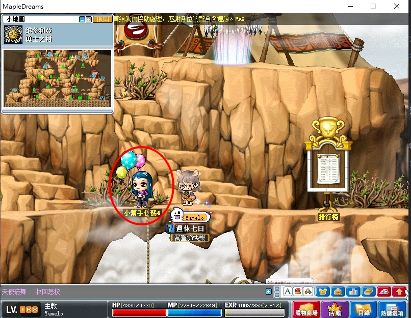

# 時代的開端


```text
注意：此系列需要按照順序解完。
```

---

## 楓之谷知識家-維多利亞港

- 等級：Lv10
- 前置：無
- NPC 位置：維多利亞港


答題順序 1 > 2 > 1。

---

## 楓之谷知識家-弓箭手村

- 等級：Lv10
- 前置：楓之谷知識家 - 維多利亞港
- NPC 位置：維多利亞港


答題順序 1 > 3 > 3。

---

## 楓之谷知識家-魔法森林

- 等級：Lv10
- 前置：楓之谷知識家 - 弓箭手村
- NPC 位置：維多利亞港


答題順序 3 > 4 > 1。

---

## 楓之谷知識家-勇士之村

- 等級：Lv10
- 前置：楓之谷知識家 - 魔法森林
- NPC 位置：維多利亞港



答題順序 4 > 1 > 4。

---

## 楓之谷知識家-墮落城市

- 等級：Lv10
- 前置：楓之谷知識家 - 勇士之村
- NPC 位置：維多利亞港


答題順序 2 > 4 > 1。

---

## 楓之谷知識家-鯨魚號

- 等級：Lv10
- 前置：楓之谷知識家 - 墮落城市
- NPC 位置：維多利亞港


答題順序 4 > 1 > 4。

---

## 完成任務

以上任務完成即可去找狐狸隊長回報擴包任務。


