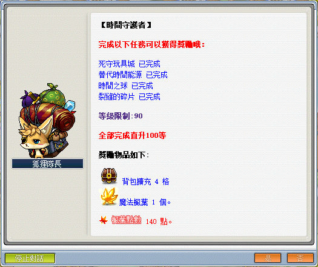

# 時間守護者


```text
此系列任務所需道具／怪物：
  - 綠色心臟x1000
```

---

- 【綠色心臟】可至回憶之路 4、回憶之路 5 打回憶的守護隊長獲得。
- 三扇門（回憶之路前面入口）走法：神木村 > 往天空之城的碼頭的最上方 > 克隆 > 往右飛到底至時間神殿 > 三扇門。

1. 向克隆對話。

    

2. 選擇「我想變成一隻龍」。

    

3. 往右飛到底。

    

    

4. 抵達。

    

5. 至三扇門找 NPC 神殿管理人講話接取任務「過去之路」。

    

6. 持續對話到接到「踏上回憶之路的人 1」。

    

7. 依序打倒指定數量怪物並回到三扇門找 NPC 神殿管理人接下一個任務，直至接到「踏上回憶之路的人 4」。

    | 踏上回憶之路的人 1  | 踏上回憶之路的人 2  | 踏上回憶之路的人 3  | 踏上回憶之路的人 4  |
    |:-----------------:|:-----------------:|:-----------------:|:-----------------:|
    | 回憶的祭司         | 回憶的神官          | 回憶的守護兵       | 回憶的守護隊長      |
    |    |    |  |  |

8. 進入回憶之路 4 後即可打回憶的守護隊長取得綠色心臟，若是覺得怪物數量太少可以解完「踏上回憶之路的人 4 」並接取任務「踏上回憶之路的人 5」，進入回憶之路 5 會有較多的回憶的守護隊長。

---

## 完成任務

以上任務完成即可去找狐狸隊長回報擴包任務，並可開啟每日狐狸隊長的商店。


