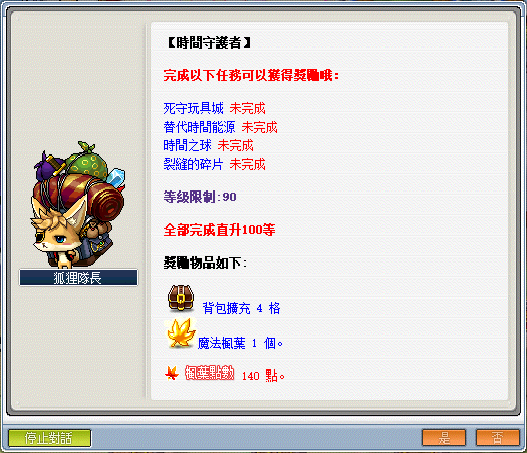
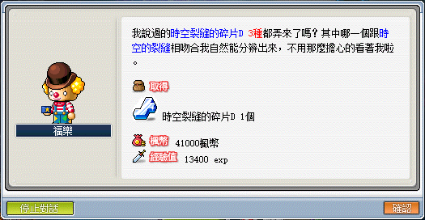

# 時間守護者



```text
此系列任務所需道具／怪物：

接取任務後才可取得的道具或怪物擊殺數：
    - 泰可因x330
    - 神秘粉末x100
```

---

## 死守玩具城

- 等級：Lv90
- 前置：無
- NPC 位置：鐘塔最下層 - 時間通道
- 需求道具／怪物
  - 泰可因x10

1. 到鐘塔最下層 - 時間通道最下方與 NPC 皮耶魯先生對話，接取任務「死守玩具城」。

    | 鐘塔最下層 - 時間通道 | 鐘塔最下層 - 時間通道  | 死守玩具城           |
    |---------------------|---------------------|---------------------|
    |      |      |      |

2. 收集完任務道具【泰可因x10】後，回鐘塔最下層 - 時間通道最下方與 NPC 皮耶魯先生對話，回報並完成任務【死守玩具城】。

    - 【泰可因】除了通道守門人、達納托斯外，其餘玩具城地城所有怪物皆會掉落。

    - 不要先多打「替代時間能源」任務所需要的數量，兩個任務所需要的【泰可因】道具代號不同。

        

    | 泰可因           | 任務所需道具     |
    |-----------------|-----------------|
    |  |  |

## 替代時間能源

- 等級：Lv90
- 前置：死守玩具城
- NPC 位置：鐘塔最下層 - 時間通道
- 需求道具／怪物
  - 泰可因x300
  - 神秘粉末x100

1. 到鐘塔最下層 - 時間通道最下方與 NPC 皮耶魯先生對話，接取任務「替代時間能源」。

    

2. 收集完任務道具【泰可因x300】、【神秘粉末x100】後，回鐘塔最下層 - 時間通道最下方與 NPC 皮耶魯先生對話，回報並完成任務【替代時間能源】。

    - 【泰可因】除了通道守門人、達納托斯外，其餘玩具城地城所有怪物皆會掉落。
    - 【神秘粉末】由多立百烈、怨靈發條熊隊長掉落。
        - 怨靈發條熊隊長掉落道具【束縛枷鎖】可以保留 20 個，擴包任務系列「失落的力量 - 束縛的枷鎖」會用到。
    - 可以從地城中打相同怪物取得，建議開啟掉寶八倍。

    | 泰可因、神秘粉末  | 替代時間能源     |
    |-----------------|-----------------|
    |  |  |

## 時間之球

- 等級：Lv90
- 前置：替代時間能源
- NPC 位置：鐘塔最下層 - 時間通道
- 需求道具／怪物
  - 時空裂縫的碎片Dx1

1. 到鐘塔最下層 - 時間通道最下方與 NPC 皮耶魯先生對話，接取任務「時間之球」。

    

2. 接著向左方 NPC 福樂對話並接取任務「裂縫的碎片」。

    

3. 收集【時空裂縫的碎片 A】、【時空裂縫的碎片 B】、【時空裂縫的碎片 C】各一個。

    - 時空裂縫的碎片 A、B、C 由怨靈女巫、巨人維京掉落。

    - 巨人維京位於時間通道中的扭曲的時間之路 <4>，於紅圈黃圈點進入隱藏地圖 <糾結的時間>。

    - 怨靈女巫則是在時間通道的遺忘的時間之路 <4>，於紅框黃圈點進入隱藏地圖 <禁忌的時間>。

    - 備註：時空裂縫的碎片 B 很好打，A 不太好打，C 較難打，掉落率如下：

        

    

4. 收集完任務道具後交給 NPC 福樂，並取得【時空裂縫的碎片 D】。

    | 回報任務               | 取得【時空裂縫的碎片 D】 |
    |-----------------------|-----------------------|
    |  |  |

5. 取得【時空裂縫的碎片 D】後，與 NPC 皮耶魯先生對話，回報並完成任務【時間之球】。

    

---

## 完成任務

以上任務完成即可去找狐狸隊長回報擴包任務，並可開啟每日狐狸隊長的商店。
