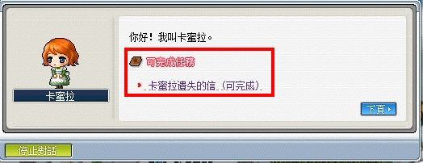
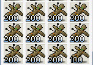

# 秘密挖掘者


```text
此系列任務所需道具／怪物：
    - 肥肥頭x5
    - 風獨眼獸之尾巴x50
    - 蝙蝠翅膀x50
    - 堅硬的羽毛x50
    - 香蕉x97
    - 詛咒娃娃x2300
    - 可可果實x57
    - 紅螃蟹鉗x270
    - 青螃蟹鉗x140
    - 鑽石x1
    - 木材x10
```

---

## 神秘書的線索

- 等級：Lv30
- 前置：無
- NPC 位置：奇幻村高級桑拿室 - 泰實夫

1. 要先去奇幻村高級桑拿室找 NPC 泰實夫接取任務「神秘書的線索」。

    

2. 與旅館服務員對話，選高級桑拿室即可進入看到 NPC 泰實夫。

    | 奇幻村高級桑拿室  | 泰實夫           |
    |-----------------|-----------------|
    |  |  |

3. 前往到魔法森林北部並進去第一個樹洞。

    | 魔法森林北部      | 第一個樹洞       |
    |-----------------|-----------------|
    |  |  |

4. 爬到樹洞最上面就會看見泰實夫的兒子 - 洛尼並回報任務。

    - 回報後「神秘書的線索」就完成了，但是後續任務「飢餓的洛尼」為其他擴包的前置，所以要繼續解完。

5. 繼續與洛尼對話並接任務「飢餓的洛尼」。

### 飢餓的洛尼

- 等級：Lv30
- 前置：神秘書的線索
- NPC 位置：北部森林通道 - 洛尼
- 需求道具／怪物：
  - 鑽石x1
  - 風獨眼獸之尾巴x50
  - 肥肥頭x5
  - 香蕉x50
  - 麗娜的特製烤鰻魚x1
  - 新鮮的牛奶x1

1. 【新鮮的牛奶】要去魔法森林找 NPC 妖精羅雯完成任務。

    

2. 獲得任務指定道具後，回去魔法森林找 NPC 妖精羅雯回報即可拿到【新鮮的牛奶】。

    

3. 【麗娜的特製烤鰻魚x1】要去弓箭手村找 NPC 麗娜完成任務。

    - 需求道具：風獨眼獸之尾巴x50、肥肥頭x5

    

4. 獲得任務指定道具後，回去弓箭手村找 NPC 麗娜回報即可拿到【麗娜的特製烤鰻魚x1】。

    

5. 【香蕉】可至猴子森林 I 打猴子獲得

    - 猴子森林I走法：魔法森林 > 魔法森林南郊 > 智慧森林中間樹洞往上傳送到底後，最左上的樹洞進入 > 猴子森林 I

    | 智慧森林           | 智慧森林           | 猴子森林 I         |
    |-------------------|-------------------|-------------------|
    |  |  |  |

6. 打完任務指定道具後，回去魔法森林北部的北部森林通道找 NPC 洛尼回報即可拿到【神祕書】。

    

7. 回到奇幻村高級桑拿室找 NPC 泰實夫回報即可完成任務。

---

## 伊卡路斯的滑翔翼

- 等級：Lv32
- 前置：好無聊
- NPC 位置：墮落城市 - 伊卡路斯
- 需求道具／怪物：蝙蝠翅膀x50、木材x10、堅硬的羽毛x50

1. 要先去墮落城市找 NPC 伊卡路斯接取任務「 伊卡路斯的滑翔翼」。

    

2. 與伊卡路斯聊天。

3. 伊卡路斯想要道具【蝙蝠翅膀x50/木材x10/堅硬的羽毛x50】

    - 是木材(加工過後的) 不是木柴 (怪物掉落物)

        - 【蝙蝠翅膀】可至地鐵內的轉乘區打蝙蝠獲得。

        - 【木材】可至墮落城市找後街吉姆兌換。

        - 【堅硬的羽毛】掉落怪物 (僅供參考，後面還有很多怪物會掉落)

            

4. 打完任務指定道具後，回去墮落城市找 NPC 伊卡路斯回報即可完成任務。

    

---

## 卡蜜拉遺失的信

- 等級：Lv32
- 前置：無
- NPC 位置：弓箭手村 - 卡蜜拉
- 需求道具／怪物：寄給卡蜜拉的信x1

1. 要先去弓箭手村找 NPC 卡蜜拉接取任務「卡蜜拉遺失的信」。

    

2. 【寄給卡蜜拉的信】可至黑森林狩獵場 II 打風獨眼獸機率性獲得。

    

3. 打完任務指定道具後，回去弓箭手村找 NPC 卡蜜拉回報即可完成任務。

    

---

## 收集 1000 個詛咒娃娃

- 等級：Lv35
- 前置：飢餓的洛尼、收集詛咒娃娃系列
- NPC 位置：魔法森林 - 妖精羅雯
- 需求道具／怪物：詛咒娃娃共需要 2300 隻（每個任務分別要 100／200／400／600／1000 隻）

1. 要先去魔法森林找 NPC 妖精羅雯接取任務「收集100個詛咒娃娃」。

    - 【詛咒娃娃】可至猴子森林 II 打天使猴獲得。

    

2. 打完任務指定道具後，回去魔法森林找NPC妖精羅雯回報並重複接取後續的任務即可。

    

---

## 黃金海灘的特別風味 IV

- 等級：Lv35
- 前置：黃金海灘的特別風味 I、黃金海灘的特別風味 II、黃金海灘的特別風味 III
- NPC 位置：黃金海灘 - 麗爾
- 需求道具／怪物：
  - 黃金海灘的特別風味 I
    - 可可果實x10
  - 黃金海灘的特別風味 II
    - 可可果實x12
    - 香蕉x12
    - 紅螃蟹鉗x130
  - 黃金海灘的特別風味 III
    - 可可果實x25
    - 香蕉x25
    - 紅螃蟹鉗x130
    - 青螃蟹鉗x130
  - 黃金海灘的特別風味 IV
    - 可可果實x10
    - 香蕉x10
    - 紅螃蟹鉗x10
    - 青螃蟹鉗x10

1. 要先去維多利亞港找 NPC 佩森前往黃金海灘。

    | 維多利亞港       | 佩森             |
    |-----------------|-----------------|
    |  |  |

2. 抵達後找中間的女孩 NPC 麗爾接取任務「黃金海灘的特別風味」

   - 【可可果實】可以從黃金海岸的任何一張野圖敲（普通攻擊）椰子樹獲得。

   - 建議這邊敲果實前先調整畫質！可以敲的果實會清楚很多，

   - 調整畫質的方式

        - 打開「目錄」（右下角）選擇「系統選項」。

            

        - 「畫面調整」拉到最低。

            

        - 就可以分辨出可以敲的果實！

            

3. 打完任務指定道具後，回去黃金海灘找 NPC 麗爾回報並接取下一個任務「黃金海灘的特別風味 II」。

    - 【紅螃蟹鉗】可至熱帶沙灘打紅螃蟹掉落。

        

    - 「黃金海灘的特別風味」任務的文字敘述與實際要求數量不同，不要打錯！以任務指引的數量為主！

        

4. 打完任務指定道具後，回去黃金海灘找NPC麗爾回報並接取下一個任務「黃金海灘的特別風味 III」。

    - 【青螃蟹鉗】可至青螃蟹海灘I/II/海龜沙灘打青螃蟹掉落。

    

5. 打完任務指定道具後，回去黃金海灘找NPC麗爾回報並接取下一個任務「黃金海灘的特別風味 IV」。

    

6. 打完任務指定道具後，回去黃金海灘找NPC麗爾回報即可完成任務。

    

---

## 完成任務

以上任務完成即可去找狐狸隊長回報擴包任務。


