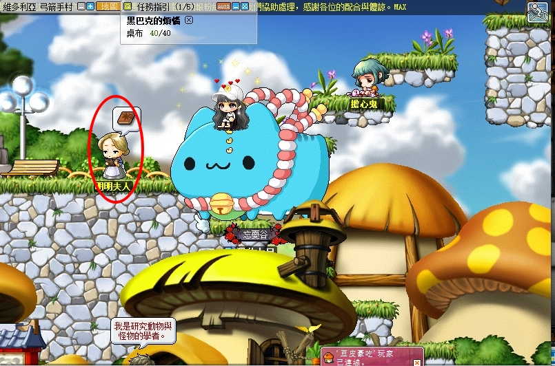

# 聲音傳播者


```text
此系列任務所需道具／怪物：
    - 石塊x100
    - 螺絲釘x30
    - 木材x30
    - 桌布x40
    - 藍色花 20 朵（需從奇幻村 - 奇怪的石像的忍耐沉睡森林獲得）
    - 休咪的鈔票（需從墮落城市地鐵的工地 B2 忍耐獲得）

接取任務後才可取得的道具或怪物擊殺數：
    - 酋長的地契x1
```

---

## 酋長蓋房子

- 等級：Lv30
- 前置：修理酋長的家 + 名聲 10
- NPC 位置：勇士之村 - 酋長
- 需求道具／怪物：石塊x100、螺絲釘x30、木材x30、酋長的地契x1

1. 要先去勇士之村找 NPC 酋長接取任務「酋長蓋房子」。

    

2. 酋長需求道具【石塊x100、螺絲釘x30、木材x30、酋長的地契x1】

    - 【石塊】可至石人寺院入口打石巨人掉落

        - 石人寺院入口走法：弓箭手村右上角 > 迷宮通道  > 弓箭手村迷宮入口 > 中間底部告示牌 >  石人寺院門外（藍菇菇的推薦地圖） > 石人寺院入口

    - 【酋長的地契】可至黑森林狩獵場II打風獨眼獸機率性獲得。

        

3. 打完任務指定道具後，回去勇士之村找 NPC 酋長回報即可完成任務。

    

---

## 黑巴克的煩惱

- 等級：Lv30
- 前置：無
- NPC 位置：鯨魚號會議室 - 黑巴克
- 需求道具／怪物：桌布x40

1. 要先去鯨魚號中央走廊，往左走即可看到會議室，進入尋找 NPC 黑巴克接取任務「黑巴克的煩惱」。

    

2. 黑巴克需求道具【桌布x40】。

    - 【桌布】可至墮落城市地鐵一號線[地區 02] 打小幽靈會掉落。

3. 打完任務指定道具後，去弓箭手村找 NPC 明明夫人回報即可完成任務。

    

---

## 給金博士的情報

- 等級：Lv30
- 前置：無
- NPC 位置：鯨魚號中央走廊 - 老學者

1. 要先去鯨魚號中央走廊，往左走即可看到 NPC 老學者並接取任務「給金博士的情報」。

    

    - 建議要走太遠的任務都直接使用「任意門高級券」節省時間，
    - 「任意門高級券」使用方式：打開世界地圖找到要前往的區域，點擊圖片中的圓點一下就會跳出相關的任意門高級券使用警語，確定前往此區域即可到達。
    - 地球防衛總部走法：從玩具城出發，往左走到愛奧斯塔，從愛奧斯塔 100 層開始向下走到第1層出去，離開愛奧斯塔區域就會看到地球防衛總部。

        

2. 金博士的位置在地球防衛總部 - 司令室內。

    

    

    

3. 找到金博士後回報即可完成任務。

    - 任務完成後，任務道具【老學者委託的材料】不會被回收，佔位置可直接扔掉。

    

---

## 約翰的禮物

- 等級：Lv30
- 前置：約翰的粉紅花籃
- NPC 位置：維多利亞港 - 約翰
- 需求道具／怪物：藍色花 20 朵（需從奇幻村 - 奇怪的石像的忍耐沉睡森林獲得）

1. 到維多利亞港找到 NPC 約翰並接任物「約翰的禮物」。

2. 至奇幻村尋找 NPC 奇怪的石像，進入沉睡森林 2 完成忍耐，點擊最後地圖內的 NPC 花朵即可獲得任務道具【藍色花 20 朵】。

    

    - 如果不會跳忍耐／懶得跳忍耐的玩家也可以到自由市場入口左側，進入時代主題公園，尋找 NPC 妍羽花錢通關忍耐任務！

    - 花錢通關需花費 ~~2000~~ 60 萬楓幣，即可獲得任務道具【藍色花 20 朵】。

        

3. 得到任務指定道具後，回去維多利亞港找 NPC 約翰回報即可完成任務。

   - 任務完成後，任務道具【藍色花】不會被回收，佔位置可直接扔掉。

   

---

## 休咪丟失的鈔票

- 等級：Lv30
- 前置：休咪遺失的硬幣
- NPC 位置：墮落城市地鐵前 - 休咪
- 需求道具／怪物：休咪的鈔票（需從墮落城市地鐵的工地 B2 忍耐獲得）

1. 到墮落城市找到 NPC 休米並接任務「休咪遺失的硬幣」。

    

2. 進入地鐵後，找 NPC 地鐵站服務員購買【工地 B1】的票。

    

    

3. 獲得【工地 B1 門票】後與 NPC 檢票口（最右邊那台）講話並進入忍耐地圖工地 B1。

    

4. 完成忍耐並點擊最後一關的寶箱即可獲得任務道具【休咪的金幣】，回到墮落城市尋找 NPC 休咪回報任務即可完成。

    

5. 繼續跟 NPC 休米並接任務「休咪丟失的鈔票」。

6. 進入地鐵後，找NPC地鐵站服務員購買【工地 B2】的票。

    

7. 獲得【工地 B2 門票】後與NPC檢票口（最右邊那台）講話並進入忍耐地圖工地 B2。

8. 完成忍耐並點擊最後一關的寶箱即可獲得任務道具【休咪的鈔票】，回到墮落城市尋找 NPC 休咪回報任務即可完成。

    - 如果不會跳忍耐／懶得跳忍耐的玩家也可以到自由市場入口左側，進入時代主題公園，尋找 NPC 妍羽花錢通關忍耐任務！

        - 花錢通關 1 - 需花費 ~~1000~~ 30 萬楓幣，即可獲得任務道具【休咪的金幣】。

        - 花錢通關 2 - 需花費 ~~2000~~ 60 萬楓幣，即可獲得任務道具【休咪的鈔票】。

        

9. 得到任務指定道具後，回去墮落城市找NPC休咪回報即可完成任務。

    

## 完成任務

以上任務完成即可去找狐狸隊長回報擴包任務。


