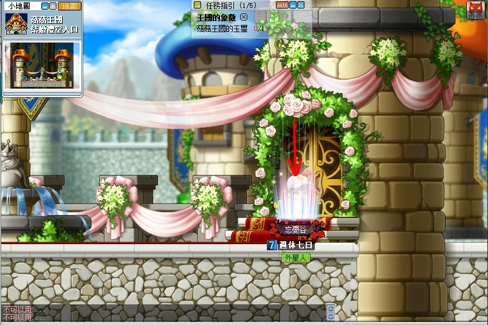
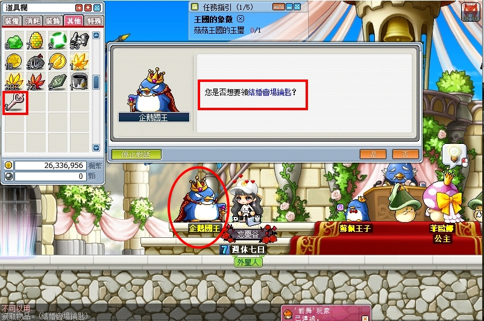

# 菇菇王國行


```text
此系列任務所需道具／怪物：
  -
```

## 任務說明

此系列要二轉後直接找自己的一轉轉職教官接取任務「危機的菇菇國王」才能開啟菇菇王國的任務。


- 接完任務會給你一封「轉職官的推薦書」，並幫你傳送過去菇菇王國。

    

- 選擇「是」。

    

- 跟 NPC 警衛隊長講話開啟菇菇王國的系列任務。

    | 警衛隊長         | 回報任務         |
    |-----------------|-----------------|
    |  |  |

菇菇王國自己去的方式：弓箭手村 > 計程車旁樹洞進入 > 菇菇公園左下 > 菇菇王國。

| 弓箭手村         | 菇菇公園         |
|-----------------|-----------------|
|  |  |

---

## 彩色菇菇芽孢 (3)

- 等級：Lv30
- 前置：危機的菇菇國王、勇士的考試、彩色菇菇芽孢 (1)、彩色菇菇芽孢 (2)
- NPC 位置：菇菇森林路口 - 警衛隊長
- 需求道具／怪物：
  - 勇士的考試：變種芽孢x50
  - 彩色菇菇芽孢 (1)：毒菇傘x100
  - 彩色菇菇芽孢 (2)：變種芽孢x50
  - 彩色菇菇芽孢 (3)：變種芽孢x50

1. 收集完【變種芽孢x50】後與 NPC 警衛隊長回報。

    

    - 【變種芽孢x50】可從幽靜的菇菇森林打叛徒菇菇仔獲得。

        

2. 與 NPC 樹木大臣對話。

    

3. 與 NPC 魔法大臣對話。

    

4. 與 NPC 思卡斯對話。

    

### 彩色菇菇芽孢 (1)

- 等級：Lv30
- 前置：以上的對話
- NPC位置：菇菇森林路口 - 思卡斯
- 需求道具：毒菇傘x100

1. 打完任務指定道具後，回去菇菇森林路口找 NPC 思卡斯回報。

   - 【毒菇傘】可從岔路打毒菇獲得。

        

   - 岔路從菇菇森林深處的最右邊藤蔓直接進去即可。

        

   - 回去菇菇森林路口可以直接使用回家卷軸，不會飛回弓箭手村。

        

### 彩色菇菇芽孢(2)

- 等級：Lv30
- 前置：以上的任務
- NPC位置：菇菇森林路口 - 思卡斯
- 需求道具：變種芽孢x50

1. 打完任務指定道具後，回去菇菇森林路口找 NPC 思卡斯回報。

    

    - 【變種芽孢】可從幽靜的菇菇森林打叛徒菇菇仔獲得。

    

2. 與 NPC 魔法大臣對話即可完成任務。

    

3. 與 NPC 樹木大臣對話就會開啟另一組任務。

    

---

## 跨越城牆 (4)

- 等級：Lv30
- 前置：以上的全部任務
- NPC位置：菇菇森林路口 - 樹木大臣
- 需求道具：中毒的肥肥尾巴x100


當解完以上任務之後消耗欄會多一個「彩色菇菇芽孢」道具，是使用在菇菇森林深處往岔路的魔法芽孢結界（但是其實沒有這罐還是可以直接通過，所以這瓶沒什麼用）。


1. 打完任務道具後，回去菇菇森林路口找 NPC 魔法大臣回報。

    

    - 【中毒的肥肥尾巴】可從筆陡的下坡 2 打中毒的肥肥獲得。
    - 筆陡的下坡 2 走法：先到岔路後走右下角的圖就會看到。

        | 岔路               | 筆陡的下坡 2       |
        |-------------------|-------------------|
        |  |  |

2. 回報完畢後即可獲得荊棘解除劑。

    

3. 前往城堡邊邊。

    

4. 進去後會自動使用【荊棘解除劑】並顯示任務完成，任務就結束了。

    

---

## 詹姆士的下落 (3)

- 等級：Lv30
- 前置：跨越城牆 (3)、詹姆士的下落 (1)、詹姆士的下落 (2)
- NPC位置：菇菇森林路口 - 警衛隊長
- 需求道具：頭盔企鵝王的頭盔x1

「王國的象徵」和「詹姆士的下落」一起解會比較順，不需要一直來回跑圖，如果嫌跑圖麻煩的人也可以善用【高級瞬移之石】。

### 詹姆士的下落 (1)

1. 與 NPC 警衛隊長對話即可完成。

    

2. 前往中央城塔找 NPC 詹姆士。

3. 先到城堡邊邊爬上藤蔓。

    - 只要跳上藤蔓+按上鍵，就可以爬上藤蔓。

        

    - 紅色線是可以爬的藤蔓。

        

        

    - 就會到城壁外部。

        

4. 從城壁外部這張圖開始往右邊走走到底。也就是瑪天路 1 走到瑪天路 5 就會抵達中央城塔。

5. 就會遇到 NPC 詹姆士，並接續任務「詹姆士的下落 (2)」

    

6. NPC 詹姆士任務需求道具。

    

    - 【頭盔企鵝王的頭盔】可以至瑪天路 3 打頭盔企鵝王獲得。

        

7. 打完任務指定道具後，回去中央城塔找 NPC 詹姆士回報即可完成任務。

    

---

## 陰謀背景

- 等級：Lv30
- 前置：跨越城牆 (3)、王國的象徵
- NPC位置：菇菇森林路口 - 菇菇國王

1. 先去找 NPC 樹木大臣接取「王國的象徵」任務。

    

2. 要去東邊城塔的組隊任務那邊進入才能繼續任務。

    - 東邊城塔走法：爬上藤蔓後到瑪天路那張圖開始往右走到最底部就會抵達。

3. 到傳送點按上，會跳出對話窗並選擇「拯救菲歐娜」。

    

4. 到結婚禮堂入口往右。

    

5. 進到結婚禮堂與企鵝國王對話拿取【結婚會場鑰匙】。

    - 請確保身上有額外的背包空位，如果沒有拿到鑰匙的確認好空位再對話一次。

    

6. 拿到鑰匙時會直接觸發下一個任務「菲歐娜在哪？」。

    

7. 接任務後會直接召喚怪物「總理大臣」出來。

    

    - 總理大臣就是上面「王國的象徵」任務的對象，擊敗它即可完成任務。

        

8. 撿取【菇菇王國的玉璽】，即可完成任務「王國的象徵」。

9. 記得也要跟 NPC 菲歐娜回報「陰謀背景」任務。

    

10. 完成任務之後，NPC 菲歐娜會給三樣道具【企鵝國王的皇冠】【總理大臣的徽章】【菇菇王國的玉璽】。

    - 總理大臣會掉一個玉璽，NPC 菲歐娜也會給你一個玉璽。

        

11. 繼續與菲歐娜對話，接取「真相大白」任務。

    

    - 講完話後又會多給你一組任務道具，是沒有用的。

        

12. 離開結婚禮堂按回捲即可回到菇菇森林路口。

13. 找 NPC 菇菇國王和樹木大臣回報任務即可完成。

    

    - 回報完任務後會收走任務道具，但多餘的一組任務道具覺得佔位置可以丟掉。

---

## 完成任務

以上任務完成即可去找狐狸隊長回報擴包任務。


