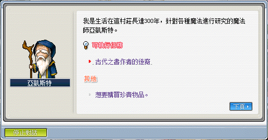
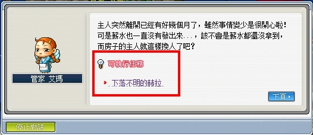
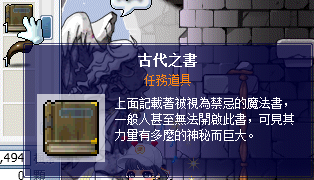
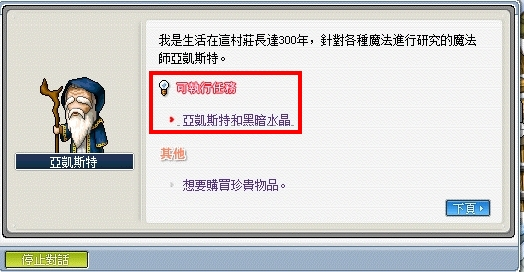
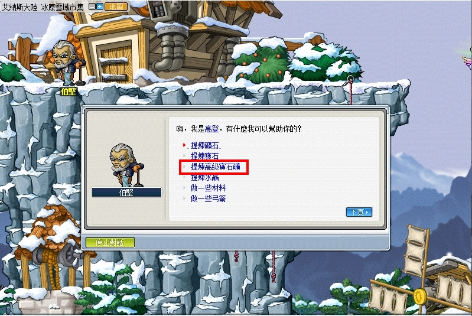
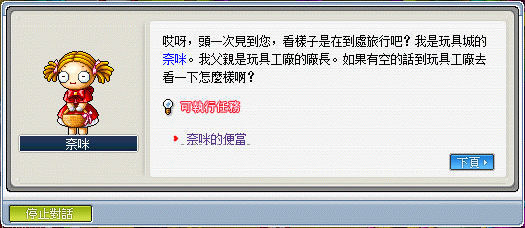
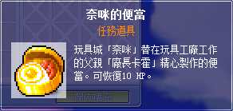
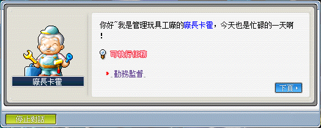
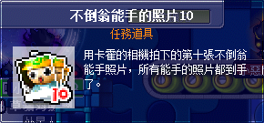
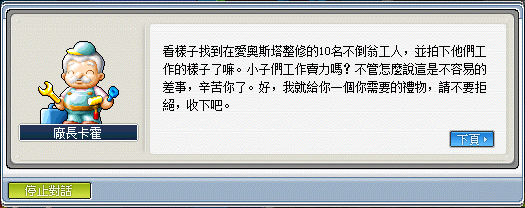

# 認識大師兄


- 「亞凱斯特和黑暗水晶」此任務建議直接湊齊材料再去跑任務！
- 這任務要一直跑來跑去，所以建議使用高級瞬移之石和任意門高級券。

```text
此系列任務所需道具／怪物：
    - 礦石類
        - 星石x1
        - 力量水晶x2
        - 智慧水晶x2
        - 敏捷水晶x2
        - 幸運水晶x2
        - 黑暗水晶x1
    - 道具類
        - 星光精靈碎片x100
        - 月光精靈碎片x50
        - 日光精靈的碎片x30
        - 野狼之尾巴x80
        - 白狼之尾巴x80
        - 狼人指甲x3
        - 地獄獵犬的尖牙x80

接取任務後才可取得的道具或怪物擊殺數：
    - 利堤x100
```

- 【星光精靈碎片】從天空之城 - 雲彩公園 I、雲彩公園 II 打星光精靈獲得。

  

- 【月光精靈碎片】從天空之城 - 雲彩公園 IV 打月光精靈獲得。
- 【日光精靈碎片】從天空之城 - 雲彩公園 VI 打日光精靈獲得。
- 【野狼之尾巴】從冰原雪域 - 結冰的平原 I 打野狼獲得。
- 【白狼之尾巴】從冰原雪域 - 寒冰平原打白狼獲得。

  

- 【狼人指甲】從冰原雪域 - 狼的領土 I 打狼人（咖啡色）獲得。
  - 狼的領土 I 位置：先用滑鼠點廢棄礦坑那個圖示，就會跳到冰原雪域較深處的地圖。

    | 冰原雪域山脈     | 廢棄礦坑          |
    |-----------------|-----------------|
    |  |  |

---

## 亞凱斯特和黑暗水晶（系列任務）

### 古代之書作者的後裔

- 等級：Lv55
- 前置：無
- NPC 位置：冰原雪域市集 - 亞凱斯特
- 需求道具／怪物：
  - 星光精靈碎片x100
  - 月光精靈碎片x50
  - 日光精靈的碎片x30
  - 野狼之尾巴x80
  - 白狼之尾巴x80
  - 狼人指甲x3
  - 力量水晶x2
  - 智慧水晶x2
  - 敏捷水晶x2
  - 幸運水晶x2

1. 要先去冰原雪域市集找 NPC 亞凱斯特接取任務「古代之書作者的後裔」。

    

2. 找天空之城 NPC 麗莎講話。

    | 對話 1          | 對話 2           |
    |-----------------|-----------------|
    |  |  |

    

    

3. 找天空之城公園 NPC 管家艾瑪接任務。

    | 對話 1          | 對話 2           |
    |-----------------|-----------------|
    |  |  |

4. 找冰原雪域 NPC 杰德說話。

    

5. 回去跟天空之城公園 NPC 管家艾瑪講話。

    

6. 回去跟冰原雪域 NPC 杰德說話。

    

7. 去雲彩公園 IV 的屋子內找 NPC 史菲魯納。

    | 雲彩公園 IV        | 史菲魯納           |
    |-------------------|-------------------|
    |  |  |

8. 去冰雪峽谷 I 找 NPC 被雪覆蓋的岩石。

    

9. 獲得任務道具【破碎的黑色水晶】。

    

10. 回去雲彩公園 IV 的屋子內找 NPC 史菲魯納。

    

11. 跟旁邊 NPC 助手說話。

    

12. 去天空之城雜貨店找 NPC 妖精克莉爾講話。

    | 對話 1            | 對話 2             |
    |-------------------|-------------------|
    |  |  |

13. 克莉爾任務需求道具。

    

14. 收集完回去找 NPC 克莉爾回報。

    

15. 獲得任務道具【妖精之粉】。

    

16. 回去雲彩公園 IV 的屋子內找 NPC 史菲魯納。

    

17. 跟旁邊 NPC 助手說話。

    

18. 獲得任務道具【赫拉的墬飾】。

    

19. 回去跟冰原雪域 NPC 杰德說話。

    

20. 去狼的領土 I 找 NPC 小墳墓講話。

    

21. 去冰原雪域市集找 NPC 亞凱斯特。

    

22. 獲得任務道具【古老之戒】。

    

23. 去冰原雪域找 NPC 史卡圖勒。

    

24. 史卡圖勒需求道具。

    

25. 繼續與 NPC 史卡圖勒對話。

26. 接下來照著勇士之村 > 魔法森林 > 弓箭手村 > 墮落城市的順序找各大村莊的一轉教官。
    - 可以去自由打 `@fm` 後，離開自由出去就是勇士之村。

27. 各大一轉轉職教官會要求各職業對應的水晶成品。

    

28. 轉職教官拿走水晶後分別會給你1／2／3／4個任務道具【古老的地圖碎片】，總共會得到 10 個。

    

29. 回去冰原雪域市集找 NPC 亞凱斯特。

    

30. 去雲彩公園 VI 找 NPC 伊吉上等兵。

    

31. 伊吉上等兵需求道具。

    

32. 打完任務指定道具後，回去雲彩公園 VI 找 NPC 伊吉上等兵回報，獲得任務道具【記憶之粉】。

    

33. 回去冰原雪域市集找 NPC 亞凱斯特。

    

34. 前往天空之城塔<8 層>找 NPC 雕像。

    - 可直接使用任意門高級券飛到 1~7 樓再往上走。

    

35. 獲得任務道具【古代之書】。

    

36. 回去冰原雪域市集找 NPC 亞凱斯特對話，完成任務。

    

### 亞凱斯特和黑暗水晶

- 等級：Lv55
- 前置：古代之書作者的後裔（或稱尋找《上古魔書》）
- NPC 位置：冰原雪域市集 - 亞凱斯特
- 需求道具／怪物：黑暗水晶x1、星石x1

1. 向冰原雪域市集 NPC 亞凱斯特對話接起任務。

    

2. 亞凱斯特需求的任務道具。

    

    - 星石在「薩比特拉瑪的返老還童藥」會獲得，如果沒有留著的玩家也可以直接去找 NPC 亞凱斯特左上的工匠伯堅製作。

        

3. 收集完任務指定道具後，回去冰原雪域市集找NPC亞凱斯特回報即可完成任務。

    

    - 任務完成後，任務道具【古老的地圖碎片、古老之戒、破碎的黑暗水晶】會有多餘的，佔位置可直接扔掉。

        

    - 完成上古魔書任務之後都可以找 NPC 亞凱斯特購買一些補給物（跟自由跟玩家買其實比較便宜）。

        

---

## 尋找雪原玫瑰的種子（系列任務）

### 修曼諾伊德 A

- 等級：Lv65
- 前置：
- NPC 位置：瑪迦提亞城 - 修曼諾伊德 A
- 需求道具／怪物：膠質果凍x50、鋰礦穆太碎片x100、雪原玫瑰的種子x1

**此任務可以不需要完成，只要接任務就可以觸發擴包需要的任務「尋找雪原玫瑰的種子」。**

1. 先去瑪迦提亞城找 NPC 修曼諾伊德 A 接取任務「修曼諾伊德 A」。

    - 瑪迦提亞城前往方式：
        - 魔法森林 > 天空之城 > 納希沙漠 > 納西北門外（點駱駝計程車） > 回家卷軸。
        - 直接使用任意門高級券。

    

### 尋找雪原玫瑰的種子

- 等級：Lv65
- 前置：接到「修曼諾伊德A」時觸發
- NPC 位置：冰原雪域市集 - 亞凱斯特
- 需求道具／怪物：利堤x100

1. 到冰原雪域市集找 NPC 亞凱斯特接起任務，並得知需要擊倒【利堤x100】。

    

    - 【利堤】可至冰原雪域最左側的地圖 - 冰雪山丘打。

        

2. 打完任務指定怪物後，回去冰原雪域市集找 NPC 亞凱斯特回報即可完成任務並獲得「修曼諾伊德 A」需要的任務道具。

    - 如果不想解「修曼諾伊德 A」任務的可以直接丟掉任務道具。

    

---

## 不倒翁能手 10（系列任務）

### 奈咪的便當

- 等級：Lv?
- 前置：無
- NPC 位置：玩具城村莊 - 卡霍之家

1. 先到玩具城村莊 - 卡霍之家與奈咪對話，並接取任務《奈咪的便當》。

    | 玩具城村莊       | 接取任務         | 奈咪的便當        |
    |-----------------|-----------------|-----------------|
    |  |  |  |

2. 將任務道具【奈咪的便當】交給玩具工廠 <主工程A> 的 NPC 廠長卡霍，完成任務。

    | 玩具工廠<主工程A> | 回報任務         |
    |-----------------|-----------------|
    |  |  |

### 監督勤務

- 等級：Lv?
- 前置：奈咪的便當
- NPC 位置：玩具城村莊 - 卡霍之家

1. 跟玩具工廠 <主工程A> 的 NPC 廠長卡霍接取任務《監督勤務》。

    

2. NPC 廠長卡霍會給予任務道具【相機】，並要求去愛奧斯塔給分佈在不同樓層的 10 個 NPC 不倒翁能手照相。

    

3. 請依照不倒翁能手 1~10 的順序拍照（不然會不讓你拍，叫你到上樓依照順序）。

    - 各個不倒翁能手分別位於：
        1. 不倒翁能手 1（98 樓）
        2. 不倒翁能手 2（93 樓）
        3. 不倒翁能手 3（90~76 樓）
        4. 不倒翁能手 4（74 樓）
        5. 不倒翁能手 5（60 樓）
        6. 不倒翁能手 6（55~46 樓）
        7. 不倒翁能手 7（41 樓）
        8. 不倒翁能手 8（21 樓）
        9. 不倒翁能手 9（7 樓）
        10. 不倒翁能手 10（3 樓）
　  - 10 張照片只會佔一格消耗欄位。

4. 收集完照片【不倒翁能手的照片 10】後，回玩具工廠 <主工程A> 跟 NPC 廠長卡霍回報任務。

    | 不倒翁能手的照片 10 | 回報任務         |
    |-------------------|-----------------|
    |    |  |

---

## 尋找尼克的痕跡（獵人史卡圖勒的兒子尼克）

- 等級：Lv65
- 前置：尋找上古魔書
- NPC 位置：冰原雪域 - 史卡圖勒
- 需求道具／怪物：地獄獵犬的尖牙x80

1. 要先去冰原雪域找 NPC 史卡圖勒接取任務「尋找尼克的痕跡…」。

    

2. 史卡圖勒任務需求道具。

    

    - 此任務需求為【地獄獵犬的尖牙x80】。任務上的文字敘述是錯誤的！
    - 【地獄獵犬的尖牙】可至試煉洞穴 I 打地獄獵犬掉落。

        

3. 打完任務道具順便至試煉洞穴 II 中間的岩漿口的隱藏地圖。

    

4. 與 NPC 石像的彈片對話。

    

5. 獲得任務道具【尼克的戒指】。

    

6. 打完任務指定道具後，回去冰原雪域 找 NPC 史卡圖勒回報即可完成任務。

    

---

## 完成任務

以上任務完成即可去找狐狸隊長回報擴包任務。


