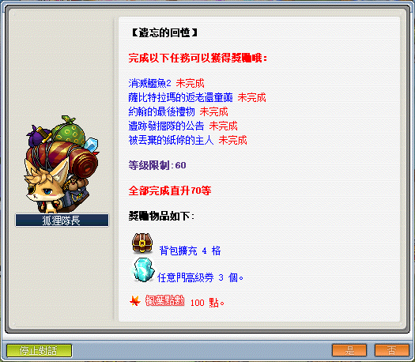

# 遺忘回憶行



```text
此系列任務所需道具／怪物：
    - 蛇皮x20
    - 黑鱷魚皮x50
    - 強效紅蔘x1（需從魔法森林 - 賽恩的忍耐之林獲得）
    - 白花x30（需從奇幻村 - 奇怪的石像獲得）
    - 肋骨x60
    - 骨盆x40
    - 馬頭骨x20
```

---

## 消滅鱷魚 2（系列任務）

- 等級：Lv30
- 前置：木妖好可怕、尋找女兒 1、尋找女兒 2、消滅鱷魚 1
- NPC 位置：勇士之村 - 義安
- 需求道具／怪物：
  - 木妖好可怕
    - 木妖x50
  - 消滅鱷魚 1
    - 蛇皮x20
    - 青蛇x40
    - 鱷魚x250
  - 消滅鱷魚 2
    - 黑鱷魚x120
    - 黑鱷魚皮x50

### 木妖好可怕

- 等級：Lv10
- 前置：無
- NPC 位置：勇士之村 - 義安
- 需求道具／怪物：木妖x50

1. 向勇士之村 NPC 義安對話接起任務，得知需要打倒【木妖x50】，木妖可至勇士之村東入口打。

    

2. 打完任務指定怪物數量後，回去勇士之村找 NPC 義安回報即可完成任務。

### 尋找女兒 1、尋找女兒 2

- 等級：Lv10
- 前置：木妖好可怕、研究菇菇寶貝（[島民的困擾](島民的困擾/index.md)）
- NPC 位置：弓箭手村 - 布魯斯
- 需求道具／怪物：傳遞任務道具

1. 向弓箭手村 NPC 布魯斯對話後接起任務。

    

2. 對話後會獲得一個任務道具【玩具刀】要交給勇士之村的 NPC 義安。

    

3. 找 NPC 義安回報任務會拿到任務道具【義安的信】。

4. 拿回去給 NPC 布魯斯即可完成任務。

5. 完成以上前置之後，去勇士之村找 NPC 義安即可開始擴包的任務。

    

### 消滅鱷魚 1

- 等級：Lv52
- 前置：尋找女兒 2
- NPC 位置：勇士之村 - 義安
- 需求道具／怪物：蛇皮x20、青蛇x40、鱷魚x250

1. 向勇士之村 NPC 義安對話接起任務，得知需打倒【鱷魚x250】、【青蛇x40】並取得【蛇皮x20】。

    - 【青蛇／鱷魚】可至墮落城市沼澤地 I 打。

        

2. 打完任務指定道具和怪物數量後，回去勇士之村找 NPC 義安回報即可完成任務。

### 消滅鱷魚 2

- 等級：Lv52
- 前置：消滅鱷魚 1
- NPC 位置：勇士之村 - 義安
- 需求道具／怪物：蛇皮x20、青蛇x40、鱷魚x250

1. 向勇士之村 NPC 義安對話接起任務，得知需打倒【黑鱷魚x120】並取得【黑鱷魚皮x50】。

    - 【黑鱷魚】可至墮落城市鱷魚潭 II 打。

    - 【黑鱷魚皮】可從黑鱷魚獲得。

    - 鱷魚潭 II 的位置。

        

2. 打完任務指定道具和怪物數量後，回去勇士之村找 NPC 義安回報即可完成任務。

---

## 薩比特拉瑪的返老還童藥

- 等級：Lv50
- 前置：薩比特拉瑪的減肥藥
- NPC 位置：奇幻村 - 薩比特拉瑪
- 需求道具／怪物：強效紅蔘x1（需從魔法森林 - 賽恩的忍耐之林獲得）

1. 要先去奇幻村找 NPC 薩比特拉瑪接取任務「薩比特拉瑪的返老還童藥」。

    

2. 忍耐要去魔法森林找 NPC 賽恩進入。

    - 這邊請直接無視賽恩說的忍耐之林（一層），如果解過「薩比特拉瑪的減肥藥」前置，這次進去就會是忍耐之林（三層）。

        | 魔法森林         | 忍耐之林（三層）  |
        |-----------------|-----------------|
        |  |  |

    - 忍耐姬妍羽花費 2000 萬楓幣通關 - 選擇任務地圖「魔法森林 - 忍耐之林 III」，即可獲得任務道具【強效紅蔘】。

        

3. 跳完／花錢通過得到任務指定道具後，回去奇幻村找 NPC 薩比特拉瑪回報即可完成任務。

    - 此任務獲得的道具【星石】要留著！後續的任務會用到星石！

    

---

## 約翰的最後禮物

- 等級：Lv60
- 前置：約翰的禮物
- NPC 位置：維多利亞港 - 約翰
- 需求道具／怪物：白花x30（需從奇幻村 - 奇怪的石像獲得）

1. 到維多利亞港找到 NPC 約翰並接任務「約翰的最後禮物」。

    

2. 至奇幻村尋找 NPC 奇怪的石像，進入沉睡森林 3 完成忍耐，點擊最後地圖內的 NPC 花朵即可獲得任務道具【白花x30】。

    

    - 忍耐姬妍羽花費 3000 萬楓幣通關 - 選擇任務地圖「奇幻村 - 沉睡森林 V」，即可獲得任務道具【白花x30】。

    - 要看清楚是「沉睡森林 V」 不是石像寫的「沉睡森林 3」

        

3. 跳完／花錢通過得到任務指定道具後，回去維多利亞港找NPC約翰回報即可完成任務。

    - 任務完成後，任務道具【白花】不會被回收，佔位置可直接扔掉。

    

---

## 遺跡發掘隊的公告

- 等級：Lv60
- 前置：無
- NPC 位置：遺跡發掘隊營地 - 公告欄
- 需求道具／怪物：
  - 骷髏士兵x200 + 肋骨x60
  - 骷髏士官x100 + 骨盆x40
  - 骷髏指揮官x40 + 馬頭骨x20

1. 到遺跡發掘隊營地找到 NPC 布告欄並接任務「遺跡發掘隊的公告」。

    | 大地圖：遺跡發掘隊營地 | 遺跡發掘隊營地    |
    |---------------------|-----------------|
    |      |  |

2. 公告欄要求的道具和怪物。

    

3. 前往遺跡野圖。

    

4. 到「遺跡之墓 II」進去城堡。

    - 此圖的骷髏士兵最多。

    

5. 圖中為骷髏士兵與骷髏士官。

    

    - 【肋骨】可從骷髏士兵咖啡色皮革帽）獲得。
      【骨盆】可從骷髏士官（戴鋼盔的）獲得。

        

    - 如果覺得骷髏士官太少可以換到遺跡之墓IV打，可以順便打骷髏指揮官。

6. 圖中為骷髏士官和骷髏指揮官。

    - 【馬頭骨】可從骷髏指揮官（騎馬的）獲得

        

7. 打完任務指定道具後，回去遺跡發掘隊營地找NPC杉峰回報即可完成任務。

    

---

## 被丟棄的紙條的主人

- 等級：Lv50
- 前置：無
- NPC 位置：螞蟻洞I - 紙
- 需求道具／怪物：傳遞道具給 NPC 武英

1. 要先去奇幻村螞蟻洞 I 找 NPC 紙接取任務「被丟棄的紙條的主人」。
    - 此任務建議直接使用道具「任意門高級券」比較省時間。
    - 記得接取任務時要把其它欄空幾格出來，不然有可能會把任務道具吃掉。

    

2. 前往找尋 NPC 武英，直接飛往地圖「另外的入口」。

    

3. 進入「另外的入口」。

    

4. 往下走到底。

    

5. 右下角的傳送點。

    

6. 往下爬到最下面的傳送點。

    | 另外的入口       | 另外的入口        |
    |-----------------|-----------------|
    |  |  |

7. 走到最底部。

    

8. 即可抵達NPC武英的所在地圖。

    

9. 和NPC武英回報完即可完成任務。

    

---

## 完成任務

以上任務完成即可去找狐狸隊長回報擴包任務。


