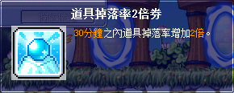
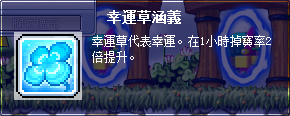
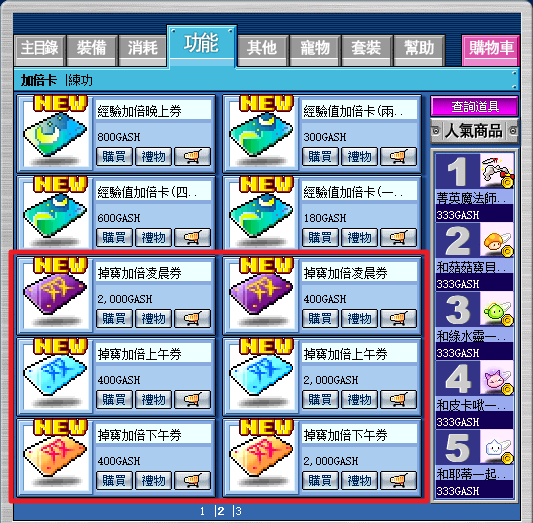
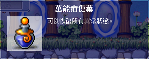

# 未來東京

- 📝 作者：
  - 🥮 Mooncake（台 1 - 台 5 撰寫、台 6 統整）
  - 🥀 開花子（台 1 - 台 5 打手）
  - 🌨️ 洛小雪（台 6 撰寫）
  - 🐙 章魚（台 6 打手、台 6 GOOD END 流程）

所謂的台 1、2、3、4、5、6，詳細講法是台場 1~6，全名如下所示：

- 台 1：台場 2100 年
- 台 2：江戶川公園 2095 年
- 台 3：秋葉原司令部 2102 年
- 台 4：東京上空 2102 年
- 台 5：澀谷 2102 年
- 台 6：六本木商城頂樓 2102 年

以下分別介紹如何前往、台 1~6 的攻略：

- [如何前往未來東京](未來東京/如何前往未來東京/index.md)
- [台 1 前置]()
- [台 2 前置]()
- [台 3 前置]()
- [台 4 前置]()
- [台 5 前置]()
- [台 6 GOOD END 前置]()
- [台 6 BAD END 前置]()
- [參考資料]()

在解台場系列任務之前，**建議準備好以下道具**：

- 卡珊德拉的獎勵 5（現今為道具掉落率 2 倍券）、幸運草涵義

  | 道具掉落率 2 倍券 | 幸運草涵義       |
  |-----------------|-----------------|
  |      |      |

- 掉寶加倍卷

  

- 萬能療傷藥數百罐

  

打道具的任務建議一律開八倍打！
