# 台場 2100（台 1）前置

1. 先找 NPC 阿夕亞接取任務「通往未來的門扉」。

    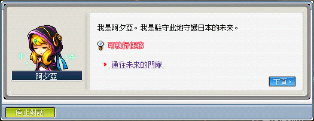

    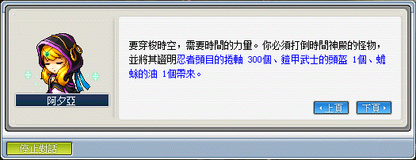

2. 輸入 `@fm` 回到自由市場，找時代花車購買【當鋪裡的大蟾蜍錢包】（500 萬楓幣）。

    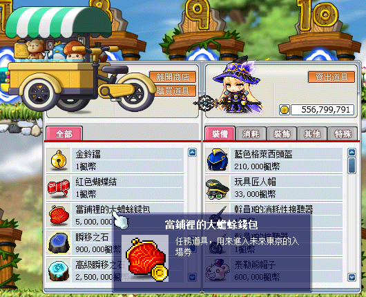

3. 回去找 NPC 阿夕亞回報任務（選擇 `找到了逆奧之流（商城道具）`）。

    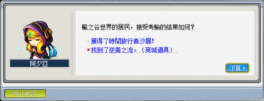

4. 再一次找 NPC 阿夕亞完成任務「通往未來的門扉」。

    

5. 再一次找 NPC 阿夕亞接取任務「往日故鄉的未來」。

    

6. 再一次找 NPC 阿夕亞完成任務「往日故鄉的未來」。

    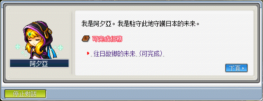

7. NPC 阿夕亞會叫你去台場 2100 年奪回元件，去左下角的水晶選擇台場 2100 年進入該地圖。

    | NPC 水晶    | 台場 2100 年 |
    |-------------|-------------|
    | 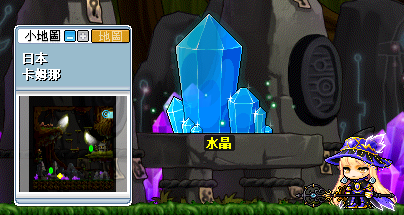 | 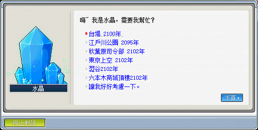 |

8. 找 NPC 波尼恰爾接取任務「潛入敵營 變形的鳥籠」。

    | NPC 波尼恰爾   | 任務「潛入敵營 變形的鳥籠」 |
    |---------------|---------------|
    |    | 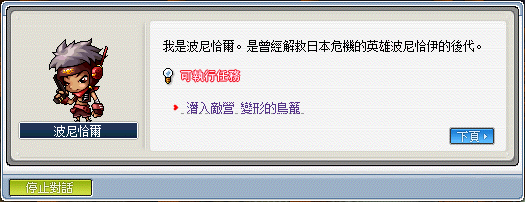 |

9. 收集 100 個【情資收集機鏡頭】。

    | 任務內容       | 情資收集機鏡頭  |
    |---------------|---------------|
    | 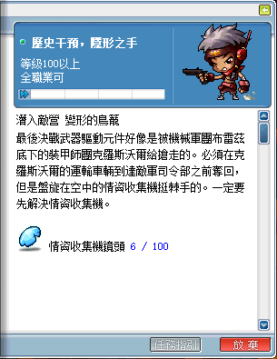 | 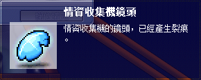 |

10. 收集完畢並回報任務完成以後，接取下一個任務「找出驅動元件」，並在台 1 內收集任務道具【驅動元件】。

    - 【驅動元件】會從後勤補給車中掉落。

    | 任務「找出驅動元件」 | 驅動元件 |
    |---------------|---------------|
    | 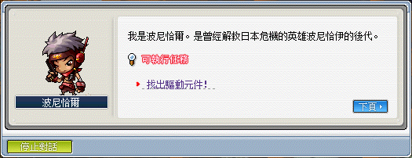 | 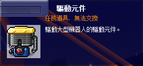 |

11. 收集完畢並回報任務完成以後，接取下一個任務「是開始也是結束」，並在台 1 內收集任務道具【高階計算連鎖反應器】、【導電聚合物增益器】、【高分子驅動器】。

    | 任務「是開始也是結束」 | 任務所需道具 |
    |---------------|---------------|
    | 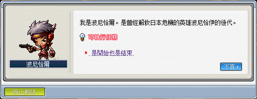 | 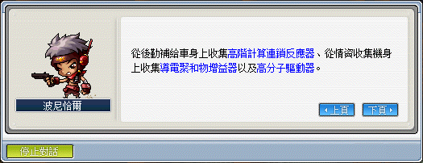 |

    - 【高階計算連鎖反應器】會從後勤補給車中掉落。
    - 【導電聚合物增益器】、【高分子驅動器】會從情資收集機掉落。

    | 高階計算連鎖反應器 | 導電聚合物增益器 | 高分子驅動器 |
    |---------------|---------------|---------------|
    | 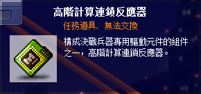 | 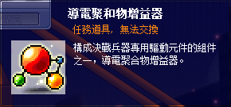 | 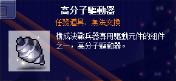 |

12. 收集完畢並回報任務完成以後，接取下一個任務「決戰！移動要塞貝爾加墨特」，接受並被傳送到另外一張地圖後進去右邊的光圈。

    | 任務「決戰！移動要塞貝爾加墨特」 | 另一張地圖 |
    |---------------|---------------|
    | 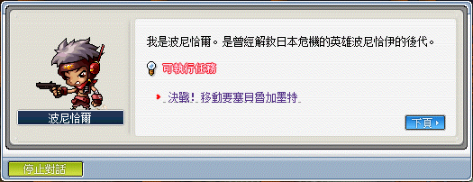 | 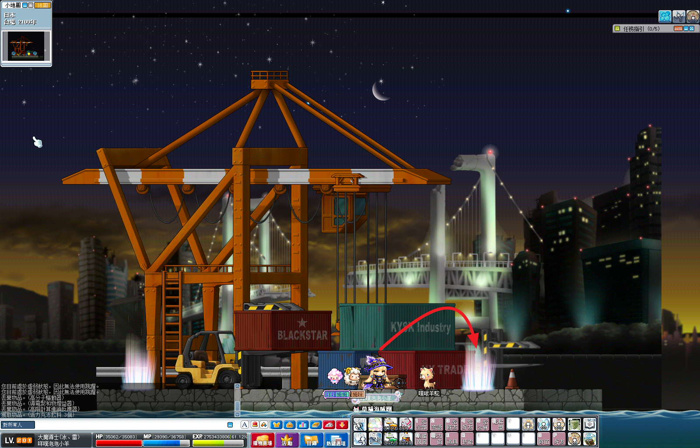 |

13. 向 NPC 波尼恰爾報名遠征，並且把貝爾加墨特三階段給擊潰。

    - 遠征隊至少需要兩名隊員才可開戰。

    
