# 江戶川公園 2095（台 2）前置

1. 向 NPC 阿夕亞接取並完成任務「崩壞的序曲」。

    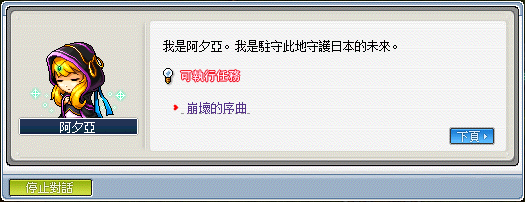

2. 去左下角的水晶選擇江戶川公園 2095 年進入該地圖。

    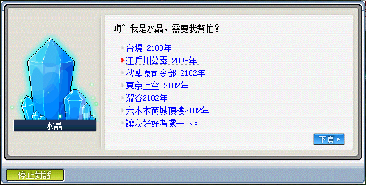

3. 進入地圖後，到中間找 NPC 提達，接取任務「和平與混沌的交界」。

    | NPC 提達    | 任務「和平與混沌的交界」 |
    |-------------|-------------|
    | 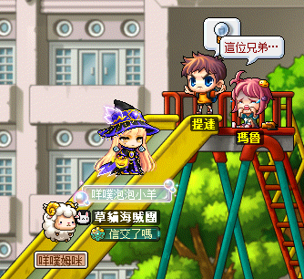 | 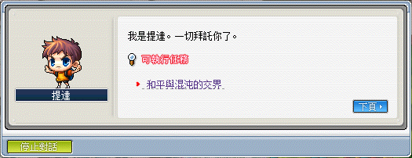 |

4. 打原型機取得一個【簡易雷達】並向 NPC 提達回報任務「和平與混沌的交界」。

    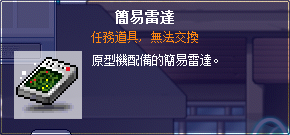

5. 向 NPC 提達接取任務「猛烈攻擊！機械化小隊馬貝立克」，接取後將會被傳送至其他地圖。

    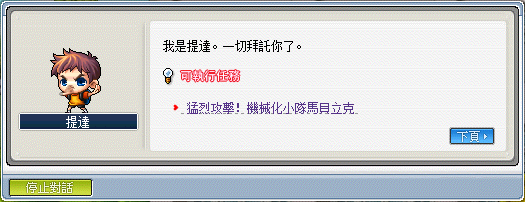

6. 往右走進去傳點，找 NPC 提達對話。

    | 被傳送到的地圖 | NPC 提達    |
    |-------------|-------------|
    | 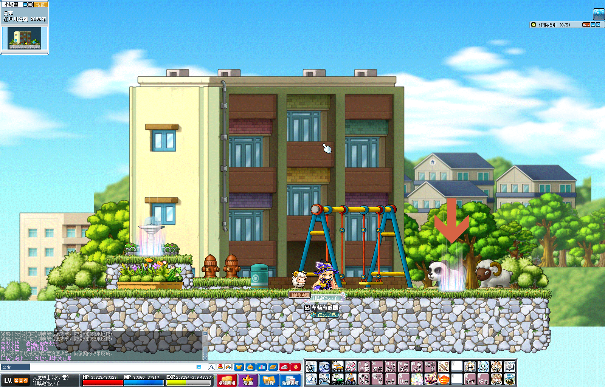 |  |

7. 開啟遠征隊後進入即準備保護小男孩。

    - 進入地圖後打馬貝力克 β 取得【簡易電磁脈衝發訊機】，然後撿起來丟到地板上、或直接讓它在地板上消失就可以開始保護小男孩了。

        | 簡易電磁脈衝發訊機 | 保護小男孩     |
        |-----------------|---------------|
        | 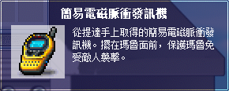   | 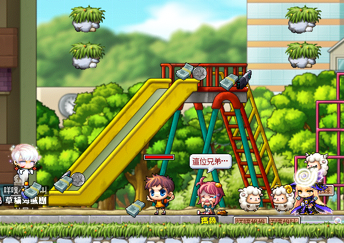 |

        - 當左下角對話視窗出現`小男孩的魅力!!!`或注意到怪都往某個中間聚集時或表示小男孩已經出現。

        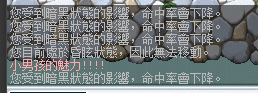

    - 這裡可以順便打台 4 需要的任務道具【攜帶式雷射誘導裝置】（由馬貝力克 γ 掉落），**建議召喚小男孩後**在這邊就先把任務道具打到，因為不好打。

        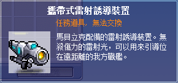

8. 小男孩出現後要蒐集任務道具【能量傳送裝置】 10 個（請記得開八倍掉寶）。

    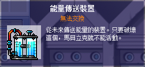

9. 收集完之後點擊 NPC 瑪魯，選擇`我想要用能量傳送裝置兌換獎勵`。

    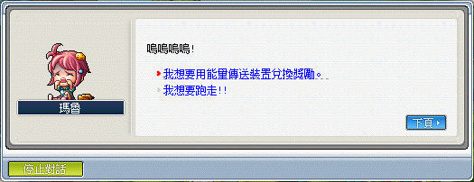

10. 點水晶通關後完成任務。

    
