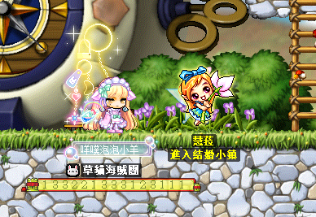
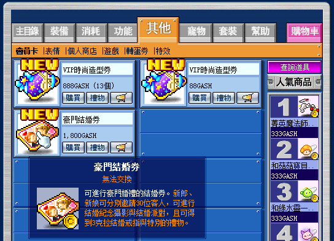
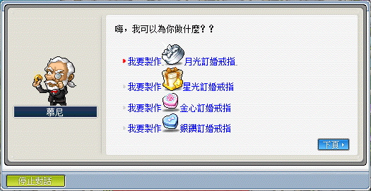
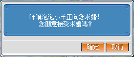
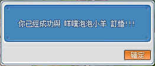
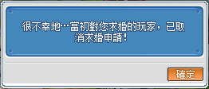
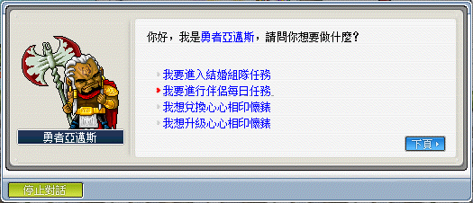
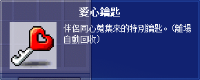
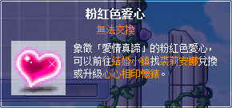

# 結婚系統

## 訂婚

1. 前往各村莊與 NPC 慧菈對話後進入結婚小鎮。

    

2. 其中一方要準備【豪門結婚券】，可以從購物商城以 1800 GASH 購得。

    

3. 向結婚小鎮內的 NPC 慕尼對話並製作訂婚戒指。訂婚戒指種類有四種，分別需要不同的材料。

    

    | 戒指     | 屬性             | 所需材料                      |
    |--------|----------------|---------------------------|
    | 月光訂婚戒指 | 全屬性 +1、移動速度 +5 | 月石 x1、鑽石 x1、楓幣 10,000,000 |
    | 星光訂婚戒指 | 全屬性 +1、跳躍力 +2  | 星石 x1、鑽石 x1、楓幣 10,000,000 |
    | 金心訂婚戒指 | 全屬性 +1、HP +60  | 黃金 x1、鑽石 x1、楓幣 10,000,000 |
    | 銀鑽訂婚戒指 | 全屬性 +1、MP +60  | 銀 x1、鑽石 x1、楓幣 10,000,000  |

4. 製作完後會得到一個求婚戒指禮盒（消耗欄內），雙擊後輸入求婚對象名字並等待對方回應後即可完成訂婚。

    | 是否接受求婚          | 接受求婚              | 拒絕求婚              |
    |---------------------|----------------------|----------------------|
    |  |  |  |

    > Thanks to the players 豬肉總匯早餐 and CHAOS for confirming.

## 伴侶每日任務

1. 訂婚完成後，即可從結婚小鎮地圖一路向右走到底直到抵達亞邁斯的鍛鍊場所（結婚小鎮 → 紫木森林 1 → 紫木森林 2 → 亞邁斯的鍛鍊場所）。

2. 和 NPC 亞邁斯對話後即可進行伴侶每日任務。

    

3. 選擇伴侶每日任務後會進入隱藏地圖，需要把 20 個箱子全部打掉後收集 20 個【愛心鑰匙】並交給隊長，由隊長和 NPC 松蘿密對話後傳出地圖。

    | 隱藏地圖                           | 愛心鑰匙                           |
    |-----------------------------------|-----------------------------------|
    |  |  |

4. 傳出地圖後即可獲得【粉紅色愛心】，【粉紅色愛心】可用於與 NPC 亞邁斯兌換與升級【心心相印懷錶】。

    

## 懷錶等級提升

| 等級 | 粉紅色愛心 | 礦石 1 (x5) | 礦石 2 (x5) | 礦石 3 (x5) | 礦石 4 (x5) | 礦石 5 (x5) | 礦石 6 (x5) | 楓幣         | 數值      |
|:--:|:-----:|-----------|-----------|-----------|-----------|-----------|-----------|------------|---------|
| 0  |       |           |           |           |           |           |           |            | 全屬性 +10 |
| 1  | 20    | 青銅        | 鋼鐵        | 鋰礦石       | 朱礦石       | 銀         |           | 13,145,200 | 全屬性 +12 |
| 2  | 22    | 紫礦石       | 黃金        | 石榴石       | 紫水晶       | 海藍寶石      | 祖母綠       | 13,145,200 | 全屬性 +14 |
| 3  | 24    | 蛋白石       | 藍寶石       | 黃晶        | 鑽石        | 黑水晶       |           | 13,145,200 | 全屬性 +16 |
| 4  | 26    | 力量水晶      | 智慧水晶      | 敏捷水晶      | 幸運水晶      | 黑暗水晶      |           | 13,145,200 | 全屬性 +18 |
| 5  | 28    | 青銅        | 鋼鐵        | 鋰礦石       | 朱礦石       | 銀         |           | 13,145,200 | 全屬性 +20 |
| 6  | 30    | 紫礦石       | 黃金        | 石榴石       | 紫水晶       | 海藍寶石      | 祖母綠       | 13,145,200 | 全屬性 +22 |
| 7  | 33    | 蛋白石       | 藍寶石       | 黃晶        | 鑽石        | 黑水晶       |           | 13,145,200 | 全屬性 +24 |
| 8  | 36    | 力量水晶      | 智慧水晶      | 敏捷水晶      | 幸運水晶      | 黑暗水晶      |           | 13,145,200 | 全屬性 +26 |
| 9  | 39    | 青銅        | 鋼鐵        | 鋰礦石       | 朱礦石       | 銀         |           | 13,145,200 | 全屬性 +28 |
| 10 | 42    | 紫礦石       | 黃金        | 石榴石       | 紫水晶       | 海藍寶石      | 祖母綠       | 13,145,200 | 全屬性 +30 |
| 11 | 45    | 蛋白石       | 藍寶石       | 黃晶        | 鑽石        | 黑水晶       |           | 13,145,200 | 全屬性 +32 |
| 12 | 48    | 力量水晶      | 智慧水晶      | 敏捷水晶      | 幸運水晶      | 黑暗水晶      |           | 13,145,200 | 全屬性 +34 |
| 13 | 51    | 青銅        | 鋼鐵        | 鋰礦石       | 朱礦石       | 銀         |           | 13,145,200 | 全屬性 +36 |
| 14 | 54    | 紫礦石       | 黃金        | 石榴石       | 紫水晶       | 海藍寶石      | 祖母綠       | 13,145,200 | 全屬性 +38 |
| 15 | 57    | 蛋白石       | 藍寶石       | 黃晶        | 鑽石        | 黑水晶       |           | 13,145,200 | 全屬性 +40 |
| 16 | 60    | 力量水晶      | 智慧水晶      | 敏捷水晶      | 幸運水晶      | 黑暗水晶      |           | 13,145,200 | 全屬性 +42 |
| 17 | 65    | 青銅        | 鋼鐵        | 鋰礦石       | 朱礦石       | 銀         |           | 13,145,200 | 全屬性 +44 |
| 18 | 70    | 紫礦石       | 黃金        | 石榴石       | 紫水晶       | 海藍寶石      | 祖母綠       | 13,145,200 | 全屬性 +46 |
| 19 | 75    | 蛋白石       | 藍寶石       | 黃晶        | 鑽石        | 黑水晶       |           | 13,145,200 | 全屬性 +48 |
| 20 | 80    | 力量水晶      | 智慧水晶      | 敏捷水晶      | 幸運水晶      | 黑暗水晶      |           | 13,145,200 | 全屬性 +50 |
