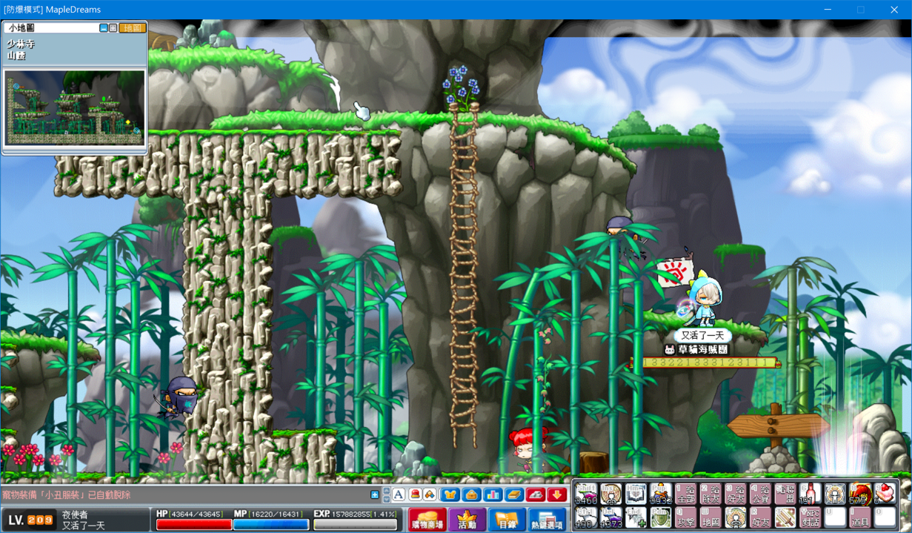

# 武陵妖僧副本

感謝玩家**又活了一天**分享。

## 前置任務流程

1. 從各處村莊找 NPC 史匹奈爾前往嵩山鎮。

    

2. 從少林寺隱藏傳點進入藏經閣。

    1. 少林寺 - 嵩山鎮最左方的水井有隱藏傳點。

        

    2. 少林寺 - 山腰圖中位置也有同樣的隱藏傳點。

        

3. 進入藏經閣。

    

4. 進入藏經閣後，從藏經閣一、二層這張地圖開始總共三張圖，任務依序往上層解完。

    

5. 向 NPC 打掃小和尚對話，接取任務「藏經閣的秘密 1」，並擊倒【小銅人x100】與收集【銅人心臟x50】後交給 NPC 打掃小和尚完成任務。

    - 建議在這邊多打 30 個銅人心臟以方便後續任務。

    

6. 向 NPC 打掃小和尚對話，接取任務「藏經閣的秘密 2」，並擊倒【銀人x80】與收集【銀人心臟x50】後交給 NPC 打掃小和尚完成任務。

    - 建議在這邊多打 30 個銀人心臟以方便後續任務。

    

7. 到藏經閣三、四層，向 NPC 曾冠接取任務「藏經閣的秘密 3」並擊倒【金人x50】與收集【金人心臟x50】後交給 NPC 曾冠完成任務。

    - 建議在這邊多打 30 個金人心臟以方便後續任務。

    

8. 到藏經閣五、六層，向 NPC 曾心接取任務「藏經閣的秘密 4」並收集【銅人心臟x30】、【銀人心臟x30】、【金人心臟x30】後回到藏經閣一、二層交給 NPC 打掃小和尚完成任務。

    

9. 接著爬回去藏經閣第七層與 NPC 達摩畫像卷軸對話就可以進行武陵妖僧副本，進場需隊伍有 3 人以上 50~80 區間的角色。

    

## 副本攻略建議

- 進場後只要有隊員死亡就會直接傳出去，請不要吝嗇喝藥水（特殊藥水以上），死亡後需要重走。
- 帶妖僧的隊長可以自殺後，帶隊員進場及出場。
- 遠攻角色建議站在圖中紅圈處，利用地形來閃避王的傷害。
- 近戰角色請貼著王打。

