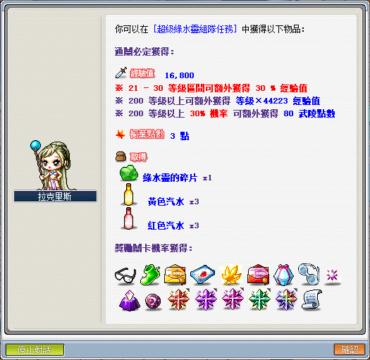
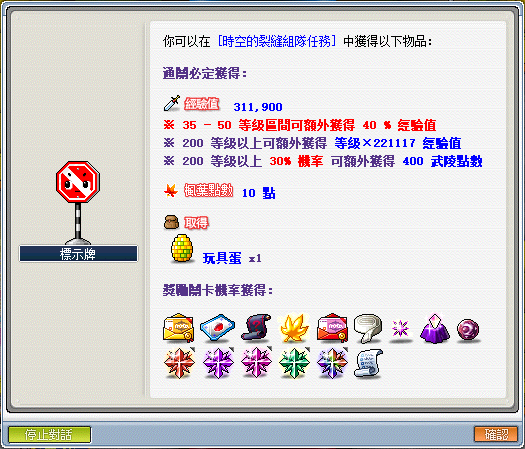
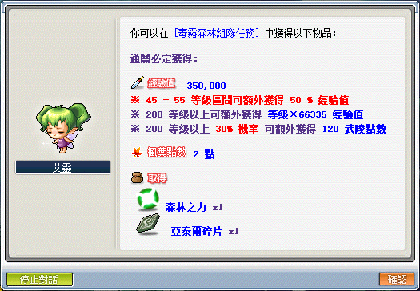
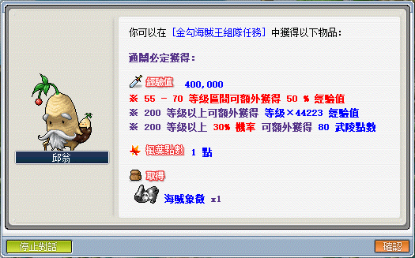
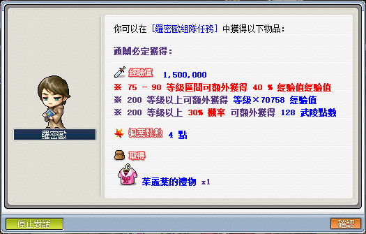
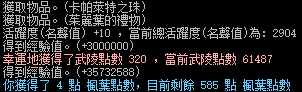
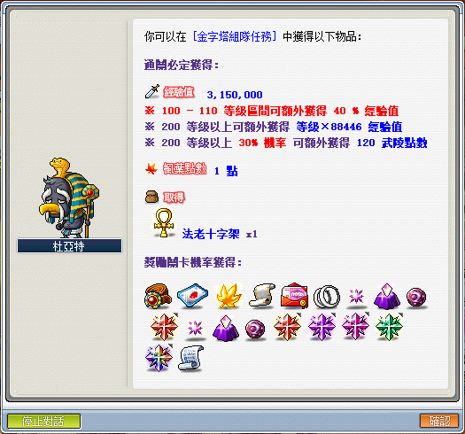
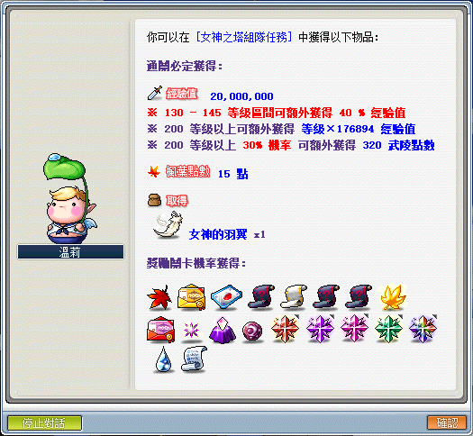
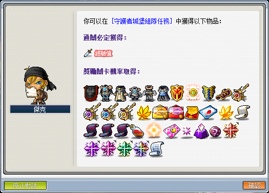

# 組隊任務

| 組隊任務  | 基本經驗值      | 加成經驗值等級區間 | 加成經驗值 | 武陵點數（獲得機率） | 200 等以上經驗值   | 200 等獲得經驗   |
|-------|------------|-----------|-------|------------|--------------|-------------|
| 超級綠水靈 | 16,800     | 21-30     | 30%   | 80 (30%)   | Lv * 44,223  | 8,844,600   |
| 時空的裂縫 | 311,900    | 35-50     | 40%   | 400 (30%)  | Lv * 221,117 | 44,223,400  |
| 毒霧森林  | 350,000    | 45-55     | 50%   | 120 (30%)  | Lv * 66,335  | 13,267,000  |
| 金勾海賊王 | 400,000    | 55-70     | 50%   | 80 (30%)   | Lv * 44,223  | 8,844,600   |
| 羅密歐   | 1,500,000  | 75-90     | 40%   | 128 (30%)  | Lv * 70,758  | 14,151,600  |
| 金字塔   | 3,150,000  | 100-110   | 40%   | 120 (30%)  | Lv * 88,446  | 17,689,200  |
| 女神之塔  | 20,000,000 | 130-145   | 40%   | 320 (30%)  | Lv * 176,894 | 35,378,800  |
| 守護者城堡 |            |           |       |            |              |             |

## 超級綠水靈（超綠）

## 時空的裂縫（101）

## 毒霧森林

## 金勾海賊王

## 羅密歐

目前可獲得經驗為與武陵點數與女神之塔相同。

## 金字塔

## 女神之塔

## 守護者城堡（CWK）

