# 全職業技能取得

## 楓葉淨化

1. 任務名稱為「堅固的意志」，首先去神木村找 NPC 村長塔塔曼接取任務「卡勒塔的罪」，他會要你找 NPC 卡勒塔。

    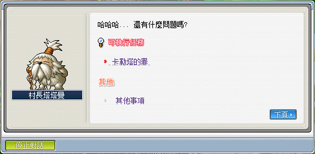

2. NPC 卡勒塔位於水世界 - 深海峽谷 1 的隱藏地圖 - 卡勒塔洞穴。

    | 大地圖：深海峽谷 1           | 隱藏地圖 - 卡勒塔洞穴          |
    |----------------------------|-----------------------------|
    | 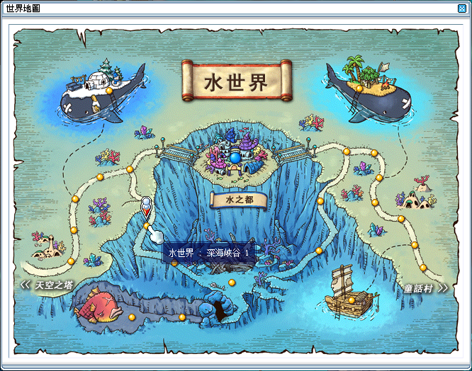 | 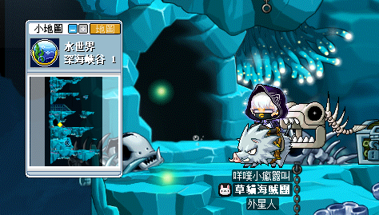 |

3. 進入隱藏地圖 - 卡勒塔洞穴並和 NPC 卡勒塔回報任務「卡勒塔的罪」。

    | 卡勒塔                      | 回報任務「卡勒塔的罪」         |
    |----------------------------|-----------------------------|
    | 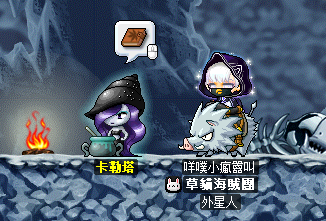 | 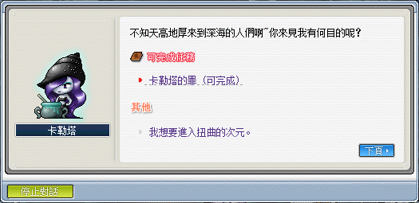 |

4. 向 NPC 卡勒塔接取任務「意志的碎片」，需要進入扭曲的次元收集 40 個【意志的碎片】給卡勒塔。

    - 向 NPC 卡勒塔對話，選擇「我想要進入扭曲的次元」即可進入（需準備一個【海怒斯模型】入場，此任務可以組隊進行，一旦跟 NPC 講話將會是**整個組隊**一起進入）。

    | 接取任務「意志的碎片」         | 海怒斯模型                   |
    |----------------------------|-----------------------------|
    | 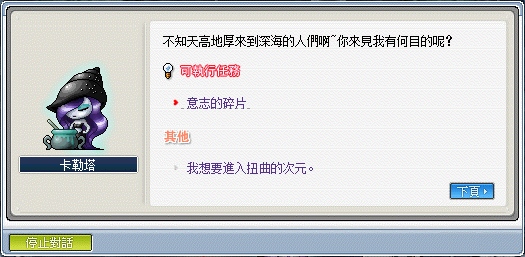 | 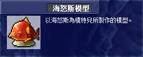 |

    | 進入扭曲的次元               | 意志的碎片                    |
    |----------------------------|-----------------------------|
    |  | 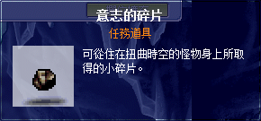 |

5. 收集 40 個【意志的碎片】後向 NPC 卡勒塔回報任務「意志的碎片」，並接取任務「卡勒塔的老舊手鐲」。

    | 回報任務「意志的碎片」         | 接取任務「卡勒塔的老舊手鐲」   |
    |----------------------------|-----------------------------|
    |  | 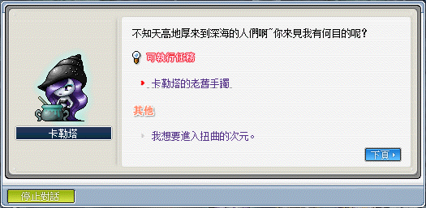 |

6. 找 NPC 流浪煉金術師（玩具城、奇幻村、神木村）回報任務「卡勒塔的老舊手鐲」後，接取任務「製作鋰礦手鐲」，並需要收集材料 10 個【鋰礦石】 + 1 個【老舊手鐲】。

    - 【老舊手鐲】透過打倒格瑞芬多取得，格瑞芬多在神木村 - 格瑞芬多森林。

    | 回報任務「卡勒塔的老舊手鐲」      | 任務「製作鋰礦手鐲」             |
    |-------------------------------|-------------------------------|
    | 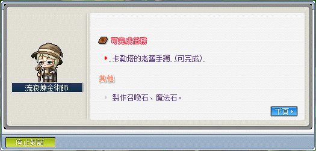 |  |

    | 大地圖：火焰死亡戰場             | 格瑞芬多森林入口                | 任務道具【老舊手鐲】            |
    |-------------------------------|-------------------------------|------------------------------|
    | 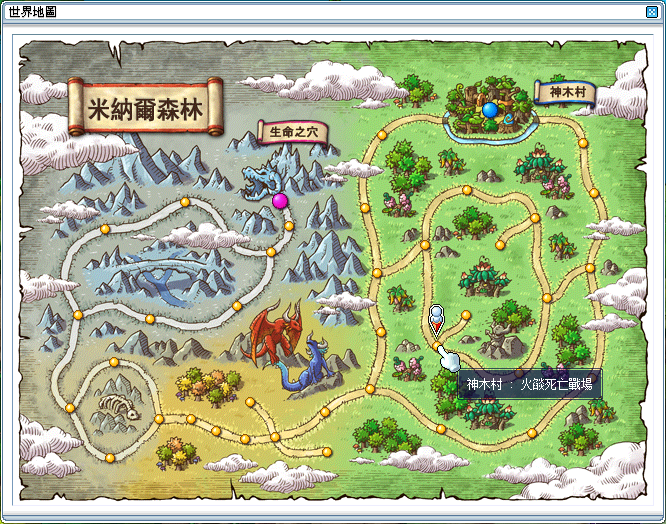 | 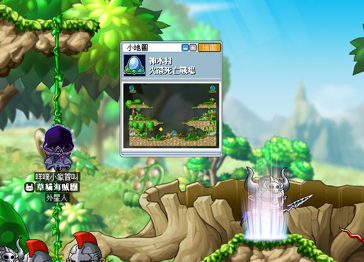 | 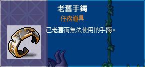 |

7. 收集完任務道具後，向 NPC 流浪煉金術師回報任務「製作鋰礦手鐲」，並在接取任務「重新找回的意志」後得到任務道具【鋰礦手鐲】。

    | 回報任務「製作鋰礦手鐲」         | 接取任務「重新找回的意志」        | 任務道具【鋰礦手鐲】            |
    |-------------------------------|-------------------------------|------------------------------|
    | 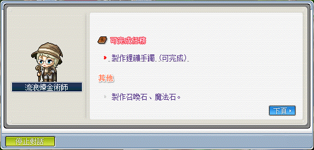 | 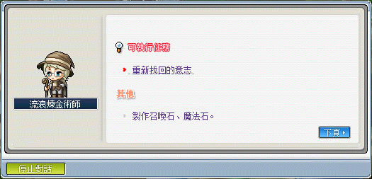 | 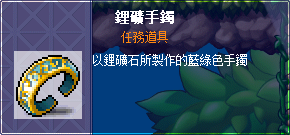 |

8. 向 NPC 卡勒塔回報任務「重新找回的意志」並得到道具【堅忍意志】，雙擊使用後即可習得技能楓葉淨化。

    | 回報任務「重新找回的意志」       | 道具【堅忍意志】                |
    |------------------------------|-------------------------------|
    | 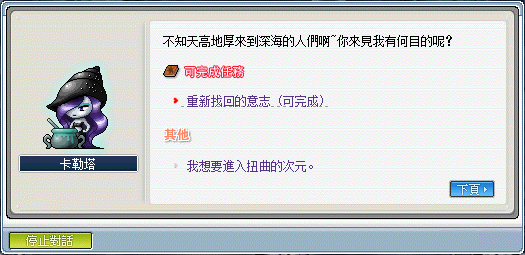 | 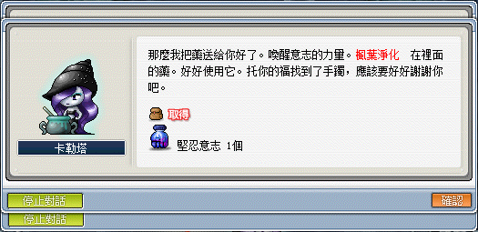 |

## 英雄迴響

1. 當玩家等級達到 200 時，可前往天空之城 - 天空之城塔 <8 層> 與雕像對話。

2. 再次與雕像對話，取得英雄迴響技能。

    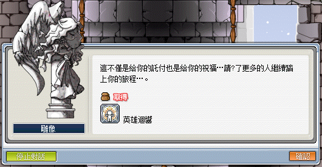
