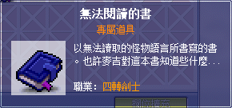

## 黑暗力量／鬼神之擊／鬥氣爆發

1. 任務名稱為「被遺忘的劍士之歌」，首先先去玩具城 - 赫爾奧斯塔（玩具城右邊塔）圖書館找懷茲接取任務，並且取得任務道具【賽伊蘭故事書】。

    | 任務名稱                    | 圖書館員懷茲                  |
    |----------------------------|-----------------------------|
    |  |  |

2. 到神木村找村長塔塔曼對話，村長塔塔曼會要求你擊敗「格瑞芬多」並且取得【賽伊蘭的項鍊】。格瑞芬多位在格瑞芬多森林，地圖指出位置如下圖所示。

    | 任務名稱                    | 所在地                       | 任務道具                     |
    |----------------------------|-----------------------------|-----------------------------|
    |  |  |  |

3. 將項鍊交給塔塔曼後，到奇幻村 - 另外的出口找無意義存在者對話。NPC會要求你取得【賽伊蘭的盾牌】。

    | 地圖                        | NPC                        |
    |----------------------------|-----------------------------|
    |  |  |

    - 進入該空間前面需要擊敗巴洛谷取得【聖殿鑰匙】，巴洛谷位於奇幻村 - 被詛咒的寺院。取得聖殿鑰匙後再從寺院通道 IV 進入到「被遺忘的神殿」（附地圖）。

        | 被詛咒的寺院                 | 寺院通道 IV                  | 任務道具                     |
        |-----------------------------|----------------------------|-----------------------------|
        |  |  |  |

4. 進入該地圖後，先把地圖上大量的巴洛谷淨空。而後走到左上傳送點後會看到五張石製盾牌。使用普通攻擊敲擊五張的任意一張玩猜猜樂，**只有一張石製盾牌會掉賽伊蘭的盾牌，猜錯則會被傳出去直到猜對為止！**

    - Note：為了避免猜錯傳出去後要再次走回寺院通道 IV 的長時間消耗，建議在寺院通道 IV 準備一隻主教。猜錯時主教開時空門，解任務的劍士使用回捲或 `@fm` 出去回村莊走時空門到寺院通道 IV 以節省大量時間。

    

5. 將賽伊蘭的盾牌交給懷茲（玩具城 - 赫爾奧斯塔圖書館）即可依照職業之不同習得技能。

    - 黑騎士：黑暗力量
    - 聖騎士：鬼神之擊
    - 英　雄：鬥氣爆發

## 究極突刺

1. 任務名稱為「麥吉的試驗」，要先[打「長槍牛魔王（Lv75）」從其身上取得【無法閱讀的書】後才可以進行該任務。

    

    

2. 去勇士之村的左上角找麥吉，麥吉會要求你去「特殊地圖」打倒 200 隻「突進長槍牛魔王」。

    

    

3. 秘密神殿位於奇幻村 - 寺院通道 III 的傳點，如下圖所示：

    

4. 進去該地圖打 200 隻突進長槍牛魔王。

    

5. 完成任務後回去找麥吉，得到究擊突刺 10 的技能書，雙擊之後即可習得。

    
