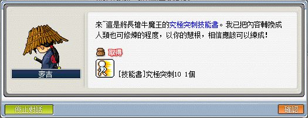

# 劍士技能取得

## 黑暗力量／鬼神之擊／鬥氣爆發

1. 任務名稱為「被遺忘的劍士之歌」，首先先去玩具城 - 赫爾奧斯塔（玩具城右邊塔）圖書館找懷茲接取任務，並且取得任務道具【賽伊蘭故事書】。

    | 任務名稱                    | 圖書館員懷茲                  |
    |----------------------------|-----------------------------|
    |  |  |

2. 到神木村找村長塔塔曼對話，村長塔塔曼會要求你擊敗「格瑞芬多」並且取得【賽伊蘭的項鍊】。格瑞芬多位在格瑞芬多森林，地圖指出位置如下圖所示。

    | 任務名稱                    | 所在地                       | 任務道具                     |
    |----------------------------|-----------------------------|-----------------------------|
    |  |  |  |

3. 將項鍊交給塔塔曼後，到奇幻村 - 另外的出口找無意義存在者對話。NPC會要求你取得【賽伊蘭的盾牌】。

    | 地圖                        | NPC                        |
    |----------------------------|-----------------------------|
    |  |  |

    - 進入該空間前面需要擊敗巴洛谷取得【聖殿鑰匙】，巴洛谷位於奇幻村 - 被詛咒的寺院。取得聖殿鑰匙後再從寺院通道 IV 進入到「被遺忘的神殿」（附地圖）。

        | 被詛咒的寺院                 | 寺院通道 IV                  | 任務道具                     |
        |-----------------------------|----------------------------|-----------------------------|
        |  |  |  |

4. 進入該地圖後，先把地圖上大量的巴洛谷淨空。而後走到左上傳送點後會看到五張石製盾牌。使用普通攻擊敲擊五張的任意一張玩猜猜樂，**只有一張石製盾牌會掉賽伊蘭的盾牌，猜錯則會被傳出去直到猜對為止！**

    - Note：為了避免猜錯傳出去後要再次走回寺院通道 IV 的長時間消耗，建議在寺院通道 IV 準備一隻主教。猜錯時主教開時空門，解任務的劍士使用回捲或 `@fm` 出去回村莊走時空門到寺院通道 IV 以節省大量時間。

    

5. 將賽伊蘭的盾牌交給懷茲（玩具城 - 赫爾奧斯塔圖書館）即可依照職業之不同習得技能。

    - 黑騎士：黑暗力量
    - 聖騎士：鬼神之擊
    - 英　雄：鬥氣爆發

## 究極突刺

1. 任務名稱為「麥吉的試驗」，要先打「長槍牛魔王（Lv75）」從其身上取得【無法閱讀的書】後才可以進行該任務。

    - 長槍牛魔王可以在迷霧森林 - 寺院通道 III／寺院通道 IV找到。
    - 【無法閱讀的書】亦會從地城的長槍牛魔王掉落。

    | 無法閱讀的書                 | 麥吉的試驗                   |
    |----------------------------|-----------------------------|
    |  |  |

2. 去勇士之村的左上角找麥吉並接取任務「麥吉的試驗」，麥吉會要求你去「特殊地圖」打倒 200 隻「突進長槍牛魔王」。

    

3. 秘密神殿位於奇幻村 - 寺院通道 III 的傳點，如下圖所示：

    

4. 進去該地圖打 200 隻突進長槍牛魔王。

    

5. 完成任務後回去找麥吉，得到究擊突刺 10 的技能書，雙擊之後即可習得。

    

    

## 格擋

1. 先去打地獄巴洛谷，取得【地獄巴洛谷的企劃書】。

    - 可以用乖寶寶印章 40 個換地獄巴洛谷召喚打，或從魔法森林往天空之城的船隻攔截擊殺。
    - 魔法森林往天空之城的船隻並不一定每次都會出現地獄巴洛古，此為機率性出現。

    | 開往天空之城          | 地獄巴洛古的企畫書      |
    |----------------------|---------------------|
    |  |  |

2. 去神木村 - 祭司之林找到劍士四轉教官漢摩尼亞，並接起任務「泰勒斯綁架陰謀」。

    - 神木村 → 山羊峽谷右上角門口進入到祭司之林找漢摩尼亞。

    

3. 找史菲魯納對話回報任務「泰勒斯綁架陰謀」，並接起任務「史菲魯納的建議」。

    - 天空之城 → 雲彩公園 IV → 進入天藍色屋頂的房子找 NPC 史菲魯納。

    | 天空之城 - 雲彩公園IV  | 回報任務「泰勒斯綁架陰謀」 | 接起任務「史菲魯納的建議」 |
    |----------------------|------------------------|------------------------|
    |  |    |    |

4. 在獵殺白狼人取得「白狼人的企劃書」後，交給劍士四轉教官回報任務。

    - 白狼人可以在艾納斯島 - 狼的領土 III／狼的領土 IV 找到。

    | 白狼人               | 白狼人的企畫書          |
    |----------------------|----------------------|
    |  |  |

5. 找劍士三轉教官－泰勒斯，並接起任務「保護泰勒斯」。再次對話並選擇`我有話要對你說~`後之後會馬上進入特殊地圖，請在此保護 NPC 泰勒斯 10 分鐘。

    - 劍士三轉教官－泰勒斯位於冰原雪域 - 長老公館。
    - 挑釁、魔力無限、龍魂之箭的 10 級技能書在保護泰勒斯的地圖可以打到。

    

    

    - 可以每隻怪物各打一下後拉到兩側發呆到時間結束。

    

6. 在保護完泰勒斯 10 分鐘後將會被傳送至隱藏地圖，與泰勒斯對話後取得任務道具【泰勒斯的信物】並被傳回長老公館。

    

7. 之後再跟 NPC 泰勒斯對話即可習得格擋。

    

## 究極神盾

1. 任務名稱為「盾牌的力量」。

    

2. 首先先去神木村的森林岔道找 NPC 穆斯。

    

3. 經由一系列對話（想學技能相關的對話）之後，穆斯會給一個【練習用盾牌】。裝備上此盾牌並且跟穆斯對話後進入訓練場！

4. 在訓練場內擊敗 200 隻暗黑半人馬後出去再和穆斯對話可以獲得【榮耀之盾】（裝備）+ 【究極神盾】（技能）。

## 聖靈之劍、棍

1. 任務名稱為「神聖的騎士之劍」，先找四轉教官 - 漢摩尼亞接取該任務。

    

2. 前往水世界 - 受難船的墓地進入小受難船找坦克接任務。

    | 受難船的墓地                        | 小受難船                            |
    |-----------------------------------|------------------------------------|
    |  |  |

3. 打【鯊魚假牙x10】後交給坦克，坦克會給「聖盃」這個道具。

    | 鯊魚假牙                            | 聖盃                               |
    |-----------------------------------|------------------------------------|
    |  |  |

4. 進入龍洞（闇黑龍王入場入口處）找尋聖水，聖水位於闇黑龍王洞穴入口的「右側」。

    

    - 找尋聖水部分需要進入龍洞。
    - 進入龍洞方式：須解取闇黑龍王相關中的任務「變身密藥」。
    - 解完迷宮室一系列出來後到達龍王遠征登記處。

5. 取得生命聖水後，去天空之城塔的第 8 層的中間側和雕像對話後即可習得聖靈之劍和聖靈之棍。

    

## 黑暗守護

待補充。

## 闇靈治癒

待補充。【】
