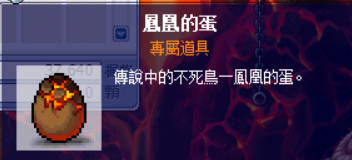
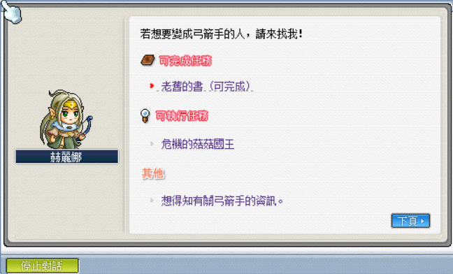

# 弓箭手技能取得

## 暴風神射、光速神弩

1. 先去神木村 - 祭司之林找 NPC 瑞吉爾接取任務「發射眼睛看不見的弓箭」。

    - 祭司之林走法：神木村 > 山羊峽谷 > 右上角傳點。

        1. 神木村 - 山羊峽谷。

            

        2. 山羊峽谷右上角傳點。

            

        3. NPC 瑞吉爾。

            

        4. 向 NPC 瑞吉爾 接取任務「發射眼睛看不見的弓箭」。

            

2. 狩獵【寒冰半人馬、火焰半人馬、暗黑半人馬】任何一個種類的人馬取得道具【赫麗娜的老舊手套】。

    - 旁人不可幫忙打，只能親自把半人馬打死取得道具！

    

3. 回到弓箭手村 - 邱比特公園進入到弓箭手培育中心找 NPC 赫麗娜（一轉教官）回報任務即可習得技能。

    - 箭神：暴風神射
    - 狙擊手：光速神弩

    1. 弓箭手村 - 邱比特公園。

        

    2. 弓箭手培育中心。

        

    3. 向 NPC 赫麗娜回報任務。

        

## 召喚鳳凰

1. 任務名稱為「傳說中的火鳥」，首先先去神木村 - 庫摩之家找尋 NPC 庫摩接取任務「火焰之鳥」。

    

2. 前往冰原雪域 - 試煉洞窟 III 的隱藏地圖 - 鳳凰的巢穴（附圖有標誌隱藏地圖的入口），使用普通攻擊把鳳凰蛋給敲破。

    | 冰原雪域 - 試煉洞窟 III                            | 隱藏地圖 - 鳳凰的巢穴                              | 鳳凰蛋                                            |
    |-------------------------------------------------|--------------------------------------------------|--------------------------------------------------|
    |  |  |  |

3. 回到神木村 - 庫摩之家找尋 NPC 庫摩回報任務「火焰之鳥」。

    

4. 和 NPC 庫摩接取任務「召喚鳳凰」。

    

5. 到神木村 - 天空之巢 I 的地圖的傳點 - 天空之巢頂端。

    

6. 把鳳凰蛋丟到地圖最上方的平台，召喚鳳凰並且擊敗它（神射手就是藍色的「冰鳳凰的卵」）。

    

    

7. 回去和庫摩回報任務，習得「召喚鳳凰／召喚銀隼」。

    

## 召喚銀隼

1. 任務名稱為「傳說中的冰鳥」，首先先去神木村 - 亞可之家找尋 NPC 亞可接取任務「冰之鳥」。

    | 神木村                                           | 亞可之家                                          |
    |-------------------------------------------------|--------------------------------------------------|
    |  |  |

2. 前往冰原雪域 - 危險的絕壁的隱藏地圖 - 冰鳳凰巢穴，使用普通攻擊把鳳凰蛋給敲破。

    

3. 回到神木村 - 亞可之家找尋 NPC 亞可回報任務「冰之鳥」。

4. 和 NPC 亞可接取任務「召喚銀隼」。

5. 到神木村 - 天空之巢 I 的地圖的傳點 - 天空之巢頂端。

    

6. 把冰鳳凰的卵丟到地圖最上方的平台，召喚鳳凰並且擊敗它（神射手就是藍色的「冰鳳凰的卵」）。

7. 回去和庫摩回報任務，習得「召喚銀隼」。

## 念力集中、必殺狙擊

1. 首先先去水世界 - 受難船的墓地打鯊魚】取得道具【老舊的書】（即綠皮書，可以交易）。

    

    

2. 到玩具城 - 赫爾奧斯塔圖書館找 NPC 懷茲接取任務「用透明墨水記載的書」。

    

3. 收集以下道具：

    - 墨汁瓶x50（水世界－烏賊怪）
    - 礦泉水x10（消耗商店有賣）
    - 魔法石x30（高等野圖怪物掉落）
    - 老舊的書x1（觸發任務的道具）

    

4. 收集完後和 NPC 懷茲回報任務。

    

5. 和 NPC 懷茲接取任務「老舊的書」。

    

6. 回到弓箭手村 - 弓箭手培訓中心（一轉教官處）找弓箭手一轉教官赫麗娜回報任務。

    | 一轉教官赫麗娜                                | 回報任務「老舊的書」                            |
    |---------------------------------------------|----------------------------------------------|
    |  |  |

7. 和弓箭手一轉教官赫麗娜接取任務「弓箭手的終極技能」。

    

8. 到冰原雪域－長老公館找NPC－蕾妮（三轉教官）對話。

    

9. 和NPC－蕾妮對話接取任務「邪摩斯的忠告」。

    

10. 到同一張地圖的最下層找 NPC 邪摩斯回報任務「邪摩斯的忠告」。

    | NPC 邪摩斯                                     | 回報任務「邪摩斯的忠告」                          |
    |-----------------------------------------------|------------------------------------------------|
    |  |  |

11. 和 NPC 邪摩斯接取任務「新的測試」。

    

12. 同一張地圖中，走到最上面和 NPC 蕾妮對話（OS：你們在同一張地圖不會一次講完？）。

    

13. 和 NPC 蕾妮接取任務「記憶者」。

    

14. 到迷霧森林 - 奇幻村（附地圖）找 NPC 記憶者對話回報任務。

    | 迷霧森林 - 奇幻村                               | 回報任務「記憶者」                                |
    |-----------------------------------------------|------------------------------------------------|
    |  |  |

15. 和 NPC 記憶者對話接取任務「無意義存在者」。

    

16. 和 NPC 無意義存在者接取任務「黑暗靈魂石」。

    | NPC 無意義存在者                                | 接取任務「黑暗靈魂石」                            |
    |-----------------------------------------------|------------------------------------------------|
    |  |  |

17. 收集【黑暗靈魂石x50】，可以透過打魔龍（Lv.62）、月牙牛魔王（Lv.70）、長槍牛魔王（Lv.75）、巴洛谷（Lv.80）取得。

    

    - 建議是使用【地城入場體驗票】，搭配【道具掉落率 2 倍券】打魔龍直接秒光。

    - 【地城入場體驗票】可以從英文村用乖寶寶印章換、或簽到都會送。

        

    - 【道具掉落率 2 倍券】可以從美江的每日補給／簽到／回饋等管道取得。

        

18. 和 NPC 無意義存在者回報任務「黑暗靈魂石」。

    

19. 和 NPC 無意義存在者接取任務「異界的巴洛谷」。

    

20. 和 NPC 無意義存在者對話，選擇`想要前往異界的弓箭手修煉場`。

    

21. 進入地圖，20 分鐘內擊敗 300 隻異界的巴洛谷。

    

22. 和 NPC 無意義存在者回報任務，即可習得念力集中／必殺狙擊！。

    
