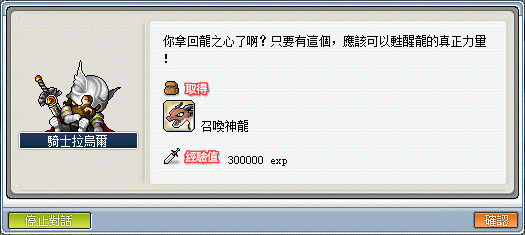
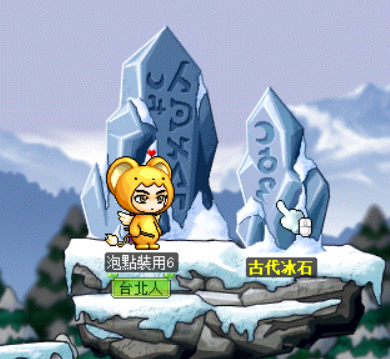
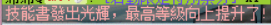
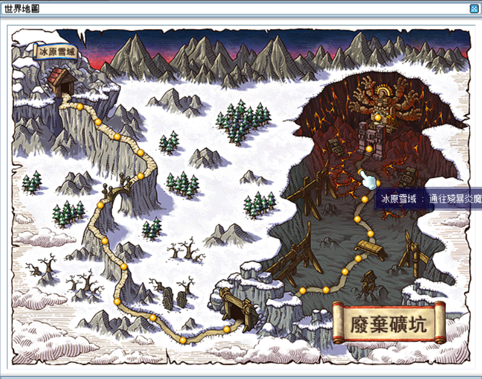
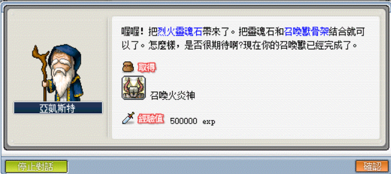

# 法師技能取得

## 天怒

天怒影片版可參考：[天怒任務－影片教學版（自己看啦！）](https://youtu.be/KpaGZ1B5sLE?si=MJSFU5mQ3--2Zfqr)。

1. 先去冰原雪域 - 長老公館尋找 NPC 羅貝亞接取任務「羅貝亞的書」。

    

2. 到玩具城 - 赫爾奧斯塔圖書館尋找 NPC 懷茲。

    | 大地圖：玩具城 - 赫爾奧斯塔圖書館 | 回報任務「火花之書」    |
    |-------------------------------|----------------------|
    |           |  |

3. 和 NPC 懷茲接取任務「某個魔法師的故事」。

    

4. 回到魔法森林 - 魔法森林圖書館（法師一轉轉職地）找 NPC 漢斯（法師一轉教官）回報任務「某個魔法師的故事」。

    | 魔法森林 - 魔法森林圖書館 | 回報任務「某個魔法師的故事」 |
    |------------------------|--------------------------|
    |    |      |

5. 和 NPC 漢斯接取任務「瘋狂的天才」。

    

6. 和冰原雪域 - 長老公館的 NPC 邪摩斯回報任務「瘋狂的天才」。

    | NPC 邪摩斯            | 回報任務「瘋狂的天才」  |
    |----------------------|----------------------|
    |  |  |

7. 和 NPC 邪摩斯接取任務「邪摩斯」。

    

8. 回到魔法森林 - 魔法森林圖書館（法師一轉轉職地）找 NPC 漢斯（法師一轉教官）回報任務「邪摩斯」。

    

9. 和 NPC 漢斯接取任務「漢斯的道歉」。

    

10. 和冰原雪域 - 長老公館的 NPC 邪摩斯回報任務「漢斯的道歉」。

    

11. 和 NPC 邪摩斯接取任務「羅貝亞的用意」。

    

12. 同一張地圖中，走到上面和 NPC 羅貝亞對話回報任務「羅貝亞的用意」。

    

13. 和 NPC 羅貝亞接取任務「羅貝亞和邪摩斯」。

    

14. 和 NPC 邪摩斯回報任務「羅貝亞和邪摩斯」。

    

15. 和 NPC 邪摩斯接取任務「天怒」。

    

16. 再解一次任務「[變身秘藥](遠征王團/闇黑龍王/前置任務/index.md#變身秘藥)」，並變身為龍的狀態。

    

17. 跳下去最下面平台，或和 NPC 對話進入到龍洞。

    

18. 進入到洞口內，和 NPC 闇黑龍王的里程碑對話。

    

19. 進入到迷宮室開扁，任何一隻怪物都會掉落任務道具【生命之根】，如果打完整張圖沒有才去下一個迷宮室（第一迷宮室、第二迷宮室等）打怪。若下一張圖仍沒有就再去下一個，依此類推慢慢打。
    - 建議使用【道具掉落率 2 倍券】或【道具掉落率 2 倍券】搭配商城道具【掉寶率加倍卡】。

    | 到迷宮室開扁            | 任務道具【生命之根】      |
    |------------------------|------------------------|
    |  |  |

20. 回到冰原雪域 - 長老公館和 NPC 邪摩斯對話回報任務「天怒」即可習得天怒！

    

## 召喚神龍

1. 任務名稱為「龍之心」，首先先去神木村 - 翼龍峽谷和 NPC 騎士拉烏爾接取任務「守護龍族的騎士」。

    

2. 打黑翼龍／藍翼龍／赤翼龍取得 20 個龍之心（建議吃【道具掉落率 2 倍券】打）。

    

3. 和 NPC 騎士拉烏爾回報即可習得召喚神龍（必須先將三轉技能聖龍召喚點到 15 才能點召喚神龍）。

    

    **召喚神龍後續的升等任務（15／20／25／30技能）也是要一直重複打龍之心任務以提升召喚神龍技能等級，只能逐次提升。**

4. 繼續與騎士拉烏爾對話並接取任務「神龍的力量 1」，要求收集 25 個龍之心，收集任務完成後後召喚神龍技能點上限提升至 15。

5. 繼續與騎士拉烏爾對話並接取任務「神龍的力量 2」，要求收集 30 個龍之心，收集任務完成後後召喚神龍技能點上限提升至 20。

6. 繼續與騎士拉烏爾對話並接取任務「神龍的力量 3」，要求收集 35 個龍之心，收集任務完成後後召喚神龍技能點上限提升至 25。

7. 繼續與騎士拉烏爾對話並接取任務「召喚神龍的完成」，要求收集 40 個龍之心，收集任務完成後後召喚神龍技能點上限提升至 30。

## 復甦之光

復甦之光影片版可參考：[【楓之谷私服】比天怒還簡單好解!?復甦之光-全網最完美教學!](https://www.youtube.com/watch?v=bRAIM83uV30&t=11s)

1. 首先先打道具【黑色書本】，該道具可以透過打殭屍、怨靈女巫取得。

    

2. 取得該道具後會出現任務「卡倫的記事本」，前往神木村 - 祭司之林和 NPC 葛雷托接取任務「黑色書」。

    | 任務名稱                     | 接取任務「黑色書」            |
    |-----------------------------|-----------------------------|
    |  |  |

3. 前往水世界 - 深海峽谷 1 的隱藏地圖，以下附圖示來標示出入口位置。

    | 大地圖：水世界 - 深海峽谷 1    | 隱藏地圖                     |
    |-----------------------------|-----------------------------|
    |  |  |

4. 進入水世界 - 卡勒塔洞穴後和卡勒塔回報任務。

    

5. 和 NPC 卡勒塔接取任務「矛盾的方法」。

    

6. 收集以下道具：
    - 道符 5 個（奇幻村 - 殭屍菇菇）
    - 火精靈的火精 50 個（冰原雪域/神秘澡堂 - 火精靈）
    - 寒冰碎塊 100 個（玩具城 - 怨靈女巫）

    

7. 收集完畢後向卡勒塔回報任務「矛盾的方法」。

    

8. 和 NPC 卡勒塔接取任務「冰冷的火種」。

    

9. 前往水世界 - 危險海峽 2 的隱藏地圖，以下附圖示來標示出入口位置。

    | 大地圖：水世界 - 危險海峽 2      | 隱藏地圖                       |
    |-------------------------------|-------------------------------|
    |  |  |

10. 進入地圖後，先丟道具「冰冷的火種」到鍋子的上方處，使其燃起藍色火焰（瞬間移動到鍋子上方）。

    | 冰冷的火種                     | 丟到鍋子的上方處                 | 燃起藍色火焰                   |
    |-------------------------------|-------------------------------|-------------------------------|
    |  |  |  |

11. 再丟黑色書本到同一個位置，獲得卡倫的記事本。

    | 丟黑色書本                     | 卡倫的記事本                    |
    |-------------------------------|-------------------------------|
    |  |  |

12. 回到水世界 - 卡勒塔洞穴 和 NPC 卡勒塔回報任務「冰冷的火種」。

    

13. 和 NPC 卡勒塔接取任務「卡倫的記事本」。

    

14. 到奇幻村找 NPC 記憶者（OS：怎麼又是你）回報任務。

    

15. 和 NPC 記憶者接取任務「復甦之光」。

    

16. 前往玩具城 - 遺忘的迴廊地圖中間的門。

    | 大地圖：玩具城 - 遺忘的迴廊      | 地圖中間的門                    |
    |-------------------------------|-------------------------------|
    |  |  |

17. 進入地圖 - 被遺忘的黑暗，必須從左側走到右側之門，先往右邊走走到不能再往右走為止（第一張圖為起點）。

    - 建議去網路上找影片看比較好。
    - 可以丟錢幣去偵測地面，筆者就是這樣測。這邊圖是詳細沒錯，但很難看懂也是真的。邊看圖邊慢慢摸索吧，這地圖真沒輒，未來有機會會有影片版本的。
    - 迷宮內部示意參考圖。

    

18. 在最後可看到出口。

    

19. 回到奇幻村，找 NPC 記憶者回報任務「復甦之光」即可習得復甦之光（終於通過個屁，垃圾迷宮來搞人的）。

    

## 暴風雪、火流星

火流星事前準備（三選一）：

- 1.2 億楓幣：給想直接跳過炎魔前置的玩家。
- 30 個殭屍的金齒：給硬解三階段炎魔前置的玩家。
  - 殭屍的金齒可以透過打怪礦坑殭屍取得。\
    
- 去跟別的玩家拿火焰之眼。

1. 先去冰原雪域 - 長老公館尋找 NPC 羅貝亞接取任務「羅貝亞的書」。

    

2. 到玩具城 - 赫爾奧斯塔圖書館尋找 NPC 懷茲。

    | 大地圖：玩具城 - 赫爾奧斯塔圖書館         | 回報任務「火花之書」                     |
    |---------------------------------------|---------------------------------------|
    |  |  |

3. 和 NPC 懷茲接取任務「某個魔法師的故事」。

    

4. 回到魔法森林 - 魔法森林圖書館（法師一轉轉職地）找 NPC 漢斯（法師一轉教官）回報任務「某個魔法師的故事」。

    | 魔法森林 - 魔法森林圖書館                | 回報任務「某個魔法師的故事」              |
    |---------------------------------------|---------------------------------------|
    |  |  |

5. 和 NPC 漢斯接取任務「瘋狂的天才」。

    

6. 和冰原雪域 - 長老公館的 NPC 邪摩斯回報任務「瘋狂的天才」。

    | NPC 邪摩斯                             | 回報任務「瘋狂的天才」                   |
    |---------------------------------------|---------------------------------------|
    |  |  |

7. 和 NPC 邪摩斯接取任務「邪摩斯」。

    

8. 回到魔法森林 - 魔法森林圖書館（法師一轉轉職地）找 NPC 漢斯（法師一轉教官）回報任務「邪摩斯」。

    

9. 和 NPC 漢斯接取任務「漢斯的道歉」。

    

10. 和冰原雪域 - 長老公館的 NPC 邪摩斯回報任務「漢斯的道歉」。

    

11. 和 NPC 邪摩斯接取任務「羅貝亞的用意」。

    

12. 同一張地圖中，走到上面和 NPC 羅貝亞對話回報任務「羅貝亞的用意」。

    

13. 和 NPC 羅貝亞接取任務「羅貝亞和邪摩斯」。

    

14. 和 NPC 邪摩斯回報任務「羅貝亞和邪摩斯」。

    

15. 和 NPC 邪摩斯接取任務：
    - 大魔導士（冰、雷）：「暴風雪」。
    - 大魔導士（火、毒）：「火流星」。

    

16. 給 NPC 邪摩斯對應的道具回報任務後，即可獲得對應技能：
    - 大魔導士（冰、雷）：任務道具【冰凍的白狼心臟x1】，習得技能暴風雪。
    - 大魔導士（火、毒）：任務道具【火焰之眼　　　x1】，習得技能火流星。
    - 【冰凍的白狼心臟】可以從地圖從白狼人身上獲得，地點為狼的領土 III、狼的領土 IV。

    |  回報任務「火流星」                        | 習得技能火流星                           |
    |-----------------------------------------|-----------------------------------------|
    |  |  |

## 寒冰地獄

1. 先打寒冰半人馬取得道具【急凍寒冰之書】。

    

2. 打開任務，會出現新任務「古代冰石」，前往神木村 - 祭司之林找 NPC 葛雷托。

    

3. 從神木村 - 山羊峽谷進入祭司之林，並向 NPC 葛雷托接取任務「寒冰之書」。

    

4. 回到魔法森林 - 魔法森林圖書館（法師一轉轉職地）找 NPC 漢斯回報任務「寒冰之書」。

    | 魔法森林 - 魔法森林圖書館     | 回報任務「寒冰之書」           |
    |----------------------------|----------------------------|
    |  |  |

5. 和 NPC 漢斯對話接取任務「奇妙的文章」。

    

6. 到冰原雪域 - 長老公館尋找 NPC 羅貝亞回報任務「奇妙的文章」。

    | NPC 羅貝亞                  | 回報任務「奇妙的文章」         |
    |----------------------------|----------------------------|
    |  |  |

7. 和 NPC 羅貝亞對話接取任務「雪山寒冰」。

    

8. 到艾納斯島 - 冰雪峽谷 II 找 NPC 傑夫回報任務「雪山寒冰」。

    | 大地圖：艾納斯島 - 冰雪峽谷 II | 冰雪峽谷 II                    | 回報任務「雪山寒冰」             |
    |----------------------------|-------------------------------|-------------------------------|
    |  |  |  |

9. 使用回家卷軸回到冰原雪域（或在對話輸入`@fm`，然後出去自由回到冰原雪域）。

    

10. 進入到艾納斯大陸 - 冰原雪域市集這張地圖找 NPC 伯堅接取任務「擊碎冰塊的槌子」。

    | 冰原雪域市集                   | 接取任務「擊碎冰塊的槌子」        |
    |-------------------------------|------------------------------|
    |  |  |

11. 收集以下道具：
    - 紫礦石成品 2 個
    - 寒冰碎塊 30 個（玩具城 - 怨靈女巫）
    - 月石 1 個（礦石礦成品各 1 + 1000000 楓幣）

        

    

12. 和 NPC 伯堅回報任務「擊碎冰塊的槌子」並取得任務道具後，到艾納斯島 - 冰雪峽谷 II 找 NPC 傑夫對話，會直接傳送到隱藏地圖 - 寒冰峽谷。

    | 冰雪峽谷 II                   | 寒冰峽谷                       |
    |-------------------------------|------------------------------|
    |  |  |

13. 到地圖的中央，和 NPC 古代冰石對話即可取得道具【冰石的粉末】。

    | NPC 古代冰石                   | 冰石的粉末                     |
    |-------------------------------|------------------------------|
    |  |  |

14. 打開背包，在消耗欄雙擊兩下道具即可習得寒冰地獄。

    

    

## 炎靈地獄

1. 先打火焰半人馬取得道具【烈焰火花之書】。

    

2. 打開任務，會出現新任務「古代冰石」，前往神木村 - 祭司之林找 NPC 葛雷托。

    

3. 從神木村 - 山羊峽谷進入祭司之林，並向 NPC 葛雷托接取任務「火花之書」。

    

4. 回到魔法森林 - 魔法森林圖書館（法師一轉轉職地）找 NPC 漢斯回報任務「火花之書」。

    | 魔法森林 - 魔法森林圖書館     | 回報任務「火花之書」           |
    |----------------------------|----------------------------|
    |  |  |

5. 和 NPC 漢斯對話接取任務「奇妙的文章」。

    

6. 到冰原雪域 - 長老公館尋找 NPC 羅貝亞回報任務「奇妙的文章」。

    | NPC 羅貝亞                  | 回報任務「奇妙的文章」         |
    |----------------------------|----------------------------|
    |  |  |

7. 和 NPC 羅貝亞對話接取任務「廢礦的熔岩」。

    

8. 到冰原雪域 - 通往殘暴炎魔之門找 NPC 阿杜比斯回報任務「廢礦的熔岩」。

    | 大地圖：通往殘暴炎魔之門       | NPC 阿杜比斯                   | 回報任務「廢礦的熔岩」          |
    |----------------------------|-------------------------------|-------------------------------|
    |  |  |  |

9. 使用回家卷軸回到冰原雪域（或在對話輸入`@fm`，然後出去自由回到冰原雪域）。

    

10. 進入到艾納斯大陸 - 冰原雪域市集這張地圖找 NPC 伯堅接取任務「可盛裝熔岩的容器」。

    | 冰原雪域市集                   | 接取任務「可盛裝熔岩的容器」        |
    |-------------------------------|------------------------------|
    |  |  |

11. 收集以下道具：
    - 鑽石成品 2 個
    - 火精靈的火精 30 個（玩具城 - 怨靈女巫）
    - 星石 1 個（寶石礦成品各 1 + 1000000 楓幣）

        

    

12. 和 NPC 伯堅回報任務「可盛裝熔岩的容器」，並取得【強化玻璃瓶】。

    

13. 到冰原雪域 - 通往殘暴炎魔之門找 NPC 阿杜比斯對話，選擇選項`我要前往熔岩心臟部位（火毒四轉任務）`。

    - 進去後有時候會召喚不出來，可以用以下方法解決：
        - 換頻道再進去一次
        - 重新進去一次

    

14. 跳「簡單」忍耐，沒任何訣竅多練習或請代跳（這沒辦法教）。

    | 忍耐                          | 忍耐                          |
    |-------------------------------|------------------------------|
    |  |  |

15. 將【強化玻璃瓶】丟到火山處，即可獲得道具【裝有熔岩的瓶子】。

    

16. 打開背包，在消耗欄雙擊兩下道具即可習得寒冰地獄。

    

    

    

## 召喚火炎神、召喚冰魔

事先準備好以下材料和任務以方便任務進行：

- 大魔導士（冰、雷） - 召喚火炎神
  - **任務前置： 寒冰地獄全部解完習得寒冰地獄**
  - 火精靈的火精 50 個（冰原雪域/神秘澡堂 - 火精靈）
  - 半人馬的火花 10 個（神木村 - 火焰半人馬）
  - 小火花羽毛 10 個（神木村 - 血腥哈維）
  - 自由之靈 50 個（玩具城 - 幽魂發條熊隊長）
  - 邪惡鐘心 50 個（玩具城 - 黑暗冥鐘）
  - 束縛枷鎖 30 個（玩具城 - 怨靈發條熊隊長）
  - 召喚石 30 個（高等怪會掉）
  - 紫礦石成品 10 個
  - 鋰礦石成品 5 個
  - 朱礦石成品 5 個
- 大魔導士（火、毒） - 召喚冰魔：
  - **任務前置： 炎靈地獄全部解完習得炎靈地獄**
  - 冷凍魚翅 30 個（水世界 - 尖鼻鯊魚）
  - 寒冰碎塊 40 個（玩具城 - 怨靈女巫）
  - 寒冰背部骨 30 個（奇幻村 - 冰龍）
  - 自由之靈 50 個（玩具城 - 幽魂發條熊隊長）
  - 邪惡鐘心 50 個（玩具城 - 黑暗冥鐘）
  - 束縛枷鎖 30 個（玩具城 - 怨靈發條熊隊長）
  - 召喚石 30 個（高等怪會掉）
  - 紫礦石成品 10 個
  - 鋰礦石成品 5 個
  - 朱礦石成品 5 個

1. 到艾納斯大陸 - 冰原雪域市集找尋 NPC 亞凱斯特接取任務「屬性的終點」。

    

2. 根據職業提交不同之材料：

    | 屬性的終點（冰、雷）                               | 屬性的終點（火、毒）                               |
    |-------------------------------------------------|-------------------------------------------------|
    |  |  |

    - 大魔導士（冰、雷）
        - 火精靈的火精 50 個（冰原雪域/神秘澡堂 - 火精靈）
        - 半人馬的火花 10 個（神木村 - 火焰半人馬）
        - 小火花羽毛 10 個（神木村 - 血腥哈維）
    - 大魔導士（火、毒）
        - 冷凍魚翅 30 個（水世界 - 尖鼻鯊魚）
        - 寒冰碎塊 40 個（玩具城 - 怨靈女巫）
        - 冰背部骨 30 個（奇幻村 - 冰龍）

3. 同一張地圖中，找尋 NPC 亞凱斯特接取任務「逆屬性」。

    

4. 到天空之城 - 天空之城塔 <10 層> 的隱藏地圖 - 天空之塔 <秘密之室> 找尋 NPC 豪克。

    | 天空之城塔 <10 層>                                | NPC 豪克                                        |
    |-------------------------------------------------|-------------------------------------------------|
    |  |  |

5. 和 NPC 豪客回報任務「逆屬性」。

    

6. 去天空之城 - 天空之塔 <地下 2 樓> 的隱藏地圖找 NPC 秀茲。

    | 天空之塔 <地下 2 樓>                              | NPC 秀茲                                        |
    |-------------------------------------------------|-------------------------------------------------|
    |  |  |

7. 和 NPC 秀茲接取任務「逆屬性召喚獸理論」。

    

8. 回到天空之城 - 天空之城塔 <10 層> 的隱藏地圖 - 天空之塔 <秘密之室> 找尋 NPC 豪克，並且接取任務「豪克的靈魂袋」。

    

9. 提交以下材料（不分職業都一樣）：

    - 自由之靈 50 個（玩具城 - 幽魂發條熊隊長）
    - 邪惡鐘心 50 個（玩具城 - 黑暗冥鐘）
    - 束縛枷鎖 30 個（玩具城 - 怨靈發條熊隊長）
    - 召喚石 30 個（高等怪會掉）

    

10. 在提交材料後會獲得道具「靈魂袋」。

    

11. 去天空之城 - 天空之塔 <地下 2 樓> 的隱藏地圖找 NPC 秀茲

12. 向 NPC 秀茲提交以下材料：

    - 紫礦石成品 10 個
    - 鋰礦石成品 5 個
    - 朱礦石成品 5 個
    - 靈魂袋 1 個（第10.步驟取得）

    

13. 向 NPC 秀茲接取任務「召喚獸的骨架」。

    

14. 到艾納斯大陸 - 冰原雪域市集找尋 NPC 亞凱斯特回報任務「召喚獸的骨架」。

    

15. 和 NPC 亞凱斯特接取任務「變更屬性」。

    

16. 到玩具城 > 鐘塔最下層 - 時間通道處找 NPC 福樂接取任務「異界的鑰匙」。

    | 大地圖：路德斯湖                                    | 大地圖：鐘塔最下層 - 時間通道                         |
    |---------------------------------------------------|---------------------------------------------------|
    |  |  |

    | NPC 福樂                                           | 接取任務「異界的鑰匙」                                |
    |---------------------------------------------------|---------------------------------------------------|
    |  |  |

17. 前往玩具城 - 扭曲的迴廊打「通道守門人」（建議吃道具掉落率 2 倍券 + 掉寶機率加倍卡，因為怪物一張圖只有 2 隻）取得任務道具【異界的鑰匙】。

    | 大地圖：扭曲的迴廊                                   | 異界的鑰匙                                         |
    |---------------------------------------------------|---------------------------------------------------|
    |  |  |

18. 到玩具城：鐘塔最下層 - 時間通道處找 NPC 福樂回報任務「異界的鑰匙」。

    

19. 和同樣類型職業（大魔導士 - 冰雷或火毒）組隊兩人，點 NPC 福樂進入到達納托斯的房間，跳下去最下層並且擊敗兩隻達納托斯後取得烈火靈魂石或寒冰靈魂石（不會一次就一定取得）。

    - **建議**最好是一冰搭一火，因為一個用冰打傷害只有 1、一個用火打傷害只有 1，除非願意學核爆術。
    - 只要是一冰一火的組合，無論有沒有解過任務都可以（即可以找人直接幫）。

    

    | 烈火靈魂石                                         | 寒冰靈魂石                                          |
    |---------------------------------------------------|---------------------------------------------------|
    |  |  |

20. 和 NPC 亞凱斯特回報任務即可按照職業習得召喚物技能。

    - 大魔導士（冰、雷）習得召喚火炎神。
    - 大魔導士（火、毒）習得召喚冰魔。

    | 召喚火炎神                                         | 召喚冰魔                                            |
    |---------------------------------------------------|---------------------------------------------------|
    |  |  |
