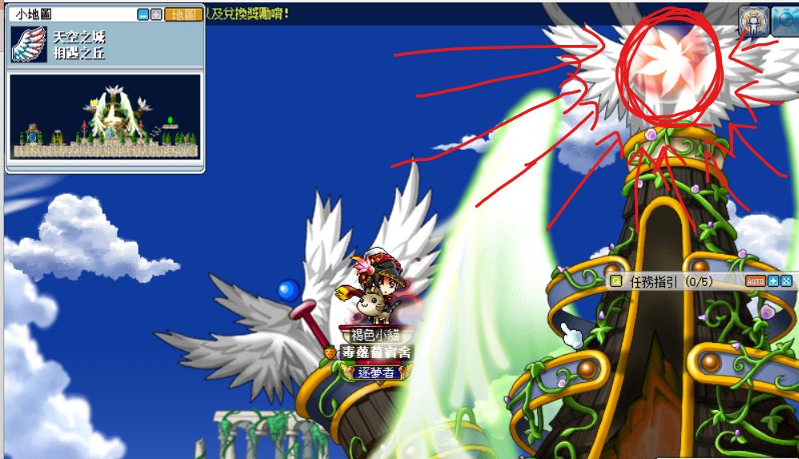
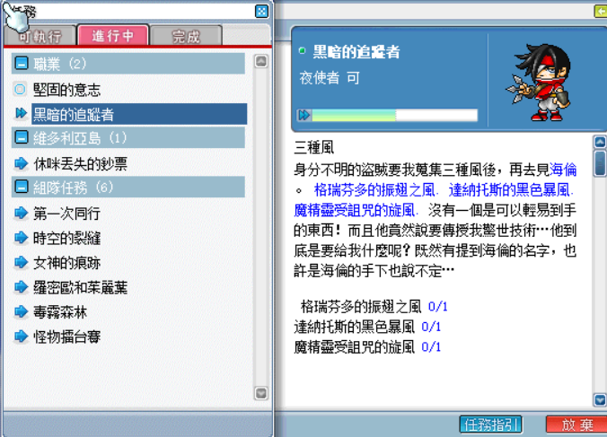

# 盜賊技能取得

## 忍術風影

1. 先去地城或玩具城隱藏地圖 - 彎曲的時間討伐怪物多立百烈取得道具【來歷不明的信】。

    

    - 彎曲的時間走法：玩具城 > 進到時間通道 > 走道扭曲的時間之路 <3> > 進入隱藏地圖－彎曲的空間。

        

    - 多立百烈如圖所示。

        

2. 打開任務，會多一個名為「黑暗的追蹤者」的任務，先進去到露台中庭，然後一直往左走到雲彩露臺 <5>，之後再往左走（直接左走就對了），會到一個隱藏地圖，跟 NPC 身分不明的盜賊對話接取任務「楓葉珠子」。

    | 露台中庭                     | 雲彩露臺 <5>                 | 雲彩陽台                    | NPC 身分不明的盜賊            |
    |-----------------------------|-----------------------------|----------------------------|-----------------------------|
    |  |  |  |  |

3. 到天空之城 - 相遇之丘這張地圖（附地圖）。

    | 天空之城                     | 大地圖：相遇之丘              |
    |-----------------------------|-----------------------------|
    |  |  |

4. 利用這個瞬間移動點傳到最上方（在紅色圈圈處按 3 次 ↑）。

    | 相遇之丘                     | 相遇之丘                       |
    |-----------------------------|------------------------------|
    |  |  |

5. 滑鼠點擊紅圈圈起來的楓葉標誌，獲得任務道具【楓葉珠子】。

    | 相遇之丘                       | 任務道具【楓葉珠子】            |
    |-------------------------------|------------------------------|
    |  |  |

6. 回到隱藏露台，和NPC－身分不明的盜賊對話回報任務【楓葉珠子】（和2.的步驟完全一樣）。

    

7. 和 NPC 身分不明的盜賊接取任務「三種風」。

    

8. 打以下三個道具。

    

    - 格瑞芬多的振翅之風：格瑞芬多（神木村 - 格瑞芬多森林）
    - 達納托斯的黑色暴風：達納托斯（玩具城 - 遺忘的迴廊）
    - 魔精靈受詛咒的旋風：魔精靈（冰原雪域 - 殘暴炎魔第一階段召喚的小怪）

9. 回到神木村 - 祭司之林尋找 NPC 海倫（盜賊四轉教官）回報任務後即可習得忍術風影。

    

## 煙幕彈

事先準備以下材料以方便任務進行：

- 多立百烈推進器x10（玩具城－多立百烈）
- 螺絲釘x50（青銅成品x1鋼鐵成品x1合成4次）
- 墨汁瓶x100（水世界－烏賊怪）
- 鋼鐵（成品）x21
- 飛機螺旋槳x100（玩具城－黃色戰鬥機）
- 拉圖斯的象徵x11（石板外觀，玩具城－拉圖斯）
- 齒輪x50（玩具城－妖魔）

1. 先去隨意的地圖（野圖，如天空之城 - 黑光庭園 II、江戶村 - 天皇殿堂、地城）打黑格里芬取得道具【黑色雲霧製作法】。

    | 黑格里芬                 | 黑色雲霧製作法           |
    |-------------------------|-------------------------|
    |  |  |

2. 會多一個名為「黑色雲霧」的任務，去天空之城－天空之塔 <地下2樓> 的隱藏地圖找 NPC 秀茲。

    | 天空之塔 <地下2樓>        |  NPC 秀茲                |
    |-------------------------|-------------------------|
    |  |  |

3. 和 NPC 秀茲接取任務－黑色雲霧。

    

4. 先去地球防衛總部 - 機庫找 NPC 凱（在最下層）。

    

5. 和 NPC 凱接取任務「製作換氣風扇」。

    

6. 將 100 個飛機螺旋槳和鋼鐵（成品）1 個給 NPC 凱，獲得【換氣風扇】。

    | 任務「製作換氣風扇」       |  換氣風扇                |
    |-------------------------|-------------------------|
    |  |  |

7. 去地球防衛總部 - 司令室和 NPC 波特接取任務「波特的長效乾電池」。

    

8. 將拉圖斯象徵 1 個交給波特，獲得【長效乾電池】。

    

9. 回去找 NPC 秀茲回報任務「黑色雲霧」，任務完成獲得【黑色雲霧製作器】。

    | 回報任務「黑色雲霧」         |  黑色雲霧製作器             |
    |---------------------------|---------------------------|
    |  |  |

10. 打開消耗欄，雙擊道具【黑色雲霧製作器】即可習得煙幕彈。

    

## 忍影瞬殺

1. 任務名稱為「藏在暗影中的存在」，首先先去祭司之林找 NPC 海倫接取任務「達克魯」。

    | 任務「藏在暗影中的存在」       | 接取任務「達克魯」            |
    |----------------------------|-----------------------------|
    |  |  |

2. 回到墮落城市酒吧找 NPC 達克魯。

    | 墮落城市酒吧                 | NPC 達克魯                  |
    |----------------------------|-----------------------------|
    |  |  |

3. 跟 NPC 達克魯接取任務「藏在暗影中的存在」。

    

4. 跟 NPC 達克魯接取任務「藏在暗影中的存在」。

    

5. 擊敗達克魯的弟子x6。

    

6. 打完後回去和 NPC 達克魯對話，習得忍影瞬殺。

    

## 致命暗殺

1. 任務名稱為「黑暗的匕首」，先去冰原雪域 - 長老公館找尋 NPC 阿里可，接取任務「奇怪的請託」。

    | 任務「黑暗的匕首」            | 接取任務「奇怪的請託」         |
    |----------------------------|-----------------------------|
    |  |  |

2. 去勇士之村 - 遺跡發掘地營地（地圖有標示）找 NPC 杉峰回報任務「奇怪的請託」。

    | 遺跡發掘地營地大地圖          | 回報任務「奇怪的請託」         |
    |----------------------------|-----------------------------|
    |  |  |

3. 跟 NPC 杉峰對話後接取任務「杉峰的不安」。

    

4. 跟 NPC 杉峰對話，選擇`其他事項`（進去地圖前先開隱身）。

    

5. 打圖示圈起來的箱子（會一層一層往上爬到最上層，按照順序為 1st、2nd、3rd）。

    | 1st                        | 2nd                         | 3rd                         |
    |----------------------------|-----------------------------|-----------------------------|
    |  |  |  |

6. 到了最上層後打掉該箱子獲得任務道具【杉峰的委託物】。

    

7. 和 NPC 杉峰接取任務「阿里可與暗影神偷」。

    

8. 回去冰原雪域 - 長老公館找 NPC 阿里可對話即可習得致命暗殺。

    
