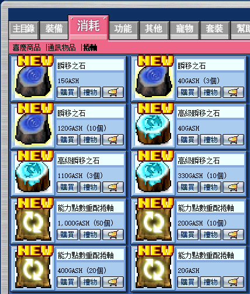
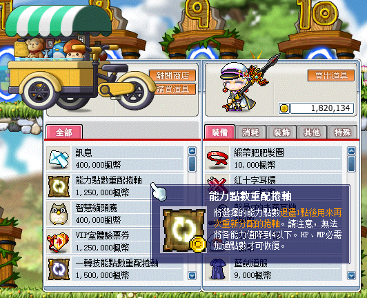
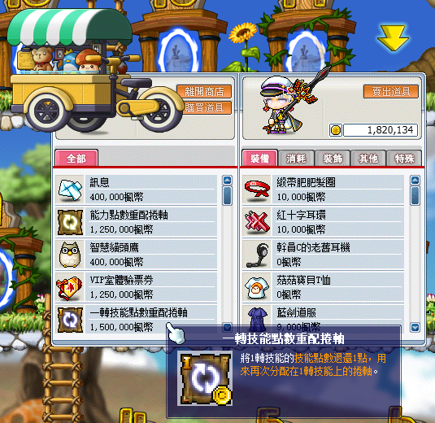

# 洗血方法

## 為什麼要洗血呢？

楓之谷原本設定的基礎血量，打王很容易被秒殺，所以夢時代有調高基礎血量

## 那這樣是不是就不用洗血？

理論上是可以，但會有以下幾個問題：

1. 可以準備 HP 裝備打王，但這樣會變相的減少輸出（不推薦）。
2. 吃加 HP 御守打王，但 HP 加的還是有限，無法 30000HP。
3. 打高難度王容易死，原地復活術取得不易。

## 要洗到多少HP比較好？

通常會要洗血的人會建議直接洗滿，原因是洗一半很奇怪（開玩笑 XD），其實是既然都要花成本洗血了，洗滿的容錯率比較高，CP 值比較划算。

## 能力點數重配卷軸是什麼？需要多少張？

能力點數重配卷軸目前取得方法有兩種：

1. 購物商城（用點數）。

    

2. 時代花車（用楓幣）。

    

依每個人的智裝強度、點了多少點智力（要點回主屬），所需要的張數不同，下列提供各職業（-MP+HP）要幾張能力點數重配卷軸才能在兩百等 + 裝備洗滿血：

1. 賊、弓、弩、槍約略需要 800 張
2. 劍士約略需要 50 張
3. 狂郎約略需要 350 張
4. 拳霸約略需要 160 張

上述的張數是粗略計算，怕多買的人可以先買八成的量，不夠再慢慢加買能力點數重配卷軸。

## 洗血知識與方法

- 洗血方法就是**先將一點能力值點加在 HP 或 MP 上**，才能用能力點數重配卷軸 -MP+HP，MP 能扣的量為升級時額外增加的 MP。
- 各職業的 MP 組成為 `MP 底線 + 裝備增加的 MP + 升級額外增加的 MP`。
- 怎麼讓升級額外增加 MP 呢？答案就是升級點智力和穿智裝，每 10 智升級時會額外增加 1MP，智力越高加的 MP 越多，最後洗完血要記得再扣一次 HP 或 MP 回主屬性上。

舉例（討厭數學的跳過）：\
假設 120 等的神射手，乾淨 HP 為 12000，乾淨 MP 為 10000，智力（本身 + 裝備）為 1000，200 等要洗到 29000HP（乾淨）。

- 要洗幾次 HP？\
  升到 200 等增加的 HP 約為 5760，因此我還需要 11240HP (29000-12000-5760)，11240 / 18（能力點數重配卷軸 +HP）約為 625 次。
- 需要多少額外的 MP 呢？\
  625 次 * 12（能力點數重配卷軸 -MP）= 7500MP
- MP 夠不夠洗？\
  10000-(Lv120 * 14) + 146 = 8174，升級時多增加的 MP(8174) > 所需要的 MP(7500)，所以 MP 已夠洗滿血。

**這邊附上一些洗血需要用到的數值：**

|        | 劍士  | 弓箭手 | 盜賊 | 拳霸  | 槍神 | 狂狼    |
| ------ | --- | --- | -- | --- | -- | ----- |
| 升等 +HP | 122 | 72  | 72 | 122 | 72 | 52    |
| 卷軸 -MP | 4~7 | 12  | 12 | 16  | 16 | 10    |
| 卷軸 +HP | 52  | 18  | 22 | 38  | 18 | 42~48 |

劍士生命擴張與拳霸強健體魄點滿會影響到浮動數值。

**各職業 MP 底線：**

| 職業           | MP 底線           |
|--------------|-----------------|
| 一轉劍士／聖騎士／黑騎士 | (Lv * 4) - 156  |
| 狂戰士、十字軍、英雄   | (Lv * 4) + 56   |
| 弓箭手、盜賊（二轉前）  | (Lv * 14) - 4   |
| 弓箭手、盜賊（二轉後）  | (Lv * 14) + 146 |
| 海盜           | (Lv * 18) + 96  |

## 特殊洗血方法（劍士、法師、拳霸）

由於劍士、法師、拳霸有可以影響 HP、MP 的技能（生命擴張、魔力擴張、強健體魄），因此可以通過下列方法來在這些等級滿時進行洗滿血的動作。

```
所需道具：
  - 一轉技能點數重配卷軸
  - 能力點數重配卷軸
```

一轉技能點數重配卷軸可以從自由市場的時代花車購買：



### 洗血流程

以劍士為例：

1. 用一轉技能點數重配卷軸將一點力量分配到 MP 上。
2. 用一轉技能點數重配卷軸將生命擴張等級扣到 0。
3. 用能力點數重配卷軸開始做 -HP+MP 的動作直到 HP 不能再扣為止。
4. 用一轉技能點數重配卷軸將生命擴張等級升到 10。
5. 用能力點數重配卷軸開始做 -MP+HP 的動作直到 MP 不能再扣為止。
6. 重複步驟 2-5，直到 HP 滿 30000 為止（因為 HP 提升上限為 30000）。
7. 用一轉技能點數重配卷軸將一點 MP 分配到力量上。

如此便可以在初期便擁有上限的 30000HP，此後升等 HP 將會從 30000 開始溢出。


