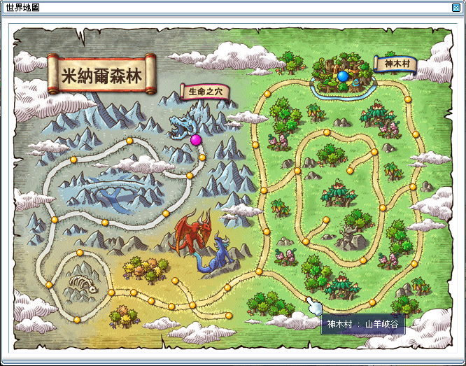
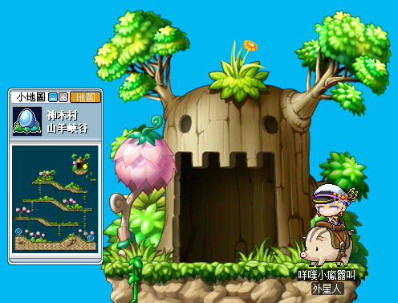
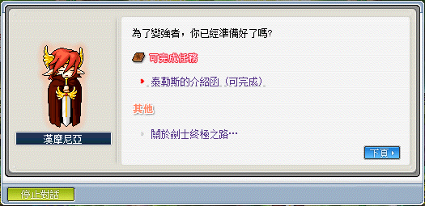
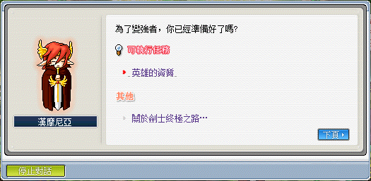
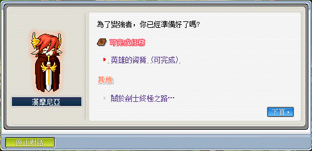
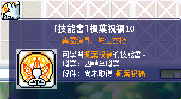
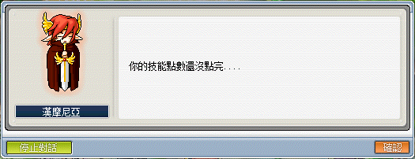

## 三轉流程

1. 首先先到冰原雪域長老公館，並向各職業對應的三轉轉職教官對話。

    

    - 劍　士 - 泰勒斯
    - 弓箭手 - 蕾妮
    - 法　師 - 羅貝雅
    - 盜　賊 - 阿里可
    - 海　盜 - 佩特勞

    

2. 對話後會傳送至一轉轉職教官所在的地圖，請和一轉轉職教官對話。

3. 對話後一轉轉職教官會將角色傳送至次元之門所在地圖，在進入次元之門後請打敗該職業教官分身取得黑符。

4. 回到冰原雪域長老公館找三轉轉職教官，對話後到尖銳的絕璧 II，從右上方的木門進入雪原聖地。

5. 與最下方的石頭對話回答並問題後，取得智慧項鍊。

    - NPC 相關
        - Q. 從楓之谷一開始，遇到的第一個 NPC 是誰？ 
          A. 莎麗
        - Q. 在維多利亞島的勇士之村看不見的 NPC 是誰？ 
          A. 易德
        - Q. 在維多利亞島的弓箭手村看不見的 NPC 是誰？ 
          A. 特奧
        - Q. 在維多利亞島的魔法森林看不見的 NPC 是誰？ 
          A. 露爾
        - Q. 在維多利亞島的墮落城市看不見的 NPC 是誰？ 
          A. 魯克
        - Q. 在艾納斯島的天空之城看不見的 NPC 是誰？ 
          A. 索非亞
        - Q. 在艾納斯島的冰原雪域看不見的 NPC 是誰？ 
          A. 管家艾瑪
        - Q. 與寵物無關的 NPC 是誰？ 
          A. 比休斯
        - Q. 下列不是進行合成、煉製、製作的 NPC 是哪一個？ 
          A. 賽恩
    - 村莊、怪物相關
      - Q. 在維多利亞島沒有的村莊是？ 
        A. 楓葉村
      - Q. 楓之島沒有哪個怪物？ 
        A. 肥肥
      - Q. 在維多利亞島沒有哪個怪物？ 
        A. 石球
      - Q. 在艾納斯島沒有哪個怪物？ 
        A. 黑鱷魚
      - Q. 綠菇菇、木妖、藍水靈、斧木妖、三眼章魚，哪個是等級最高的怪物？ 
        A. 斧木妖
      - Q. 以下會飛的怪物是什麼？ 
        A. 巫婆
      - Q. 下列怪物中，哪組怪物與打倒它所能得到的戰利品是正確對應關係的？ 
        A. 蝙蝠 - 蝙蝠翅膀
      - Q. 下列怪物中，哪組怪物與打倒它所能得到的戰利品是不正確對應關係的？ 
        A. 食人花 - 食人花的葉子
      - Q. 被怪物攻擊時特別的異常狀態沒有被正確說明的是哪一個？ 
        A. 虛弱 - 移動速度降低
    - 任務相關
      - Q. 以下要求等級最高的任務是？ 
        A. 亞凱斯特和黑暗水晶
      - Q. 喚醒麥吉的舊戰劍任務不需要的材料是什麼？ 
        A. 妖精之翼
      - Q. 弓箭手村的瑪亞請求我們拿什麼物品給她，來治好她的病？ 
        A. 奇怪的藥
      - Q. 在墮落城市中，離家出走的少年阿勒斯的父親是誰？ 
        A. 長老斯坦
      - Q. 以下可以重複執行的任務是？ 
        A. 查理中士的交換任務
      - Q. 在艾納斯島的阿爾法小隊中沒有的人物是誰？ 
        A. 皮特
    - 職業、轉職相關
      - Q. 楓之谷中，從等級 1 到等級 2 需要多少經驗值？ 
        A. 15
      - Q. 以下哪個職業不是 2 轉中出現的職業? 
        A. 魔導士(巫師)
      - Q. 根據不同職業的第 1 次轉職必須條件，被正確敘述的是哪一個？ 
        A. 弓箭手 - 敏捷 25 以上
      - Q. 為了 2 轉而收集 30 個黑珠給轉職教官，從他那裡得到什麼？ 
        A. 英雄證書
    - 藥水相關
      - Q. 楓之谷下列藥品中，哪組藥品與功效是正確對應關係的？ 
        A. 披薩 - HP 400 恢復
      - Q. 楓之谷下列藥品中，哪組藥品與功效是不正確對應關係的？ 
        A. 清晨之露 — MP 3000 恢復

6. 回到冰原雪域長老公館找三轉轉職教官並交給他智慧項鍊即可完成轉職。

### 三轉注意事項

- 轉職之前一定要把技能點數都點完，否則會有無法轉職的問題（附圖所示），二轉的技能點數總共 121 點。

  

## 四轉流程

1. 事先準備以下道具以方便轉職：

    - 秘咒（500 萬楓幣）：前往玩具城 - 愛奧斯塔 44 樓尋找NPC - 彌爾格購買。

        | NPC                 | 購買一個秘咒                                     |
        |---------------------|------------------------------------------------|
        |  |     |

2. 前往冰原雪域 - 長老公館找自己的三轉教官接取任務「XXX的 介紹信」（XXX 為三轉教官名字）。

    - 劍　士 - 泰勒斯
    - 弓箭手 - 蕾妮
    - 法　師 - 羅貝雅
    - 盜　賊 - 阿里可
    - 海　盜 - 佩特勞

    

3. 前往神木村 - 山羊峽谷地圖的右上角，進入到祭司之林。

    

    

    

4. 找自己職業的教官回報任務。

    

5. 和 OOO 接取並回報任務「OOO 的第一個故事」（OOO 為四轉教官名字）。

    **Note：教官的故事請一定要聽完！！！教官的故事請一定要聽完！！！教官的故事請一定要聽完！！！不要跳過千拜託萬拜託。**

    - 劍　士 - 漢摩尼亞
    - 弓箭手 - 瑞吉爾
    - 法　師 - 葛雷托
    - 盜　賊 - 海倫
    - 海　盜 - 薩穆埃爾

    

    | 接取第一個故事任務        | 回報第一個故事任務        |
    |-------------------------|-------------------------|
    |  |  |

6. 和 OOO 接取並回報任務「OOO 的第二個故事」（OOO 為四轉教官名字）。

    | 接取第二個故事任務          | 回報第二個故事任務           |
    |---------------------------|---------------------------|
    |  |  |

7. 和 OOO 接取並回報任務「OOO 的第三個故事」（OOO 為四轉教官名字）。

    | 接取第三個故事任務          | 回報第三個故事任務           |
    |---------------------------|---------------------------|
    |  |  |

8. 和 OOO 接取任務「英雄的資質」（OOO 為四轉教官名字）。

    

9. 回到神木村並向神木村 - 村長塔塔曼接取任務「塔塔曼的提議」。

    

10. 將準備好的秘咒交給村長塔塔曼，並取得任務道具【英雄星型墜飾】與【英雄五角勳章】。

    | 接取任務                   | 回報任務                   |
    |---------------------------|---------------------------|
    |  |  |

11. 回到神木村 - 祭司之林找自己職業的教官回報任務「英雄的資質」。

    

12. 和自己職業的轉職教官對話，選擇我想成為某某職業即可轉職。

    

13. 轉職成功！並且獲得技能書【楓葉祝福 10】。

    | 完成轉職               | 楓葉祝福技能書          |
    |-----------------------|-----------------------|
    |  |  |

### 四轉注意事項

- 轉職之前一定要把技能點數都點完，否則會有無法轉職的問題（附圖所示），三轉的技能點數總共 151 點。

  
