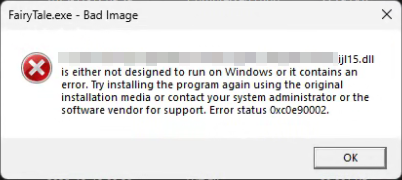
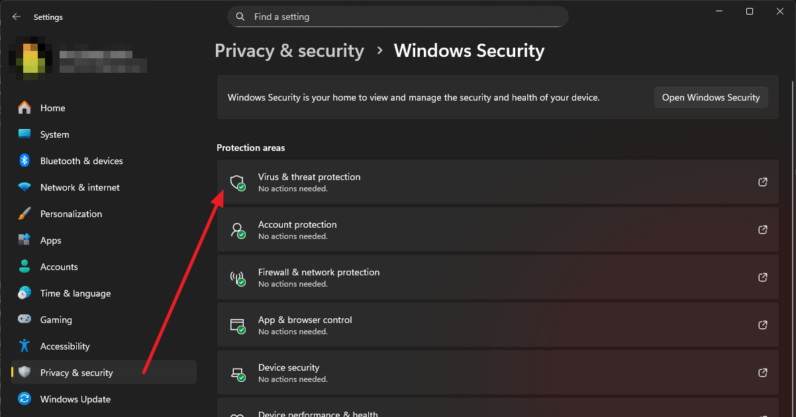
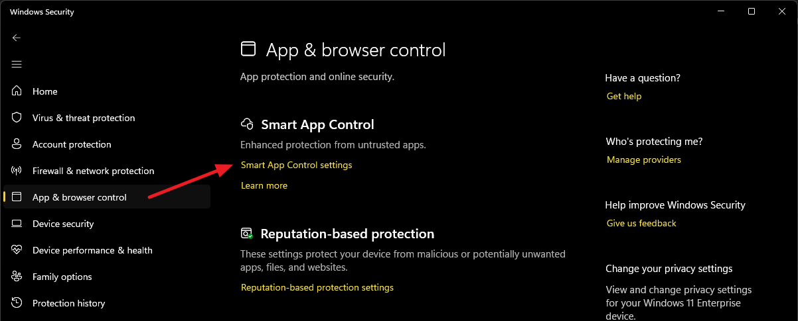
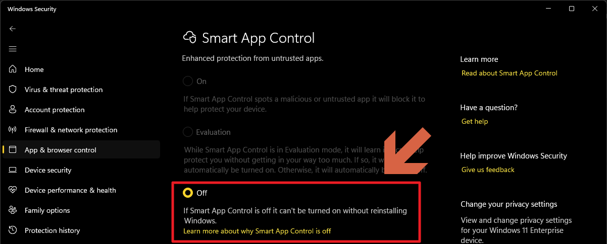

# 遊戲執行問題

## Cannot find 'ijl15.dll'. Please, re-install this application

1. 請先開啟防毒軟體，並分別將 `MapleDreams` 資料夾與 `ijl15.dll` 檔案加入白名單。

2. 請重新從官方網站下載遊戲，並解壓縮覆蓋到原有遊戲目錄上。

## FairyTale.exe - Bad Image

### 問題範例

### 解決方法

1. 請先開啟 Setting，進入 `Privacy & security` 標籤頁開啟 Windows Security，並進入 `Virus & threat protection`。

    

2. 進入 `App & browser control` 標籤頁，並點擊 `Smart App Control settings`。

    

3. 選擇 `Off`。

    - 系統可能會跳出訊息告知關閉後無法再次開啟，請確認。

    
