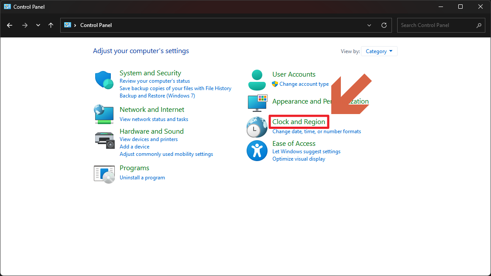
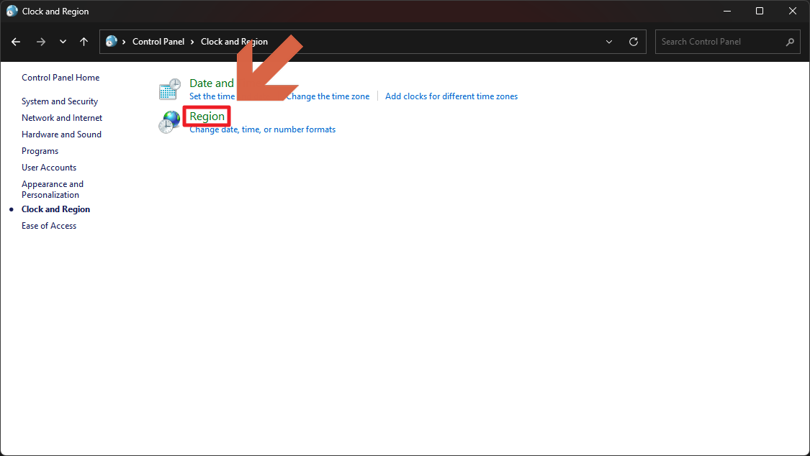
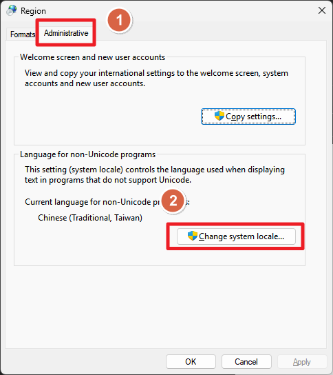
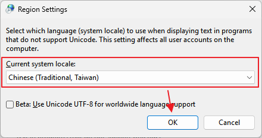

# 電腦的語系不正確

1. 開啟控制台。

2. 選擇 `Clock and Region`。

    

3. 選擇 `Region`。

    

4. 開啟 `Administrative` 分頁，並按下 `Change system locale`。

    

5. 選擇 `Chinese (Tranditional , Taiwan)`，並按下 `OK`。

    

6. 重開機後即完成設定。
