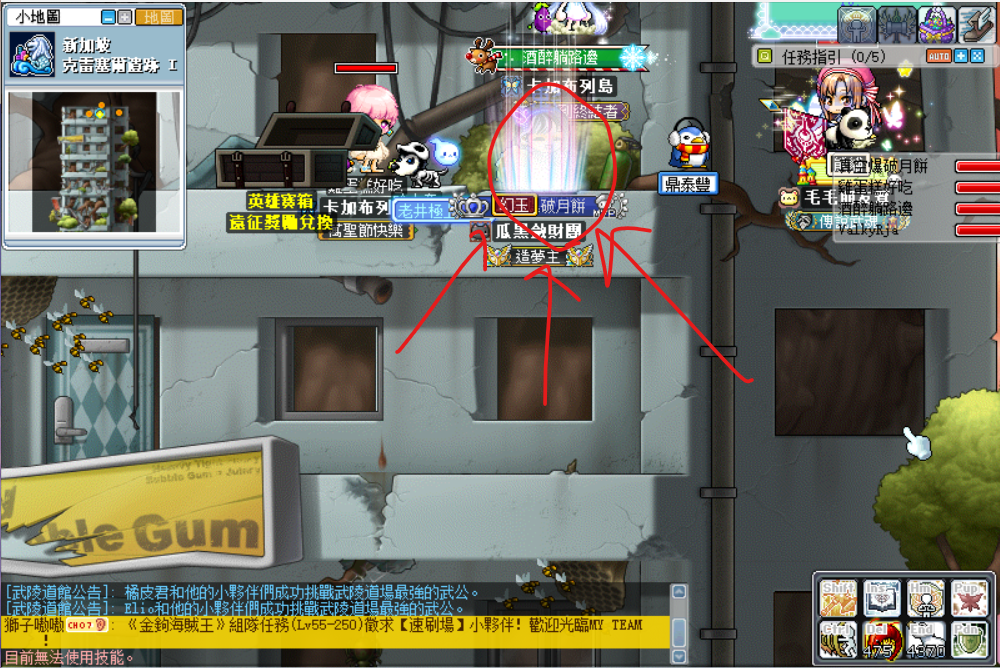
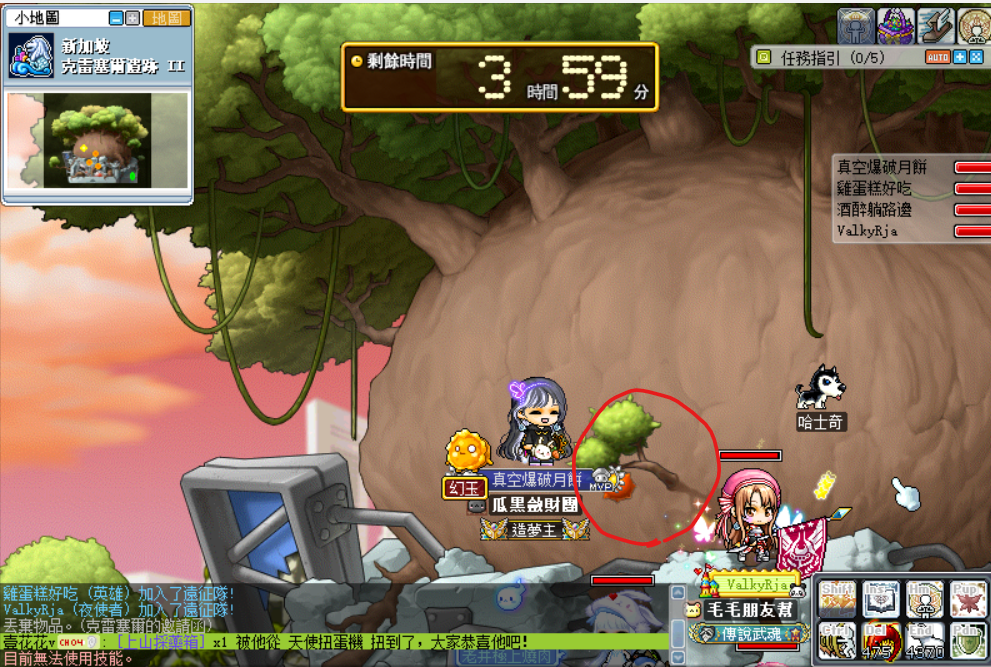
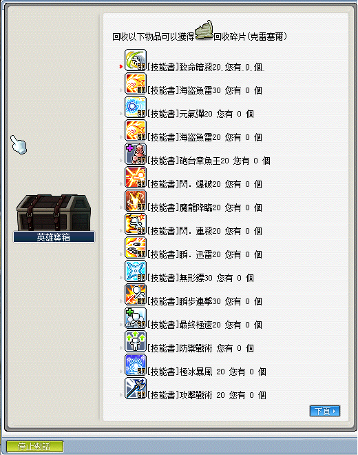

# 克雷塞爾

## 遠征說明

- 等級限制：110 以上
- 人數限制：3~12
- 前置任務：無
- 準備道具：克雷塞爾的邀請函（打一場用一張）
- 報名入口：新加坡 - 克雷塞爾遺跡 I
- 重要道具：森之守護者

## 遠征流程

1. 先到[克雷塞爾遺跡 I](遠征王團/克雷塞爾/克雷塞爾遺跡I走法/index.md)。

2. 爬到最上面後，對準圖示之光圈，按上鍵（↑）報名。

    

3. 對準圖中圈起的樹枝處使用「普通攻擊」，將其打掉後就能召喚王。

    

4. 先打克雷塞爾的左眼，打掉後再打克雷塞爾的右眼，如圖所示：

    

5. 打完 BOSS 後撿起地板的討伐象徵，之後點 NPC 出去並點擊英雄寶箱，選擇`象徵兌換`。

6. BOSS 所能兌換到之獎勵如下（感謝雞蛋糕、ValkyRja、VV馬麻支援）：

    克雷塞爾可以低機率換到「克爾遺失的文件」，為日後 200 等「冒險家巔峰之路」任務道具。

    
