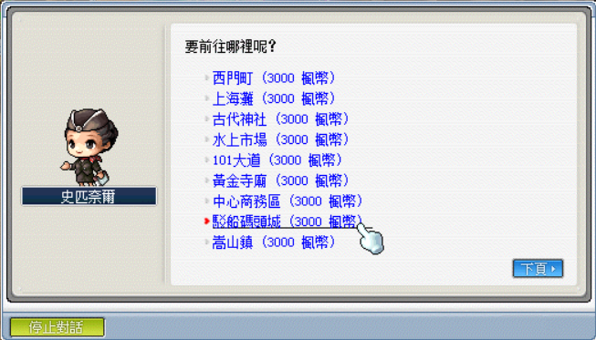

# 克雷塞爾遺跡 I 走法

1. 首先，到各個村莊找 NPC 史匹奈爾，選擇前往駁船碼頭城。

    

2. 往左走到郊區 1 後，到左上角的傳送點後進入。

    

3. 進這個傳點。

    

4. 往右走，進這個傳點。

    

5. 往上走，進這個傳點。

    

6. 往右走，進這個傳點。

    

7. 往右走，進這個傳點。

    

8. 往上走，進這個傳點。

    

9. 往右走，進這個傳點。

    

10. 往上走，進這個隱藏傳點就到了。

    
