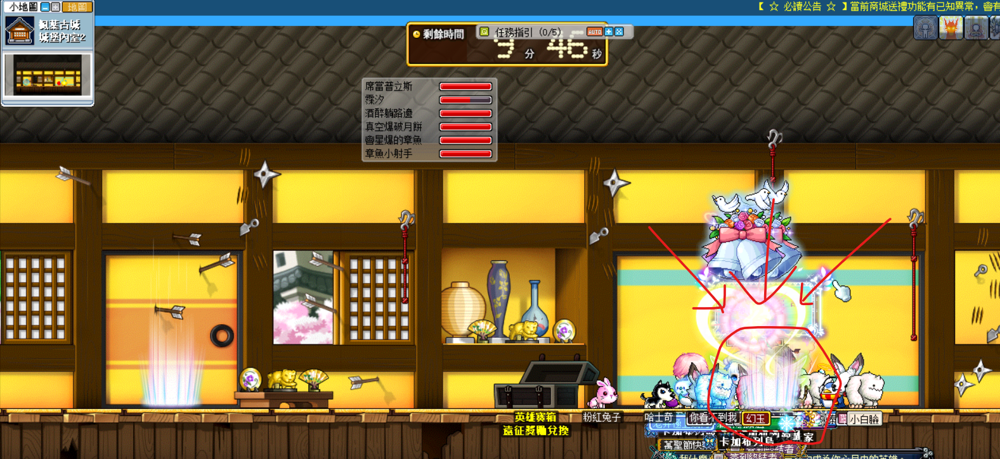
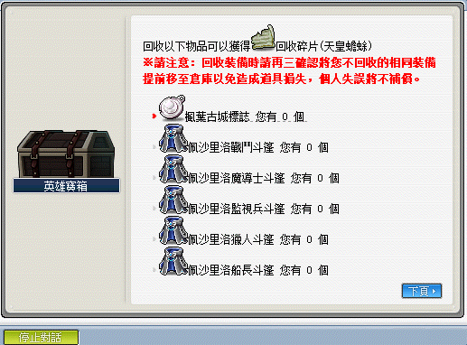

# 天皇蟾蜍

## 遠征說明

- 等級限制：160 以上（一般模式）
- 人數限制：3~12
- 前置任務：無
- 準備道具：天皇蟾蜍的邀請函（打一場用一張）
- 報名入口：楓葉古城 - 城堡內室 2
- 重要道具：樂觀、祝福、驚訝、克爾遺失的文件、140 披風、魔法楓葉、魔法楓葉抽獎箱

## 遠征流程

1. 到達[城堡內室 2](遠征王團/天皇蟾蜍/楓葉古城城堡內室2走法/index.md) 後，對準圖示之光圈，按上鍵（↑）開啟遠征、報名，然後出發開扁。

    

2. 利用【天皇蟾蜍討伐象徵】兌換或湊齊 10 個【天皇蟾蜍碎片】可以抽獎換道具。詳細獲得道具如下（感謝雞蛋糕、開花子、ValkyRja、章魚、酒醉躺路邊、席當普立斯支援）：

    - 楓葉古城標誌
    - 樂觀、祝福、驚訝
    - 魔法楓葉、魔法楓葉抽獎箱
    - 各職業140等披風
    - 克爾遺失的文件

    
