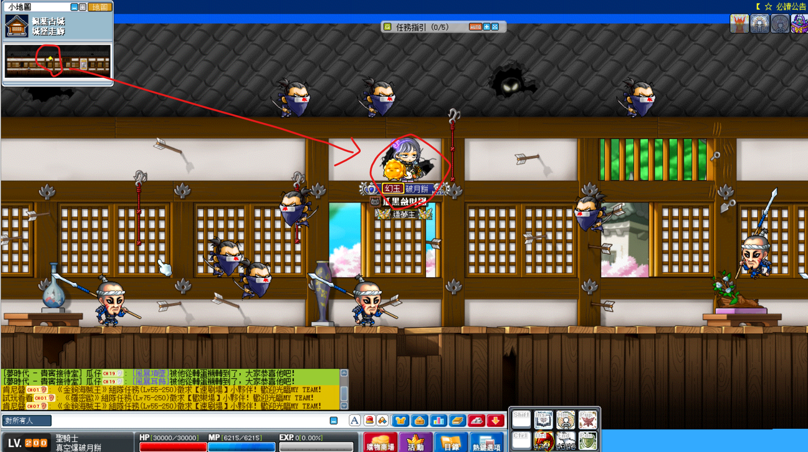
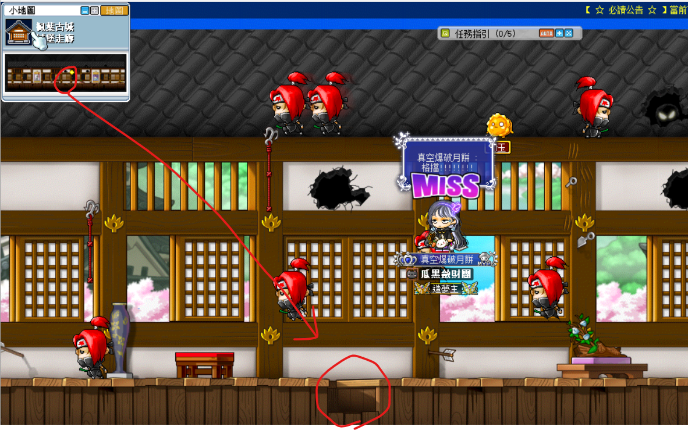
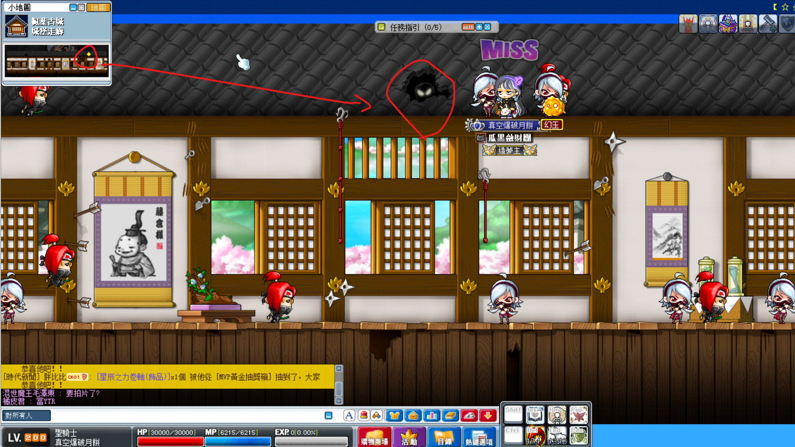
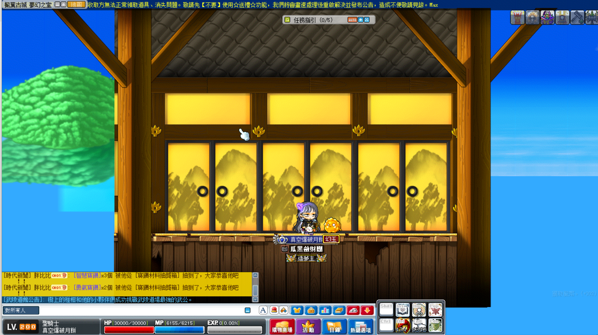

# 楓葉古城 - 城堡內室 2 走法

1. 首先，到各個村莊找 NPC 史匹奈爾，選擇前往古代神社。

    

2. 進到古代神社地圖後，利用該黃圈傳到右側找 NPC 轎子對話進到楓葉古城。

    | 古代神社     | NPC 轎子    |
    |-------------|-------------|
    |  |  |

3. 往右進入這個傳點。

    

4. 往上進入這個破洞。

    

5. 先進到這幅畫中。

    

6. 再進到這個破洞中。

    

7. 跳進去。

    

8. 進到這個破洞中。

    

9. 跳進去。

    

10. 進到這個破洞中。

    

11. 進到這個破洞中。

    

12. 進到這個破洞中。

    

13. 進到這個破洞中，然後跳忍耐、或付 2000 萬楓幣來跳過忍耐。

    

14. 跟 NPC 直助對話後進入到夢幻之室，「連續兩次」進入到「中間的門」，然後往右走一張圖就到王圖門口了。

    
