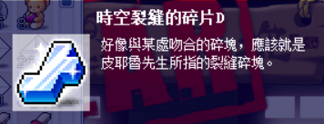
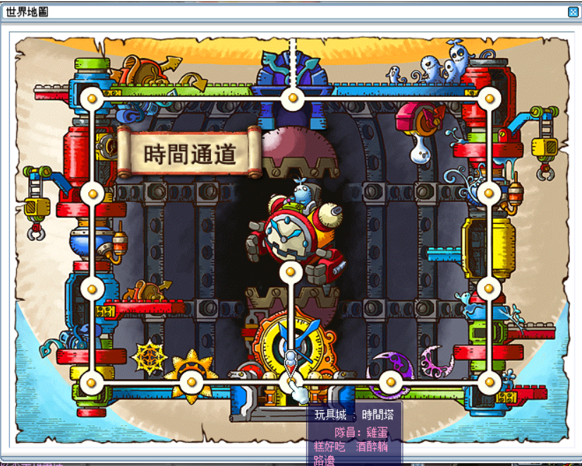
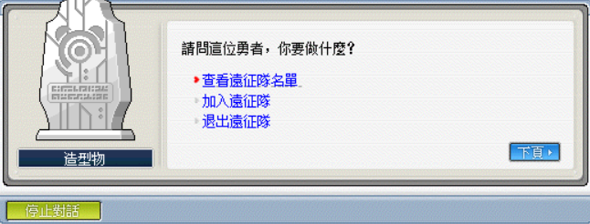
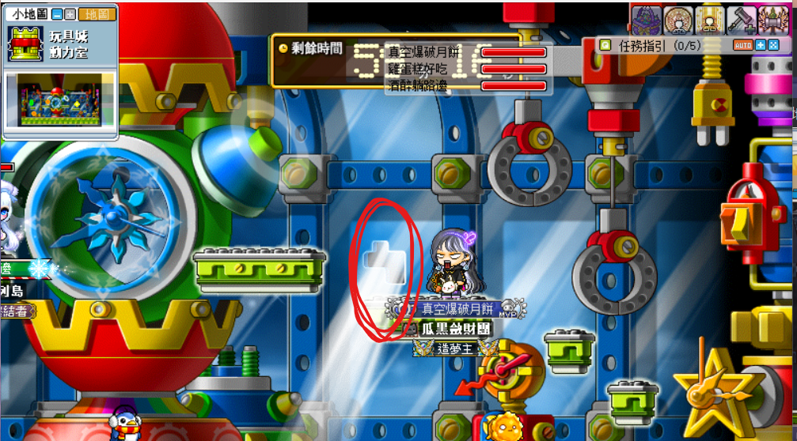
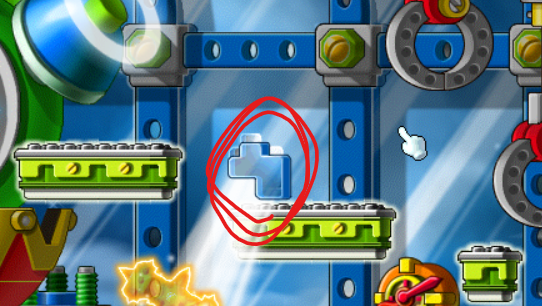
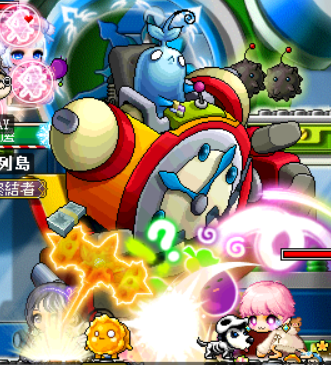
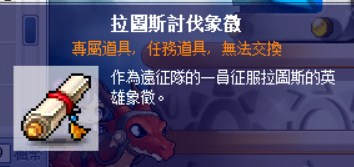
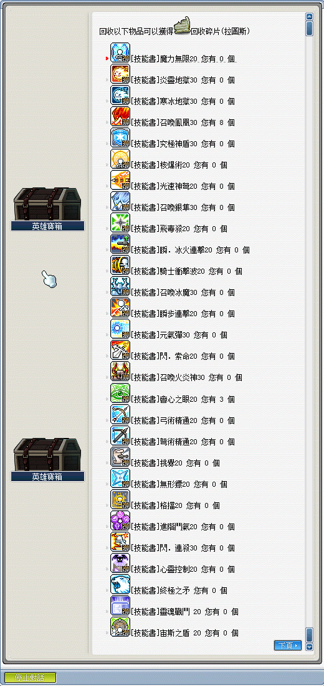

# 海怒斯

## 遠征說明

- 等級限制：90 以上
- 人數限制：2~12
- 前置任務：無
- 準備道具：拉圖斯的邀請函（打一場用一張）
- 報名入口：玩具城 - 時間塔
- 重要道具：拉圖斯的象徵（石板）
- **重要事項：需要有人攜帶「時空裂縫的碎片 D」以召喚 BOSS（Google 找死守玩具城相關系列任務）**\
    

## 遠征流程

1. 首先，來到玩具城－時間塔，具體地圖如下所示：

    

2. 跟造型物對話報名遠征。

    

3. 對準裂縫的口，丟【時空裂縫的碎片 D】。

    | 裂縫的口     | 丟出碎片      |
    |-------------|-------------|
    |  |  |

4. 先將中間召喚出的球打掉，然後再將這隻大笨鐘打掉（有兩階段）。

    

5. 打完 BOSS 後撿起地板的討伐象徵，之後點 NPC 出去並點擊英雄寶箱，選擇`象徵兌換`。

    

6. BOSS 所能兌換到之獎勵如下（感謝雞蛋糕、ValkyRja、VV馬麻支援）：

    
