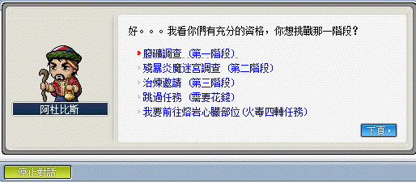

# 殘暴炎魔

## 遠征說明

- 等級限制：100 以上（一般模式）、150 以上（一般模式）
- 人數限制：4~12
- 前置任務：[咖米教學影片](https://www.youtube.com/watch?v=O9GE1MI5SRY&ab_channel=%E5%92%96%E7%B1%B3)
- 準備道具：殘暴炎魔的邀請函（打一場用一張）
- 報名入口：冰原雪域 - 殘暴炎魔祭壇入口
- 重要道具：殘暴炎魔頭盔、殘暴炎魔的象徵（石板）、克爾遺失的文件（通用信）、殘暴炎魔王座
- **重要事項：進地圖時每個人身上皆需要有火焰之眼、召喚王需要火焰之眼**\
    

## 遠征流程

1. 首先先到冰原雪域，之後到殘暴炎魔祭壇入口有幾種走法，但不論選哪種走法都是要再走一段路：

    1. 自己一路往後走。
    2. 點選黑色計程車到冰雪峽谷 II。

        | 黑色計程車   | 大地圖：冰原峽谷 II  | 大地圖：廢棄礦坑 |
        |-------------|-------------|-------------|
        |  |  |  |

    3. 用【廢礦區移動卷軸】到廢棄礦坑 I。

        | 廢礦區移動卷軸 | 大地圖：廢棄礦坑 I |
        |-------------|-------------|
        |  |  |

    4. 用高級任意門傳送到火山通道。

        

    5. 或是可以先請一位主教到通往殘暴炎魔之門，並使用技能任意門直接讓同隊伍的人傳過去，但需要注意的是**需要和主教同頻道**才能被組隊邀請。

        | 組隊邀請後    | 開啟傳送門   |
        |-------------|-------------|
        |  |  |

2. 抵達通往殘暴炎魔之門後，和 NPC 阿杜比斯對話後進入殘暴炎魔祭壇入口。

    | 通往殘暴炎魔之門 | NPC 阿杜比斯  | 殘暴炎魔祭壇入口 |
    |---------------|---------------|---------------|
    |  |  |  |

3. 進入到遠征地圖，在祭壇上丟出【火焰之眼】召喚殘暴炎魔。

4. 打完 BOSS 後點 NPC 出去，撿起地板的討伐象徵後點擊英雄寶箱，選擇`象徵兌換`。

5. BOSS 所能兌換到之獎勵如下（感謝雞蛋糕、ValkyRja、VV馬麻支援）：

    

6. 殘暴炎魔另外有挑戰模式：

    
