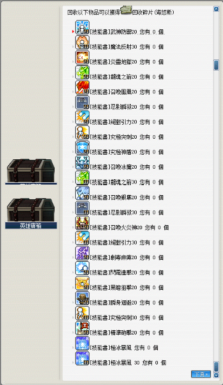

# 海怒斯

## 遠征說明

- 等級限制：85 以上
- 人數限制：2~12
- 前置任務：無
- 準備道具：海怒斯的邀請函（打一場用一張）
- 報名入口：水世界 - 危險的洞穴
- 重要道具：海怒斯模型、海怒斯的象徵（石板）

## 遠征流程

1. 首先，來到水世界 - 危險的洞穴，具體地圖如下所示：

    

2. 對準圖示之光圈，按上鍵（↑）。

    

3. 按`是`，其餘的玩家一樣對準光圈，按上鍵（↑）後選擇`加入遠征隊`。

    

4. 將左右兩邊的魚殺死，王會噴象徵。

    | 海怒斯       | 海怒斯討伐象徵 |
    |-------------|-------------|
    |  |  |

5. 打完 BOSS 後撿起地板的討伐象徵，之後點 NPC 出去並點擊英雄寶箱，選擇`象徵兌換`。

    

6. BOSS 所能兌換到之獎勵如下（感謝雞蛋糕、ValkyRja、VV馬麻支援）：

    
