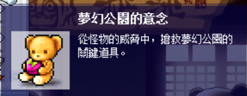
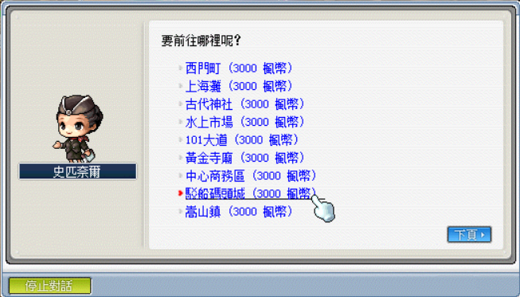
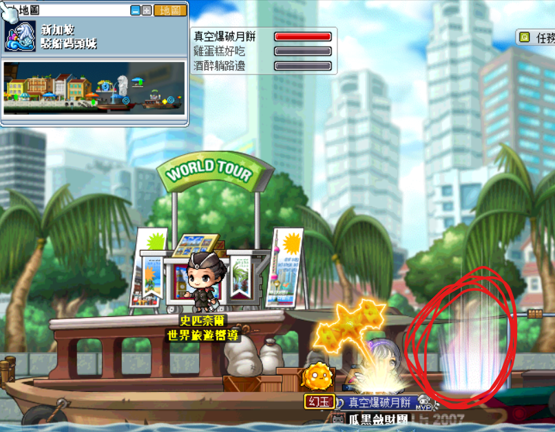
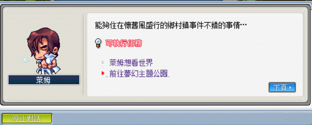
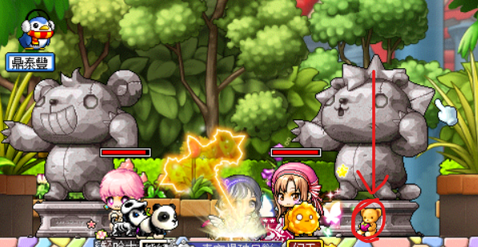
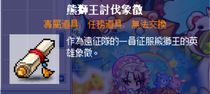
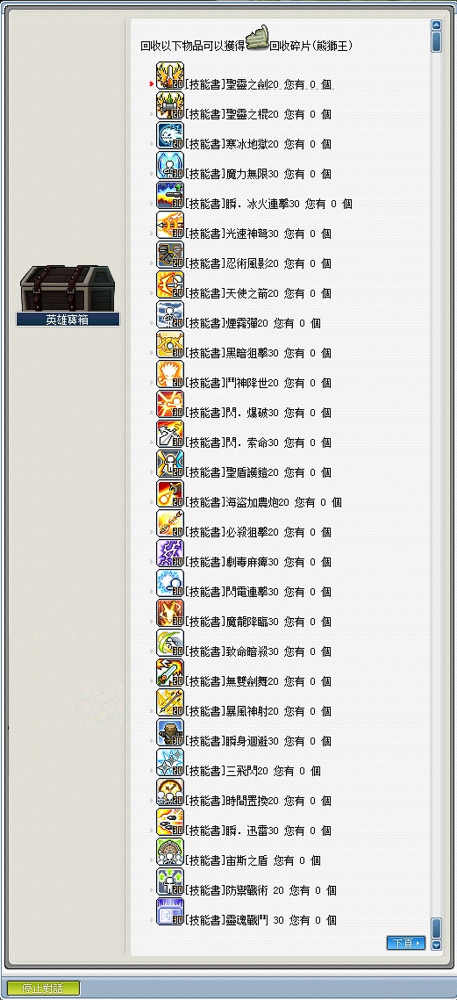

# 熊獅王

## 遠征說明

- 等級限制：95 以上
- 人數限制：3~12
- 前置任務：無
- 準備道具：熊獅王的邀請函（打一場用一張）
- 報名入口：馬來西亞 - 夢幻公園入口
- 重要道具：泰勒熊帽子、娃娃獅王帽子、熊椅、獅椅
- **重要事項：報名每個人身上「皆需要」有意念、召喚王需要消耗意念**\
    

## 遠征流程

1. 首先，到各個村莊找 NPC - 史匹奈爾，選擇前往駁船碼頭城：

    

2. 走紅圈這個傳點，然後一直往右走走到鄉村鎮。

    

3. 找 NPC 萊姆對話，接任務「前往夢幻主題公園」拿取夢幻公園的意念，然後往右走到底可以到夢幻公園入口。

    夢幻公園的意念一次可以拿到兩個，可以接任務後放棄任務來重複洗該道具。

    

4. 進入到遠征地圖，對準雕像丟【夢幻公園的意念】。

    

5. 打完 BOSS 後撿起地板的討伐象徵，之後點 NPC 出去並點擊英雄寶箱，選擇`象徵兌換`。

    

6. BOSS 所能兌換到之獎勵如下（感謝雞蛋糕、ValkyRja、VV馬麻支援）：

    
