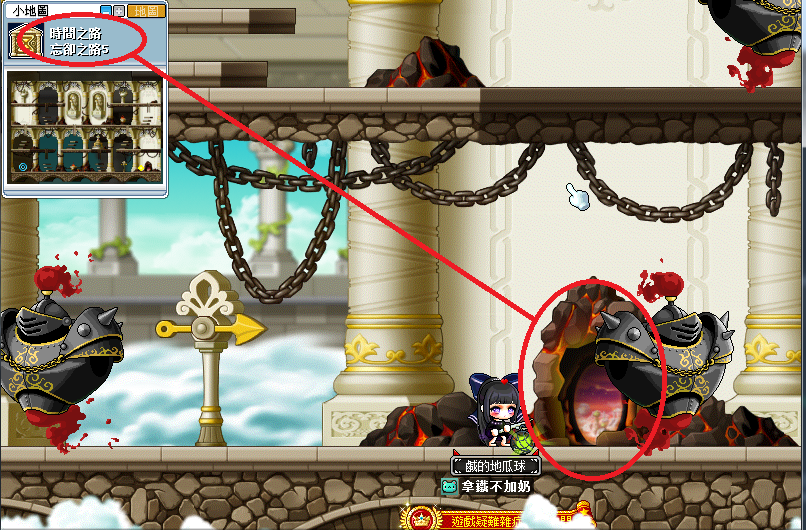
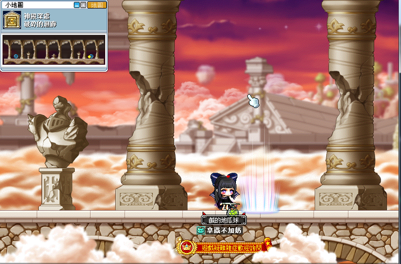
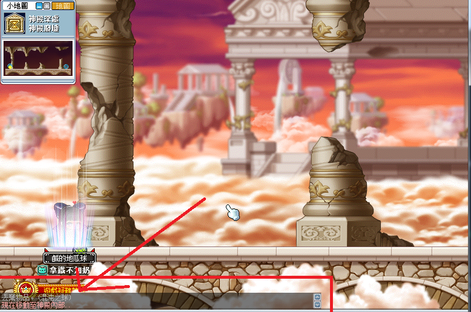
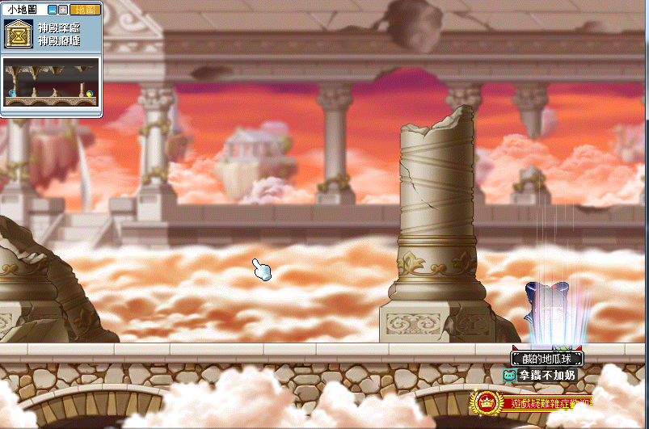
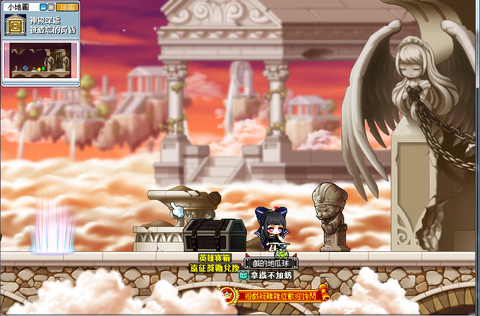
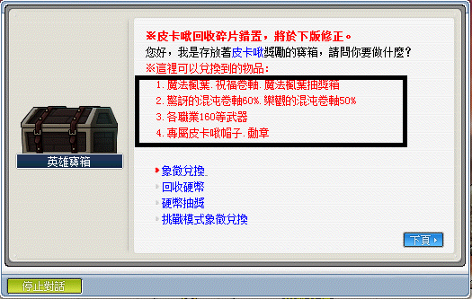
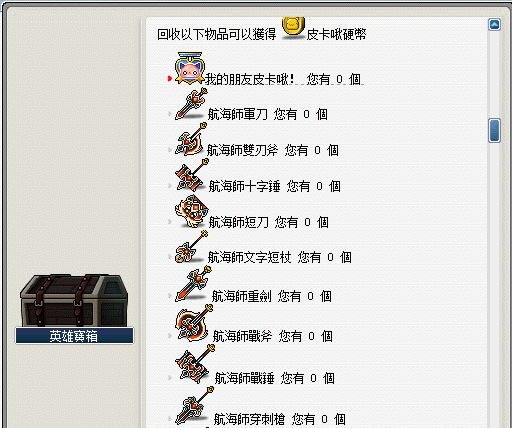
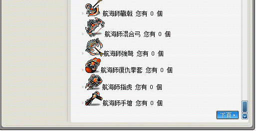
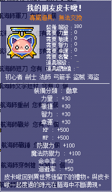
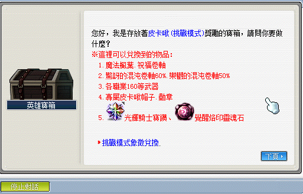

# 皮卡啾

## 遠征說明

- 等級限制：？？？以上（一般模式）
- 人數限制：6~12
- 前置任務：[皮卡啾前置任務](遠征王團/皮卡啾/前置任務/index.md)
- 準備道具：皮卡啾的邀請函（打一場用一張）
- 報名入口：神殿深處 - 被遺忘的黃昏
- 重要道具：
- **重要事項：進神殿廢墟時身上需要有【混沌之球】**\

## 遠征流程

1. 先取得[混沌之球](遠征王團/皮卡啾/前置任務/index.md#結界)。

2. 從時間之路 - 忘卻之路 5 這邊進來。

    

3. 到達神殿深處 - 破碎的迴廊。

    

4. 進入神殿深處 - 神殿廢墟，這邊就會收走【混沌之球】。

    

5. 繼續往右邊走。

    

6. 到達神殿深處 - 被遺忘的黃昏（登記遠征的地方）。

    

7. 打完 BOSS 後點 NPC 出去，撿起地板的討伐象徵後點擊英雄寶箱，選擇`象徵兌換`。

8. BOSS 所能兌換到之獎勵如下：

    

    

    

    

9. 皮卡啾另外有挑戰模式：

    
