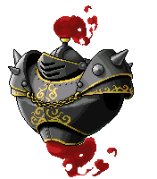

# 皮卡啾前置任務

## 999

在擊殺怪物的過程中，請保留以下道具方便後續獲得【混沌之球】的任務。

| 道具     | 數量 | 怪物          |
|--------|----|-------------|
| 微笑面具   | 10 | 回憶的祭司、回憶的神官 |
| 面無表情面具 | 10 | 悔恨的祭司、悔恨的神官 |
| 哀傷面具   | 10 | 忘卻的祭司、忘卻的神官 |
| 鯨魚的頭盔  | 1  | 多多          |
| 騎士的面具  | 1  | 利里諾斯        |
| 守護獸的角  | 1  | 萊伊卡         |

1. 到時間之路 - 三扇門向神殿管理人接取任務。

2. 踏上回憶之路的人系列任務與對應怪物數量。

    | 踏上回憶之路的人 1  | 踏上回憶之路的人 2  | 踏上回憶之路的人 3  | 踏上回憶之路的人 4  | 踏上回憶之路的人 5  |
    |:-----------------:|:-----------------:|:-----------------:|:-----------------:|:-----------------:|
    | 回憶的祭司x999     | 回憶的神官x999      | 回憶的守護兵x999   | 回憶的守護隊長x999  | 多多x1            |
    |    |    |    |    |    |

3. 以上任務完成之後，時間神殿管理人會要求去找凝視者，凝視者會要求去找該職業的一轉教官。找一轉教官完成任務後，回去找凝視者。完成後，再找時間神殿管理人繼續接任務。

    | 大地圖：凝視者的房間 | 凝視者             |
    |:-----------------:|:-----------------:|
    |    |    |

4. 踏上悔恨之路的人系列任務與對應怪物數量。

    | 踏上悔恨之路的人 1  | 踏上悔恨之路的人 2  | 踏上悔恨之路的人 3  | 踏上悔恨之路的人 4  | 踏上悔恨之路的人 5  |
    |:-----------------:|:-----------------:|:-----------------:|:-----------------:|:-----------------:|
    | 悔恨的祭司x999     | 悔恨的神官x999      | 悔恨的守護兵x999   | 悔恨的守護隊長x999  | 利里諾斯x1         |
    |    |    |    |    |    |

5. 前往悔恨中的休息處 2 到魔法提煉師的房間。他會讓你花 100 萬楓幣向其購買消耗品要你喝下，但是夢時代改成可以買就好，不用喝。

    

6. 踏上忘卻之路的人系列任務與對應怪物數量。

    | 踏上忘卻之路的人 1  | 踏上忘卻之路的人 2  | 踏上忘卻之路的人 3  | 踏上忘卻之路的人 4  | 踏上忘卻之路的人 5  |
    |:-----------------:|:-----------------:|:-----------------:|:-----------------:|:-----------------:|
    | 忘卻的祭司x999     | 忘卻的神官x999      | 忘卻的守護兵x999   | 忘卻的守護隊長x999  | 萊伊卡x1          |
    |    |    |    |    |    |

7. 打完回應 NPC後，會要你找紀錄者，跟他交談回應任務即可。

## 結界

1. 到時間之路 - 三扇門向神殿管理人接取任務「結界」，神殿管理人惠要求玩家收集以下任務道具。

    | 道具     | 數量 | 怪物          |
    |--------|----|-------------|
    | 微笑面具   | 10 | 回憶的祭司、回憶的神官 |
    | 面無表情面具 | 10 | 悔恨的祭司、悔恨的神官 |
    | 哀傷面具   | 10 | 忘卻的祭司、忘卻的神官 |
    | 鯨魚的頭盔  | 1  | 多多          |
    | 騎士的面具  | 1  | 利里諾斯        |
    | 守護獸的角  | 1  | 萊伊卡         |

2. 在收集完後回去向神殿管理人回報任務，獲得【混沌之球】。

    
