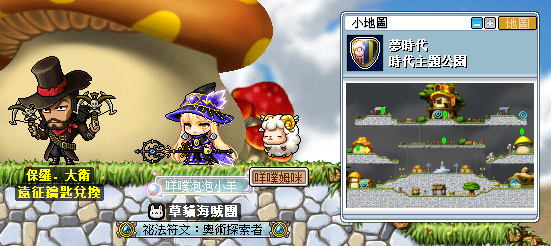
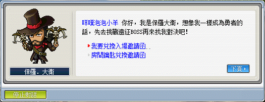

# 邀請函製作

夢時代楓之谷在打遠征王 BOSS 時必須準備好邀請函（入場 BOSS 地圖時消耗一張），需要製作邀請函之 BOSS 如下：

- 海怒斯
- 拉圖斯
- 熊獅王
- 殘暴炎魔
- 克雷塞爾
- 黑道長老
- 闇黑龍王
- 天皇蟾蜍
- 皮卡啾

1. 首先先到夢時代－時代主題公園左中處找尋 NPC－保羅大衛：

    

2. 跟 NPC 保羅大衛對話後，選擇「我要兌換入場邀請函」。

    

    - 「舊版本」的 XXX 王房間鑰匙可以用「1：10」的比例換成 XXX 的邀請函。

3. 不同遠征王所需要的礦石與楓幣如下表。

    | 遠征王  | 礦石 | 礦石 | 礦石| 礦石 | 礦石 | 礦石| 礦石 | 礦石 | 礦石 | 礦石 | 礦石 | 楓幣 |
    | ---- | ------- | ------- | ------ | ------- | ----- | ------ | ------- | ------- | ------- | ------- | ----- | ------: |
    | 海怒斯　 | 石榴石 x1　 | 海藍寶石 x1 | 鋰礦石 x1 | 智慧水晶 x1 | 　　　　    | 　　　　    | 　　　　    | 　　　　    | 　　　　    | 　　　　    | 　　　　    | 100,000   |
    | 拉圖斯　 | 祖母綠 x1　 | 青銅 x1　　 | 蛋白石 x1 | 敏捷水晶 x1 | 　　　　    | 　　　　    | 　　　　    | 　　　　    | 　　　　    | 　　　　    | 　　　　    | 100,000   |
    | 熊獅王　 | 鋼鐵 x1　　 | 朱礦石 x1　 | 紫水晶 x1 | 力量水晶 x1 | 　　　　    | 　　　　    | 　　　　    | 　　　　    | 　　　　    | 　　　　    | 　　　　    | 200,000   |
    | 殘暴炎魔 | 鋰礦石 x1　 | 紫水晶 x1　 | 銀 x1　　 | 幸運水晶 x1 | 　　　 　   | 　　　　    | 　　　　    | 　　　　    | 　　　　    | 　　　　    | 　　　　    | 300,000   |
    | 克雷賽爾 | 海藍寶石 x1 | 青銅 x1　　 | 朱礦石 x1 | 智慧水晶 x1 | 　　　　    | 　　　　    | 　　　　    | 　　　　    | 　　　　    | 　　　　    | 　　　　    | 300,000   |
    | 黑道長老 | 石榴石 x1　 | 海藍寶石 x1 | 鋰礦石 x1 | 祖母綠 x1　 | 青銅 x1　 　| 蛋白石 x1　 | 力量水晶 x1 | 智慧水晶 x1 | 幸運水晶 x1 | 月石 x1　　 | 　　　　    | 1,000,000 |
    | 闇黑龍王 | 石榴石 x1　 | 海藍寶石 x1 | 鋰礦石 x1 | 祖母綠 x1 　| 青銅 x1　 　| 蛋白石 x1　 | 力量水晶 x1 | 智慧水晶 x1 | 敏捷水晶 x1 | 月石 x2　　 | 　　　　    | 1,500,000 |
    | 天皇蟾蜍 | 石榴石 x1　 | 紫水晶 x1　 | 祖母綠 x1 | 蛋白石 x1　 | 鋼鐵 x1　 　| 紫礦石 x1　 | 青銅 x1　　 | 朱礦石 x1　 | 敏捷水晶 x1 | 幸運水晶 x1 | 星石 x1　　 | 2,500,000 |
    | 皮卡啾　 | 祖母綠 x2　 | 藍寶石 x2　 | 黃晶 x2　 | 鑽石 x2　　 | 銀 x2　　　 | 黃金 x2　　 | 紫礦石 x2　 | 黑水晶 x2　 | 力量水晶 x2 | 智慧水晶 x2 | 星石 x2　　 | 5,000,000 |
