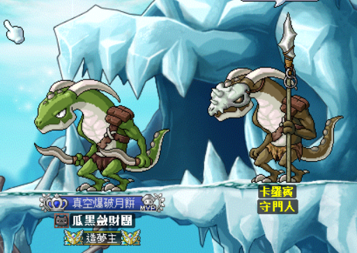
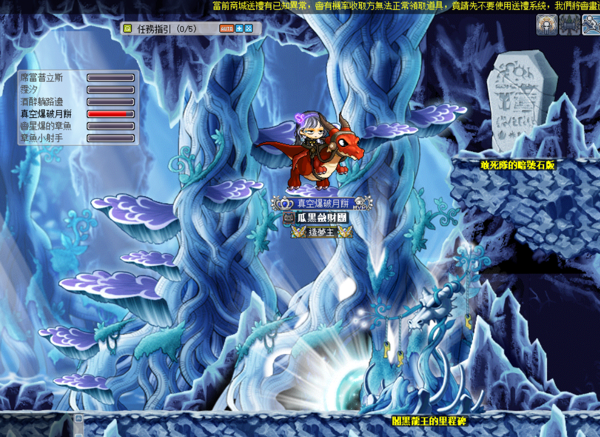
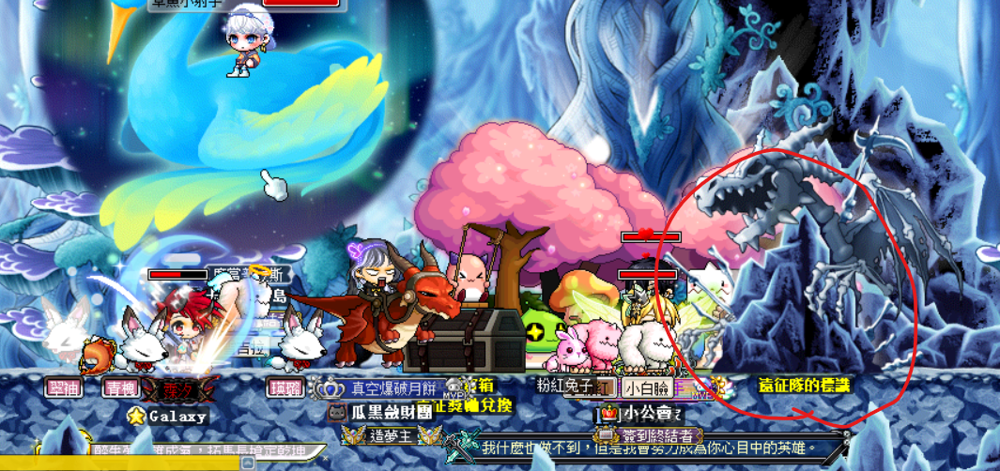
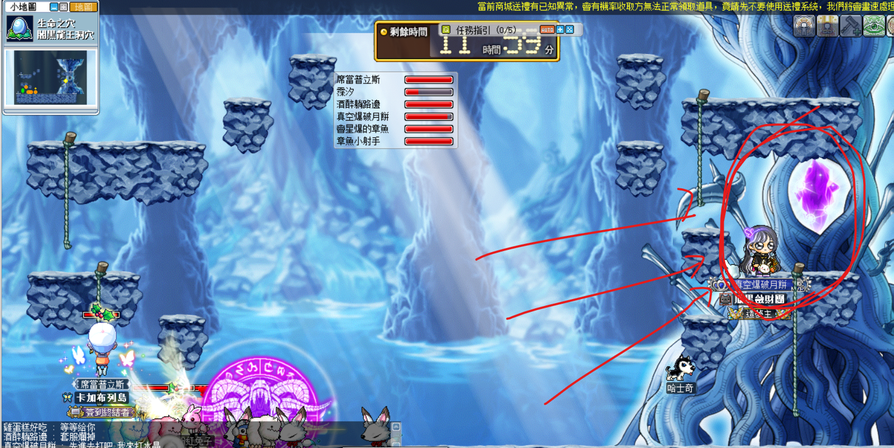
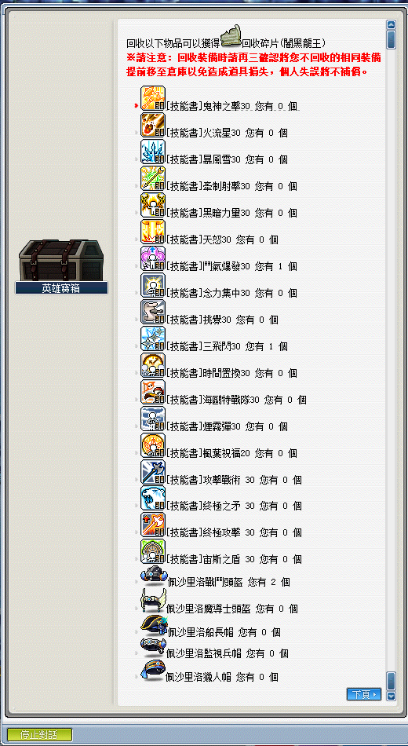

# 闇黑龍王

## 遠征說明

- 等級限制：150 以上（一般模式）
- 人數限制：3~12
- 前置任務：[闇黑龍王前置任務](遠征王團/闇黑龍王/前置任務/index)
- 準備道具：闇黑龍王的邀請函（打一場用一張）
- 報名入口：神木村 - 闇黑龍王洞穴入口
- 重要資訊：無
- 重要道具：樂觀混沌卷軸、祝福卷軸、驚訝混沌卷軸、克爾遺失的文件、140 頭盔、魔法楓葉、魔法楓葉抽獎箱、楓葉祝福 20

## 遠征流程

1. 先解[變身秘藥](遠征王團/闇黑龍王/前置任務/index#變身秘藥)（每打一次闇黑龍王都需要重新解一次）。

2. 變身完畢後，跳下去或和 NPC 卡羅賓（守門人）對話進入到龍洞。

    

3. 沒解過敢死隊象徵任務的點右下角開始跑[龍洞任務](遠征王團/闇黑龍王/前置任務/index#闇黑龍王前置任務)。
   有解過敢死隊象徵任務（要有【敢死隊榮譽隊員的象徵】）的點右上角直接進去龍洞入口。

    

4. 點擊右邊的遠征隊的標誌開啟遠征，並且報名後入場開打。

    

5. 對紅圈圈起來的水晶處使用普通攻擊數次即可召喚闇黑龍王。

    

6. 利用「闇黑龍王討伐象徵」兌換或湊齊 10 個【闇黑龍王碎片】可以抽獎換道具。詳細獲得道具如下（感謝雞蛋糕、開花子、ValkyRja、章魚、酒醉躺路邊、席當普立斯支援）：

    
