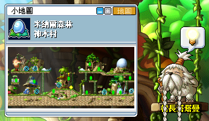
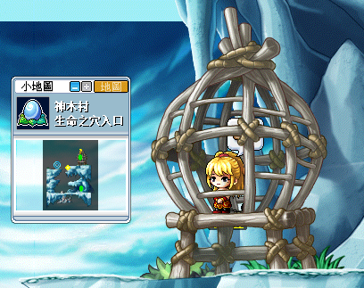
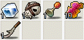

# 闇黑龍王前置任務

建議準備道具來解任務「敢死隊的象徵」，這樣之後去打龍王就不必再跑一次打鑰匙流程：

- 海怒斯的象徵x1
- 拉圖斯的象徵x1
- 殘暴炎魔的象徵x1

1. 首先，先到神木村找 NPC 村長塔塔曼接取任務「摩伊拉的行蹤」。

    | NPC 村長塔塔曼               | 接取任務「摩伊拉的行蹤」       |
    |----------------------------|----------------------------|
    |  |  |

2. 到神木村 - 生命之穴入口找 NPC 摩伊拉回報任務「摩伊拉的行蹤」。

    - 若是使用高級瞬移之石、高級傳送門只能傳送到神木村 - 主巢穴山峰。

3. 進行並完成任務「[變身秘藥](#變身秘藥)」以變身為龍的狀態。

4. 跳下去最下面平台，或和 NPC 對話進入到龍洞。

    | 跳下去最下面平台              | 和 NPC 對話                 |
    |----------------------------|----------------------------|
    |  |  |

5. 第一次解任務（或身上沒有敢死隊象徵）時和闇黑龍王的里程碑對話。

    

6. 進到左上角的光圈處，開始打任務道具（五種迷宮室鑰匙）。

    - 在迷宮室打倒怪物會掉落【敢死隊的象徵 1】、【敢死隊的象徵 2】、【敢死隊的象徵 3】，如果要解任務「敢死隊的象徵」的玩家請留著這幾個道具。

    | 迷宮室                     | 五種迷宮室鑰匙                |
    |----------------------------|----------------------------|
    |  |  |

7. 打完鑰匙後出地圖（迷宮室 5 右側就是出口），回到生命之穴 - 迷宮室後跟 NPC 迷宮室碎片對話進到生命之穴 - 光明洞穴。

    | NPC 迷宮室碎片               | 生命之穴 - 光明洞穴            |
    |----------------------------|----------------------------|
    |  |  |

8. 打光明洞穴內的化石龍長老來取得道具藍色鑰匙 6 把，打完後走到右側和 NPC 闇黑龍王的里程碑對話即可完成任務。

    

## 變身秘藥

1. 同樣的地圖，和 NPC 摩伊拉接取任務「變身秘藥」。

    | NPC 摩伊拉                                  | 接取任務「變身秘藥」                           |
    |--------------------------------------------|--------------------------------------------|
    |  |  |

2. 收集以下材料：

    - 龍戰士的精髓1個（神木村 - 雙刀龍戰士、短刃龍戰士）
    - 骷髏肩護帶（神木村 - 雙刀龍戰士）
    - 噴火龍集音器（神木村 - 噴火龍）
    - 堅韌的龍皮（神木村 - 赤翼龍、藍翼龍、黑翼龍）
    - 惡龍的短刀
    - Notes
        1. 龍皮、集音器因為再次解密藥任務代號會不同別多打。
        2. 噴火龍可以請人幫忙打到殘血，然後打手「必須換頻／進入商城／下線」三選一，需要任務道具的人再尾刀把噴火龍幹掉才會出現噴火龍的集音器。

    

3. 【惡龍的短刀】需要先打短刃龍戰士取得【壞掉的短刀】，並到神木村找 NPC 摩斯進行修復成【惡龍的短刀】。

    - 修復材料需要鋼鐵、鋰礦石各一個。

    

4. 和 NPC 摩伊拉回報任務「變身秘藥」後將會變成龍的狀態。

    

## 敢死隊的象徵

1. 到神木村 - 生命之穴入口找 NPC 摩伊拉接取任務「敢死隊的象徵」。

    

2. 收集任務道具後向NPC 摩伊拉回報任務「敢死隊的象徵」，並獲得【敢死隊榮譽隊員的象徵】。

    