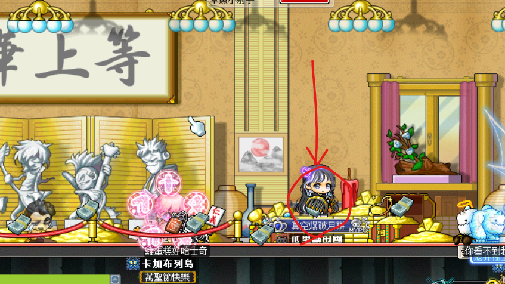
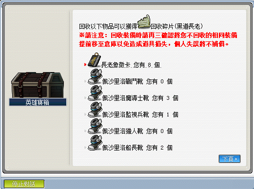

# 黑道長老

## 遠征說明

- 等級限制：130 以上（一般模式）
- 人數限制：3~12
- 前置任務：無
- 準備道具：黑道長老的邀請函（打一場用一張）、半月梳子（入場時每個角色都要有梳子、召喚時需丟梳子）
- 報名入口：昭和村 - 武器庫
- 重要道具：樂觀、祝福、驚訝、克爾遺失的文件、140 鞋、魔法楓葉、魔法楓葉抽獎箱

## 遠征流程

1. 抵達[武器庫](遠征王團/黑道長老/昭和村武器庫走法/index.md)後，在這個位置丟梳子，就能召喚黑道保鑣。依序把保鑣、師爺、長老打敗。

    

2. 利用【黑道長老討伐象徵】兌換或湊齊 10 個【黑道長老碎片】可以抽獎換道具。詳細獲得道具如下（感謝雞蛋糕、開花子、ValkyRja、章魚、酒醉躺路邊、席當普立斯支援）：

    - 長老象徵卡
    - 樂觀、祝福、驚訝
    - 魔法楓葉、魔法楓葉抽獎箱
    - 各職業 140 等鞋子
    - 克爾遺失的文件

    
